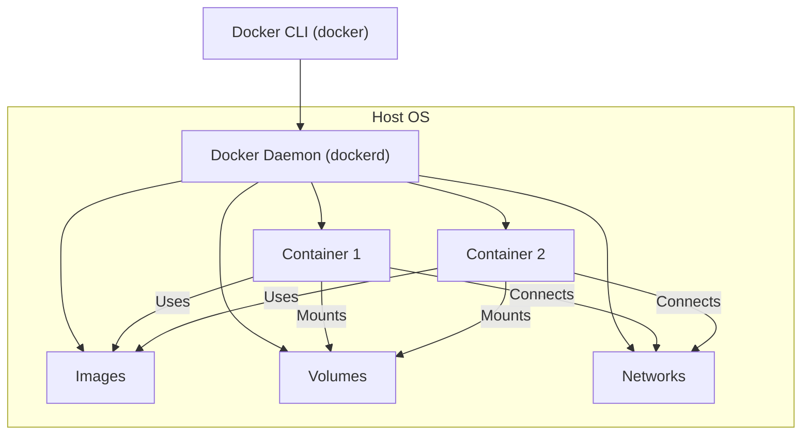
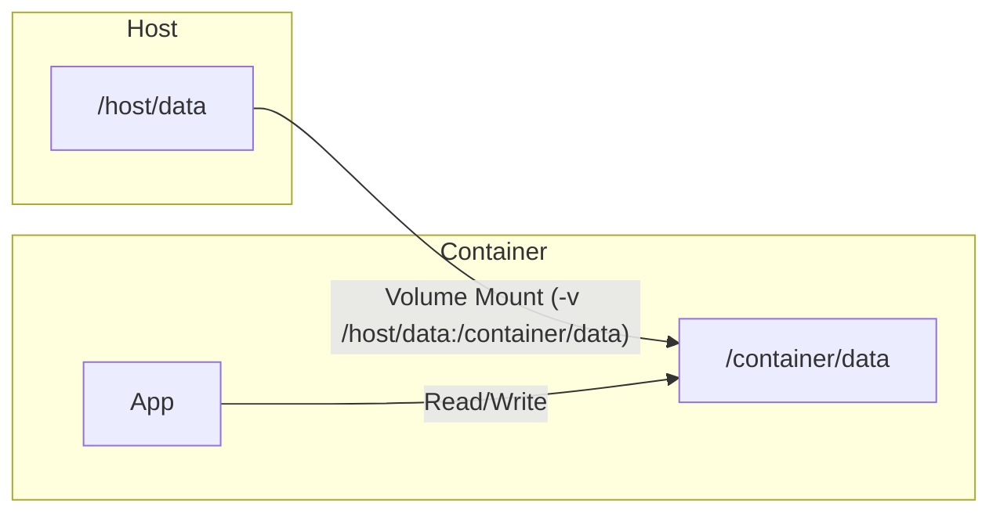
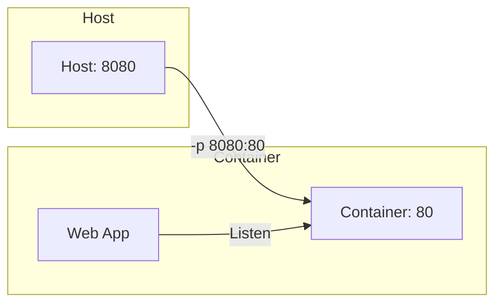
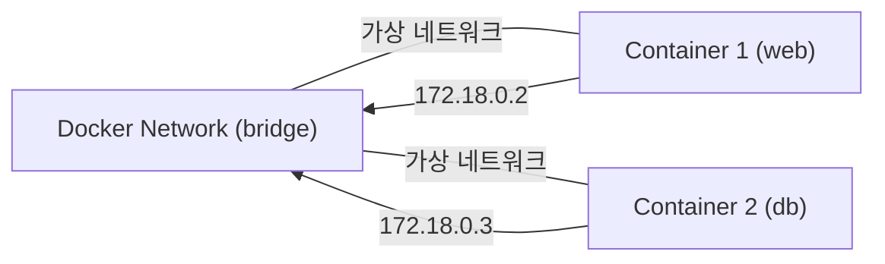

# What is docker

- Docker는 애플리케이션을 컨테이너라는 격리된 환경에서 실행할 수 있게 해주는 플랫폼입니다. 컨테이너는 애플리케이션과 그 실행에 필요한 모든 것을 하나로 묶어, 어디서든 일관되게 실행할 수 있도록 합니다.

# 장점

- 컨테이너 기반 가상화 기술로, 가볍고 빠른 배포가 가능
- 이미지 기반으로 환경을 표준화하여, 개발-테스트-운영 환경 차이를 최소화
- 격리된 환경에서 여러 애플리케이션을 동시에 실행 가능

## Docker 구조

- Docker CLI: 사용자가 명령을 입력하는 도구 (docker 명령어)
- Docker Daemon: 컨테이너와 이미지를 관리하는 백그라운드 서비스
- Images: 컨테이너 실행에 필요한 모든 파일과 설정을 포함한 패키지
- Containers: 실제로 실행 중인 애플리케이션 인스턴스
- Volumes: 데이터 영속성을 위한 저장소
- Networks: 컨테이너 간 통신을 위한 가상 네트워크



# How to use docker

1. Docker 설치 후, 이미지를 받아 컨테이너를 실행

- image는 기본적으로 hub.docker.com에서 가져온다.

2. Dockerfile로 이미지를 직접 빌드하여 배포 가능
3. 주요 사용 흐름:
   1. 이미지를 다운로드(pull)
   2. 컨테이너 실행(run)
   3. 상태 확인(ps)
      - 컨테이너 접속(exec)
   4. 중지/삭제(stop/rm)

예시:

```bash
docker pull nginx

# -d option is background
# --name option is create container name
# -p option is port forwarding {local port}:{container port}
# nginx is image
docker run -d --name webserver -p 8080:80 nginx

docker ps

# -it: interactive
# bash is command running shell
docker exec -it webserver bash

docker stop webserver

docker rm webserver
```

## Local Volume과 Mount 구조



### 왜 volume mount를 사용하는가?

- 컨테이너는 기본적으로 휘발성(컨테이너 삭제 시 데이터도 삭제)
- 호스트와 데이터를 공유하거나, 데이터 영속성을 보장하기 위해 사용
- 개발 환경에서 소스코드 실시간 반영, DB 데이터 보존 등에 활용

---

## Port Forwarding 구조



### 왜 port forwarding을 사용하는가?

- 컨테이너 내부 서비스(예: 80번 포트 웹서버)를 외부(호스트)에서 접근 가능하게 함
- 여러 컨테이너가 각각 다른 포트로 외부에 서비스 제공 가능
- 개발/운영 환경에서 서비스 접근 및 테스트 용이

---

## Docker Network란?

Docker Network는 컨테이너 간 통신, 외부와의 연결을 관리하는 가상 네트워크입니다.

- 컨테이너끼리 독립적이면서도 필요에 따라 서로 통신 가능
- 브리지, 호스트, 오버레이 등 다양한 네트워크 드라이버 제공
- 네트워크 격리 및 보안성 강화

### 왜 docker network를 사용하는가?

- 여러 컨테이너가 하나의 서비스처럼 상호작용(예: 웹+DB)
- 네트워크 격리로 보안성 향상
- 복잡한 서비스 아키텍처(마이크로서비스 등) 구현에 필수

### Docker Network 구조 다이어그램



# Command of docker

- **inspect image**

  - 이미지 상세 정보 확인
  - `docker inspect <이미지명>`

- **volume mounts**

  - 호스트와 컨테이너 간 디렉토리/파일 공유
  - `docker run -v /host/path:/container/path ...`

- **network**

  - 컨테이너 간 통신, 외부와의 연결 설정
  - `docker network ls`, `docker network create`, `docker run --network <네트워크명>`

- **How to connect to host ip**

  - 컨테이너에서 호스트로 접근: Linux는 `host.docker.internal` 또는 호스트의 실제 IP 사용

- **How to use exec**

  - 실행 중인 컨테이너에 명령어 실행/접속
  - `docker exec -it <컨테이너명> /bin/sh` 또는 `/bin/bash`

- **save**

  - 이미지를 tar 파일로 저장(백업, 이동, 오프라인 배포 등)
  - `docker save -o <저장할파일명.tar> <이미지명>:<태그>`
  - 예시: `docker save -o nginx.tar nginx:latest`

- **load**

  - 저장된 이미지(tar 파일)를 Docker에 불러오기
  - `docker load -i <이미지파일명.tar>`
  - 예시: `docker load -i nginx.tar`

- **commit**
  - 실행 중인 컨테이너의 상태를 새로운 이미지로 저장
  - `docker commit <컨테이너명 또는 ID> <새이미지명>:<태그>`
  - 예시: `docker commit webserver mynginx:custom`
