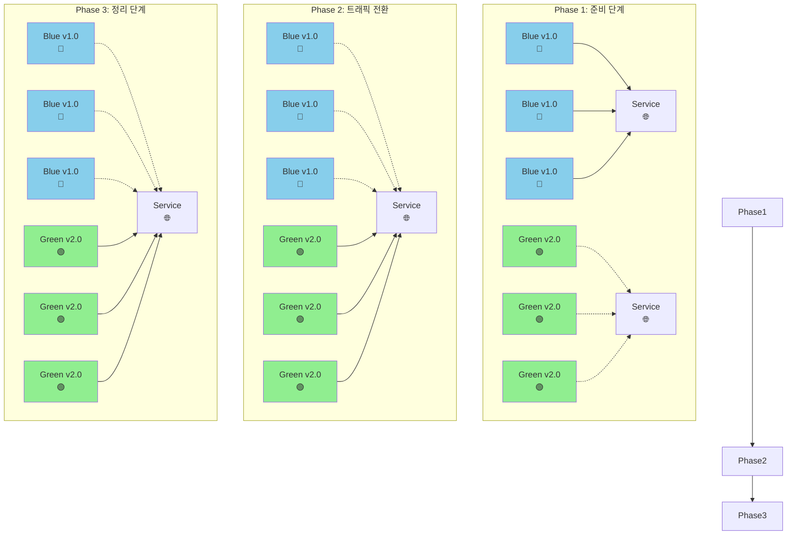
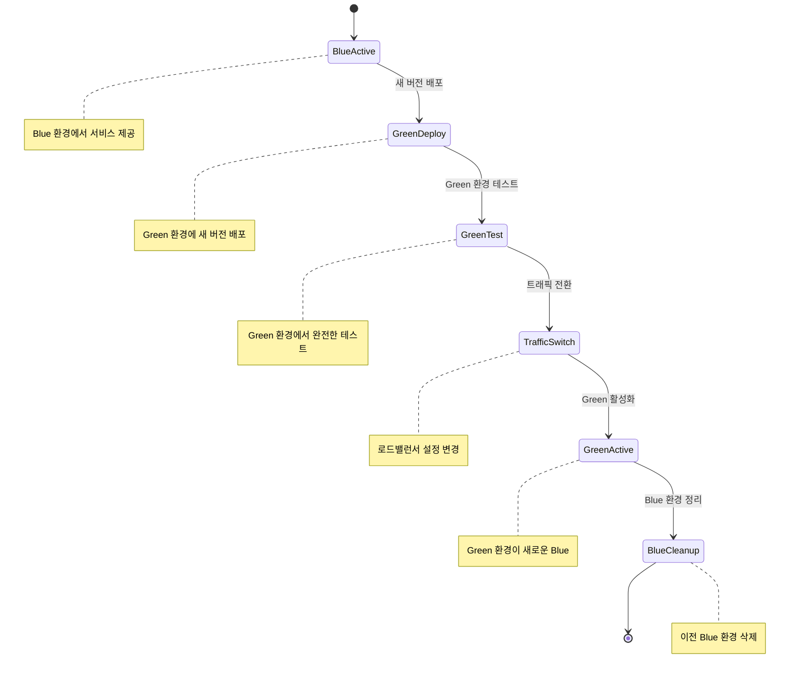

# Blue/Green 배포 전략

Blue/Green 배포는 두 개의 동일한 환경(Blue와 Green)을 사용하여 완전한 버전 전환을 통해 무중단 배포를 구현하는 전략입니다.

## 개요

Blue/Green 배포에서는 현재 운영 중인 환경(Blue)과 새로운 버전을 배포할 환경(Green)을 준비합니다. 새로운 버전이 Green 환경에서 완전히 테스트된 후, 트래픽을 한 번에 Blue에서 Green으로 전환합니다.

## 작동 원리



## 배포 과정



## 장점

- ✅ **빠른 롤백**: 트래픽을 다시 Blue로 전환하여 즉시 롤백 가능
- ✅ **완전한 테스트**: Green 환경에서 실제 환경과 동일한 조건으로 테스트
- ✅ **무중단 배포**: 트래픽 전환이 순간적으로 이루어짐
- ✅ **버전 분리**: Blue와 Green이 완전히 분리되어 버전 충돌 없음

## 단점

- ❌ **리소스 비용**: 두 배의 인프라가 필요
- ❌ **데이터베이스 복잡성**: 데이터베이스 스키마 변경 시 주의 필요
- ❌ **상태 관리**: 세션 상태나 캐시 데이터 처리 필요
- ❌ **복잡한 설정**: 로드밸런서와 네트워크 설정이 복잡

## Kubernetes에서의 구현

### Blue 환경 (현재 운영)

```yaml
apiVersion: apps/v1
kind: Deployment
metadata:
  name: my-app-blue
  labels:
    app: my-app
    version: blue
spec:
  replicas: 3
  selector:
    matchLabels:
      app: my-app
      version: blue
  template:
    metadata:
      labels:
        app: my-app
        version: blue
    spec:
      containers:
        - name: my-app
          image: my-app:v1.0
---
apiVersion: v1
kind: Service
metadata:
  name: my-app-service
spec:
  selector:
    app: my-app
    version: blue # 현재 Blue 환경으로 트래픽 전달
  ports:
    - port: 80
      targetPort: 8080
```

### Green 환경 (새 버전)

```yaml
apiVersion: apps/v1
kind: Deployment
metadata:
  name: my-app-green
  labels:
    app: my-app
    version: green
spec:
  replicas: 3
  selector:
    matchLabels:
      app: my-app
      version: green
  template:
    metadata:
      labels:
        app: my-app
        version: green
    spec:
      containers:
        - name: my-app
          image: my-app:v2.0
```

### 배포 스크립트

```bash
#!/bin/bash

# 1. Green 환경 배포
kubectl apply -f green-deployment.yaml

# 2. Green 환경 상태 확인
kubectl rollout status deployment/my-app-green

# 3. Green 환경 테스트
kubectl port-forward service/my-app-green 8080:80 &
sleep 10
curl -f http://localhost:8080/health || exit 1

# 4. 트래픽 전환 (Service selector 변경)
kubectl patch service my-app-service -p '{"spec":{"selector":{"version":"green"}}}'

# 5. Green 환경 활성화 확인
kubectl get endpoints my-app-service

# 6. Blue 환경 정리 (선택사항)
kubectl delete deployment my-app-blue
```

## 트래픽 전환 방법

### 1. Service Selector 변경

```bash
# Blue에서 Green으로 전환
kubectl patch service my-app-service -p '{"spec":{"selector":{"version":"green"}}}'

# Green에서 Blue로 롤백
kubectl patch service my-app-service -p '{"spec":{"selector":{"version":"blue"}}}'
```

### 2. Ingress 설정 변경

```yaml
apiVersion: networking.k8s.io/v1
kind: Ingress
metadata:
  name: my-app-ingress
spec:
  rules:
    - host: my-app.example.com
      http:
        paths:
          - path: /
            pathType: Prefix
            backend:
              service:
                name: my-app-service
                port:
                  number: 80
```

## 모니터링 및 검증

```bash
# 배포 상태 확인
kubectl get deployments -l app=my-app

# 서비스 엔드포인트 확인
kubectl get endpoints my-app-service

# 파드 상태 확인
kubectl get pods -l app=my-app

# 로그 확인
kubectl logs -l app=my-app,version=green

# 헬스체크
kubectl exec -it $(kubectl get pods -l app=my-app,version=green -o jsonpath='{.items[0].metadata.name}') -- curl localhost:8080/health
```

## 데이터베이스 고려사항

### 스키마 변경이 없는 경우

- Green 환경에서 동일한 데이터베이스 사용
- 트래픽 전환만으로 배포 완료

### 스키마 변경이 있는 경우

- 데이터베이스 마이그레이션 스크립트 준비
- Green 환경 배포 전 마이그레이션 실행
- 롤백 시 데이터베이스 롤백 계획 필요

## 베스트 프랙티스

1. **완전한 테스트**: Green 환경에서 실제 환경과 동일한 테스트
2. **모니터링**: 트래픽 전환 후 즉시 모니터링 시작
3. **롤백 계획**: 문제 발생 시 빠른 롤백 절차 준비
4. **리소스 관리**: 사용하지 않는 Blue 환경 정리
5. **문서화**: 배포 절차와 롤백 절차 문서화

## 사용 시나리오

- ✅ **중요한 프로덕션 환경**: 완전한 무중단 배포가 필요한 경우
- ✅ **복잡한 애플리케이션**: 여러 컴포넌트가 상호 의존하는 경우
- ✅ **데이터베이스 변경**: 스키마 변경이 포함된 배포
- ✅ **긴급 배포**: 빠른 롤백이 필요한 경우

Blue/Green 배포는 완전한 환경 분리를 통해 안전하고 신뢰할 수 있는 배포를 제공하지만, 추가 리소스와 복잡한 설정이 필요한 고급 배포 전략입니다.
