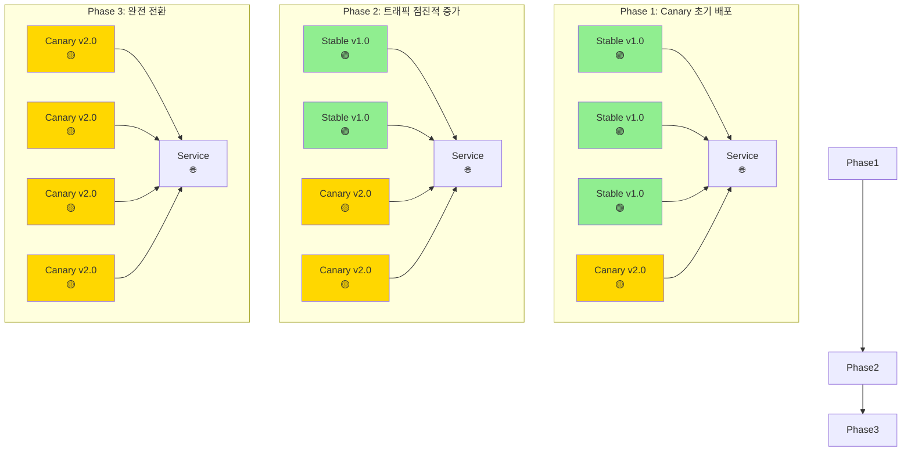
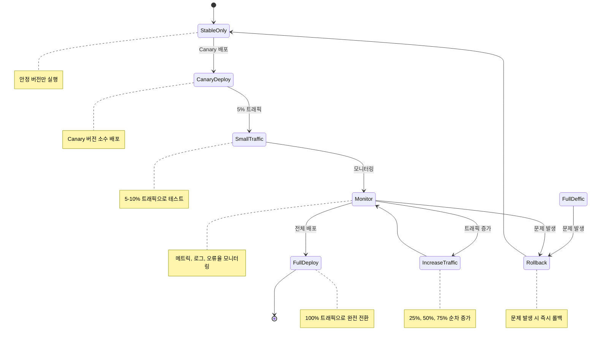

# Canary 배포 전략

Canary 배포는 새로운 버전을 소규모 사용자 그룹에게 먼저 배포하여 안전성을 검증한 후, 점진적으로 전체 사용자에게 확산하는 배포 전략입니다.

## 개요

Canary 배포는 광부들이 카나리아(새)를 광산에 데려가서 유해 가스 유무를 확인했던 것에서 유래한 이름입니다. 소수의 사용자에게 새 버전을 먼저 제공하여 문제가 없는지 확인한 후, 점진적으로 트래픽을 늘려가는 방식입니다.

## 작동 원리



## 배포 과정



## 장점

- ✅ **위험 최소화**: 소수 사용자에게만 영향
- ✅ **실시간 피드백**: 실제 사용자 데이터로 검증
- ✅ **점진적 배포**: 트래픽 비율 조정으로 안전한 확산
- ✅ **빠른 롤백**: 문제 발생 시 즉시 이전 버전으로 복구
- ✅ **A/B 테스트**: 사용자 반응 비교 가능

## 단점

- ❌ **복잡한 설정**: 트래픽 분산 로직 구현 필요
- ❌ **모니터링 부담**: 실시간 모니터링과 알림 설정 필요
- ❌ **세션 관리**: 사용자 세션 일관성 유지 어려움
- ❌ **데이터 일관성**: 두 버전 간 데이터 동기화 문제

## Kubernetes에서의 구현

### 기본 Canary 배포

```yaml
# Stable 버전 (기존)
apiVersion: apps/v1
kind: Deployment
metadata:
  name: my-app-stable
  labels:
    app: my-app
    version: stable
spec:
  replicas: 9 # 90% 트래픽
  selector:
    matchLabels:
      app: my-app
      version: stable
  template:
    metadata:
      labels:
        app: my-app
        version: stable
    spec:
      containers:
        - name: my-app
          image: my-app:v1.0
---
# Canary 버전 (새로운)
apiVersion: apps/v1
kind: Deployment
metadata:
  name: my-app-canary
  labels:
    app: my-app
    version: canary
spec:
  replicas: 1 # 10% 트래픽
  selector:
    matchLabels:
      app: my-app
      version: canary
  template:
    metadata:
      labels:
        app: my-app
        version: canary
    spec:
      containers:
        - name: my-app
          image: my-app:v2.0
---
# Service (라벨 셀렉터로 트래픽 분산)
apiVersion: v1
kind: Service
metadata:
  name: my-app-service
spec:
  selector:
    app: my-app # stable과 canary 모두 선택
  ports:
    - port: 80
      targetPort: 8080
```

### 트래픽 비율 조정

```bash
# Canary 10% (1개 파드)
kubectl scale deployment my-app-canary --replicas=1
kubectl scale deployment my-app-stable --replicas=9

# Canary 25% (2개 파드)
kubectl scale deployment my-app-canary --replicas=2
kubectl scale deployment my-app-stable --replicas=6

# Canary 50% (3개 파드)
kubectl scale deployment my-app-canary --replicas=3
kubectl scale deployment my-app-stable --replicas=3

# Canary 100% (완전 전환)
kubectl scale deployment my-app-canary --replicas=10
kubectl scale deployment my-app-stable --replicas=0
```

## 고급 Canary 배포 (Istio 사용)

### Istio VirtualService 설정

```yaml
apiVersion: networking.istio.io/v1alpha3
kind: VirtualService
metadata:
  name: my-app-vs
spec:
  hosts:
    - my-app.example.com
  http:
    - route:
        - destination:
            host: my-app-stable
            subset: v1
          weight: 90 # 90% 트래픽
        - destination:
            host: my-app-canary
            subset: v2
          weight: 10 # 10% 트래픽
---
apiVersion: networking.istio.io/v1alpha3
kind: DestinationRule
metadata:
  name: my-app-dr
spec:
  host: my-app-service
  subsets:
    - name: v1
      labels:
        version: stable
    - name: v2
      labels:
        version: canary
```

### 트래픽 비율 동적 조정

```bash
# Canary 10%로 시작
kubectl patch virtualservice my-app-vs -p '{"spec":{"http":[{"route":[{"destination":{"host":"my-app-stable","subset":"v1"},"weight":90},{"destination":{"host":"my-app-canary","subset":"v2"},"weight":10}]}]}}'

# Canary 50%로 증가
kubectl patch virtualservice my-app-vs -p '{"spec":{"http":[{"route":[{"destination":{"host":"my-app-stable","subset":"v1"},"weight":50},{"destination":{"host":"my-app-canary","subset":"v2"},"weight":50}]}]}}'

# Canary 100%로 완전 전환
kubectl patch virtualservice my-app-vs -p '{"spec":{"http":[{"route":[{"destination":{"host":"my-app-canary","subset":"v2"},"weight":100}]}]}}'
```

## 모니터링 및 알림

### 메트릭 수집

```yaml
apiVersion: v1
kind: ConfigMap
metadata:
  name: prometheus-config
data:
  prometheus.yml: |
    global:
      scrape_interval: 15s
    scrape_configs:
    - job_name: 'kubernetes-pods'
      kubernetes_sd_configs:
      - role: pod
      relabel_configs:
      - source_labels: [__meta_kubernetes_pod_annotation_prometheus_io_scrape]
        action: keep
        regex: true
```

### 알림 규칙

```yaml
apiVersion: monitoring.coreos.com/v1
kind: PrometheusRule
metadata:
  name: canary-alerts
spec:
  groups:
    - name: canary.rules
      rules:
        - alert: CanaryHighErrorRate
          expr: rate(http_requests_total{status=~"5.."}[5m]) > 0.1
          for: 2m
          labels:
            severity: critical
          annotations:
            summary: "Canary deployment has high error rate"
```

## 자동화된 Canary 배포

### 배포 스크립트

```bash
#!/bin/bash

# Canary 배포 자동화 스크립트
CANARY_REPLICAS=1
STABLE_REPLICAS=9
MONITORING_DURATION=300  # 5분

echo "Starting Canary deployment..."

# 1. Canary 배포
kubectl apply -f canary-deployment.yaml
kubectl rollout status deployment/my-app-canary

# 2. 초기 트래픽 설정 (10%)
kubectl scale deployment my-app-canary --replicas=$CANARY_REPLICAS
kubectl scale deployment my-app-stable --replicas=$STABLE_REPLICAS

# 3. 모니터링
echo "Monitoring canary deployment for $MONITORING_DURATION seconds..."
sleep $MONITORING_DURATION

# 4. 메트릭 확인
ERROR_RATE=$(kubectl exec -it $(kubectl get pods -l app=my-app,version=canary -o jsonpath='{.items[0].metadata.name}') -- curl -s localhost:8080/metrics | grep error_rate | awk '{print $2}')

if [ "$ERROR_RATE" -lt "0.05" ]; then
    echo "Canary deployment successful. Increasing traffic..."

    # 5. 트래픽 증가 (25%)
    kubectl scale deployment my-app-canary --replicas=2
    kubectl scale deployment my-app-stable --replicas=6

    sleep $MONITORING_DURATION

    # 6. 완전 전환
    kubectl scale deployment my-app-canary --replicas=10
    kubectl scale deployment my-app-stable --replicas=0

    echo "Canary deployment completed successfully!"
else
    echo "High error rate detected. Rolling back..."
    kubectl scale deployment my-app-canary --replicas=0
    kubectl scale deployment my-app-stable --replicas=10
    echo "Rollback completed."
fi
```

## 베스트 프랙티스

1. **점진적 트래픽 증가**: 5% → 25% → 50% → 75% → 100%
2. **충분한 모니터링**: 각 단계별로 충분한 시간 모니터링
3. **자동 롤백**: 오류율 임계값 설정으로 자동 롤백
4. **메트릭 정의**: 성공률, 응답시간, 오류율 등 핵심 메트릭 정의
5. **사용자 세션**: 사용자별 일관된 버전 제공

## 사용 시나리오

- ✅ **중요한 프로덕션 서비스**: 위험을 최소화하고 싶은 경우
- ✅ **새로운 기능 배포**: 사용자 반응을 확인하고 싶은 경우
- ✅ **성능 테스트**: 실제 트래픽으로 성능 검증
- ✅ **A/B 테스트**: 사용자 경험 비교 분석

Canary 배포는 위험을 최소화하면서 새로운 버전을 안전하게 배포할 수 있는 현대적인 배포 전략입니다.
