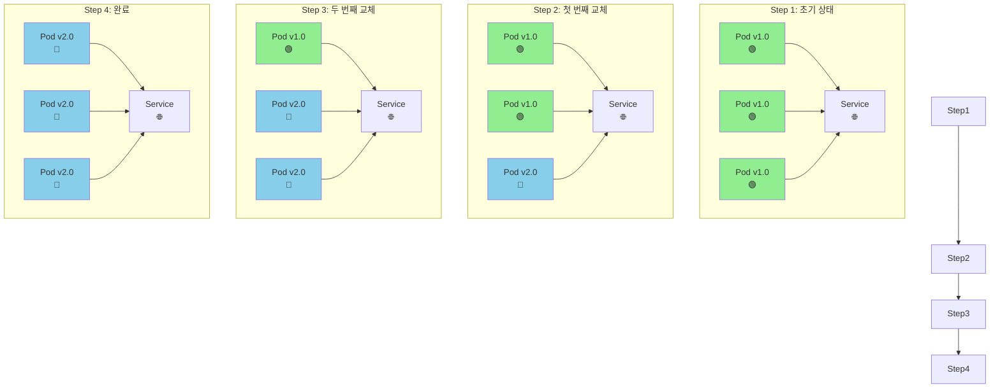
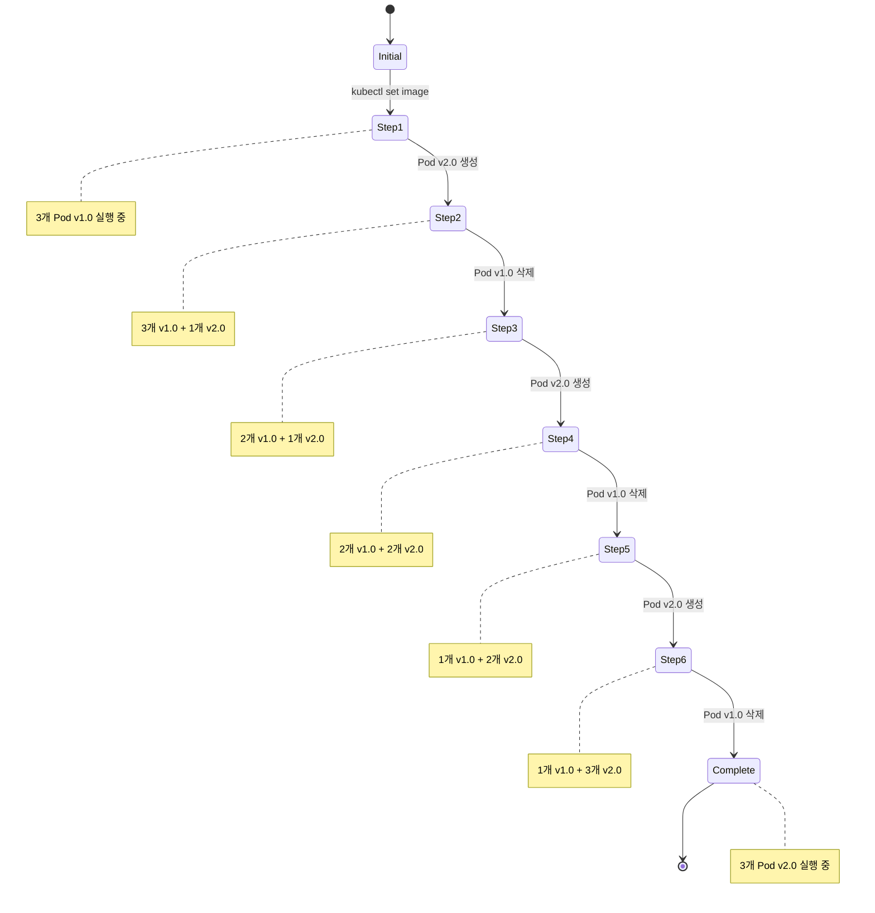

# Rolling Update 배포 전략

Rolling Update는 새로운 버전을 점진적으로 배포하여 서비스 중단을 최소화하는 배포 전략입니다.

## 개요

Rolling Update는 기존 파드들을 하나씩 새로운 버전으로 교체하는 방식입니다. 이 과정에서 항상 일정 수의 파드가 서비스를 제공하므로 무중단 배포가 가능합니다.

## 작동 원리



## 장점

- **무중단 배포**: 서비스 중단 없이 업데이트 가능
- **점진적 배포**: 한 번에 모든 인스턴스를 교체하지 않음
- **자동 롤백**: 문제 발생 시 이전 버전으로 자동 복구
- **리소스 효율성**: 추가 인프라 없이 배포 가능

## 단점

- **배포 시간**: 점진적 배포로 인한 긴 배포 시간
- **버전 혼재**: 배포 중에는 여러 버전이 동시에 실행
- **데이터베이스 호환성**: 스키마 변경 시 주의 필요

## Kubernetes에서의 구현

### Deployment 설정

```yaml
apiVersion: apps/v1
kind: Deployment
metadata:
  name: my-app
spec:
  replicas: 3
  strategy:
    type: RollingUpdate
    rollingUpdate:
      maxSurge: 1 # 최대 추가 파드 수
      maxUnavailable: 1 # 최대 사용 불가 파드 수
  selector:
    matchLabels:
      app: my-app
  template:
    metadata:
      labels:
        app: my-app
    spec:
      containers:
        - name: my-app
          image: my-app:v1.0
```

### 배포 명령어

```bash
# 이미지 업데이트로 Rolling Update 시작
kubectl set image deployment/my-app my-app=my-app:v2.0

# 배포 상태 확인
kubectl rollout status deployment/my-app

# 배포 진행 상황 모니터링
kubectl get pods -l app=my-app -w

# 배포 일시정지
kubectl rollout pause deployment/my-app

# 배포 재개
kubectl rollout resume deployment/my-app

# 롤백
kubectl rollout undo deployment/my-app
```

## 배포 과정 상세



## 설정 옵션

### maxSurge

- 배포 중 생성할 수 있는 최대 추가 파드 수
- 기본값: 25% (최소 1개)

### maxUnavailable

- 배포 중 사용 불가능한 최대 파드 수
- 기본값: 25% (최소 1개)

```yaml
strategy:
  type: RollingUpdate
  rollingUpdate:
    maxSurge: 2 # 최대 2개 추가 파드 허용
    maxUnavailable: 0 # 사용 불가 파드 없음 (100% 가용성)
```

## 모니터링 및 디버깅

```bash
# 배포 상태 확인
kubectl rollout status deployment/my-app

# 배포 히스토리
kubectl rollout history deployment/my-app

# ReplicaSet 확인
kubectl get rs -l app=my-app

# 파드 상태 확인
kubectl get pods -l app=my-app

# 이벤트 확인
kubectl get events --sort-by='.lastTimestamp'
```

## 베스트 프랙티스

1. **적절한 replica 수**: 최소 2개 이상의 replica 유지
2. **Health Check**: Readiness/Liveness Probe 설정
3. **점진적 배포**: maxSurge와 maxUnavailable 조정
4. **모니터링**: 배포 후 메트릭과 로그 확인
5. **롤백 준비**: 문제 발생 시 빠른 롤백 계획

## 사용 시나리오

- ✅ **웹 애플리케이션**: 무중단 서비스가 중요한 경우
- ✅ **API 서비스**: 지속적인 가용성이 필요한 경우
- ✅ **마이크로서비스**: 각 서비스의 독립적 배포
- ✅ **개발/스테이징 환경**: 안전한 배포 테스트

Rolling Update는 Kubernetes의 기본 배포 전략으로, 대부분의 애플리케이션에 적합한 안전하고 효율적인 배포 방식을 제공합니다.
