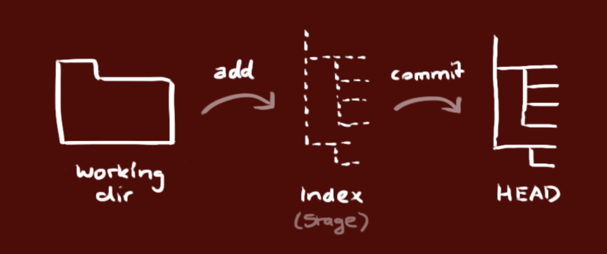
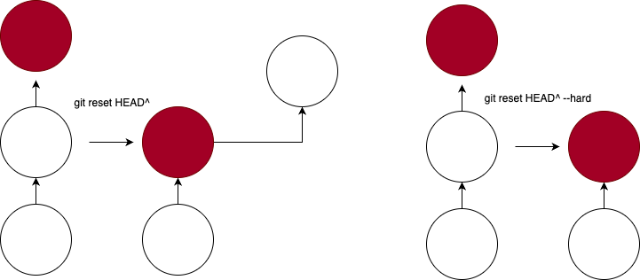

# Git 구성
- 작업 디렉토리(working directory)
    - 실제 파일들로 이루어져 있음
- 인덱스(Index)
    - 준비 영역(staging area)의 역할
- HEAD
    - 최종 확정본(commit)
    

    

# Branch
## branch는 안전하게 격리된 상태에서 작업을 할 때 사용
- 저장소를 만들면 기본이 `master` 브랜치이다.
- 다른 `branch`를 이용해서 개발을 진행하고, `master` 브랜로 돌아와 `merge` 한다.

# Git 명령어
- 원격 저장소 추가
- 기존에 있던 원격 저장를 추가할 때

```bash
git remote add origin <원격 서버 주소>
```

# 새로운 저장소 만들기
1. `git init` : 현재 폴더를 git 저장소로 만들기
2. 로컬 저장소를 복제(clone) 하기
    
```bash
git clone /로컬/저장소/경로
```
    
# 원격 서버의 저장소 복제
```bash
git clone 사용자명@호스트:/원격/저장소/경로
git clone https://githugib.com/[USERNAME]/[REPOSITORY_NAME].git
```
    

# git checkout
```bash
git checkout branchName
git checkout -b <branch name> //브랜치 생성 및 이
git checkout -d <branch name> //delete branch
git push origin <branch namem> //원격 저장소로 전송 전에는 다른 사용자들이 사용 불가
```

# git add

- 변경된 파일을 인덱스(staging area)에 추가

```bash
git add . => 해당 폴더의 모든 파일을 더하겠다
git add file_name => 해당 파일만 더하겠다
git add -i //파일을 추가할 때 대화식으로 추가하
```

# git commit
- 실제 변경 내용을 확정
- HEAD에 반영
- 원격 저장소에는 반영이 안된다.
- git push를 해야 remote에 반영된다.

## git commit 뜻
- 인덱스에 추가된 변경 내용 및 새로 생성한 파일은 남는다.
```bash
git checkout -- <파일 이름>
```

```bash
git commit -m "commit 내용"
git commit # 이 명령어만 치면 변겨 사항을 확인하는 상태로 작성할 수 있다.
```

# git pull
- 로컬 저장소를 원격 저장소와 동기화
- git pull = git fetch && git merge
    - 변경사항을 가져오고 현재 브랜치를 remote 브랜치로 업데이트한다.

```bash
git pull
```

# git push
- HEAD의 변경 내역을 서버로 올린다.
```bash
git push origin master # upstream을생성하지 않았을 때 사용
```

# git pull request 
- merge를 해도 되는지를 요청
```bash
git pull request => 해당 변경사항에 대한 merge를 요청
```

# git merge 
- 소스 파일을 병합
```bash
git merge => 변경 사항들을 병합
git merge <branch name> //브랜치에 있는 변경 내용을 현재 브랜치에 병합(현재 branch is a branch name is master)
# ex) Current branch is dev
git merge master # master 내용을 dev에 합친다.
```

# reset 그림


# git status 
- 현재 폴더 상태를 나타낸다.
`git reset --hard HEAD` : HEAD로 되돌리기

`git reset --merge` : `branch|merging` 풀기

# Git Conflict
- 충돌 발생 시 충돌 부분을 수정해서 merge
```bash
git diff <원래 브랜치> <비교 대상 브랜치> //변경사항 비
git fetch --all
git reset --hard origin/master
git pull origin/master
```

# git log
- 로컬 변경 내용 되돌리기

## Rebase
### 브랜치 업데이트
```bash
git rebase staging
```
