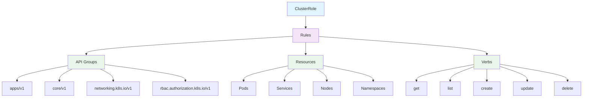

## ClusterRole 개요

ClusterRole은 Kubernetes에서 클러스터 전체 범위의 권한을 정의하는 리소스입니다. 모든 네임스페이스에 적용되며, 클러스터 관리자나 시스템 컴포넌트가 사용하는 권한을 정의합니다.

### ClusterRole의 특징

1. **클러스터 범위**: 모든 네임스페이스에 적용
2. **시스템 권한**: 클러스터 관리자 권한 정의
3. **네임스페이스 리소스**: 모든 네임스페이스의 리소스에 접근
4. **클러스터 리소스**: Node, PersistentVolume 등 클러스터 리소스 접근

---

## ClusterRole 구조



---

## ClusterRole 예시

### 기본 ClusterRole

```yaml
apiVersion: rbac.authorization.k8s.io/v1
kind: ClusterRole
metadata:
  name: pod-reader
rules:
  - apiGroups: [""]
    resources: ["pods"]
    verbs: ["get", "list", "watch"]
```

### 관리자 ClusterRole

```yaml
apiVersion: rbac.authorization.k8s.io/v1
kind: ClusterRole
metadata:
  name: cluster-admin
rules:
  # 모든 리소스에 대한 모든 권한
  - apiGroups: ["*"]
    resources: ["*"]
    verbs: ["*"]
  # 모든 네임스페이스 접근
  - apiGroups: [""]
    resources: ["namespaces"]
    verbs: ["*"]
```

### 시스템 ClusterRole

```yaml
apiVersion: rbac.authorization.k8s.io/v1
kind: ClusterRole
metadata:
  name: system:node
rules:
  # 노드 리소스 관리
  - apiGroups: [""]
    resources: ["nodes"]
    verbs: ["get", "list", "watch", "update", "patch"]
  # Pod 관리
  - apiGroups: [""]
    resources: ["pods", "pods/binding", "pods/eviction"]
    verbs: ["get", "list", "watch", "create", "update", "patch", "delete"]
  # 서비스 관리
  - apiGroups: [""]
    resources: ["services", "endpoints"]
    verbs: ["get", "list", "watch", "create", "update", "patch", "delete"]
```

---

## ClusterRole 타입

### 1. 읽기 전용 ClusterRole

```yaml
apiVersion: rbac.authorization.k8s.io/v1
kind: ClusterRole
metadata:
  name: cluster-reader
rules:
  # 모든 네임스페이스의 리소스 읽기
  - apiGroups: [""]
    resources:
      ["pods", "services", "configmaps", "secrets", "persistentvolumeclaims"]
    verbs: ["get", "list", "watch"]
  - apiGroups: ["apps"]
    resources: ["deployments", "replicasets", "statefulsets"]
    verbs: ["get", "list", "watch"]
  # 클러스터 리소스 읽기
  - apiGroups: [""]
    resources: ["nodes", "namespaces"]
    verbs: ["get", "list", "watch"]
```

### 2. 관리자 ClusterRole

```yaml
apiVersion: rbac.authorization.k8s.io/v1
kind: ClusterRole
metadata:
  name: cluster-manager
rules:
  # 모든 리소스 관리
  - apiGroups: ["*"]
    resources: ["*"]
    verbs: ["*"]
  # 네임스페이스 관리
  - apiGroups: [""]
    resources: ["namespaces"]
    verbs: ["get", "list", "watch", "create", "update", "patch", "delete"]
  # RBAC 관리
  - apiGroups: ["rbac.authorization.k8s.io"]
    resources: ["clusterroles", "clusterrolebindings", "roles", "rolebindings"]
    verbs: ["get", "list", "watch", "create", "update", "patch", "delete"]
```

### 3. 모니터링 ClusterRole

```yaml
apiVersion: rbac.authorization.k8s.io/v1
kind: ClusterRole
metadata:
  name: monitoring
rules:
  # 모든 리소스 읽기
  - apiGroups: [""]
    resources: ["pods", "services", "nodes", "namespaces", "events"]
    verbs: ["get", "list", "watch"]
  - apiGroups: ["apps"]
    resources: ["deployments", "replicasets", "statefulsets"]
    verbs: ["get", "list", "watch"]
  # Pod 로그 읽기
  - apiGroups: [""]
    resources: ["pods/log"]
    verbs: ["get", "list"]
  # 메트릭 수집
  - apiGroups: [""]
    resources: ["nodes/proxy"]
    verbs: ["get", "list", "watch"]
```

---

## ClusterRole과 ClusterRoleBinding 조합

### ClusterRoleBinding 예시

```yaml
apiVersion: rbac.authorization.k8s.io/v1
kind: ClusterRoleBinding
metadata:
  name: cluster-admin-binding
subjects:
  - kind: User
    name: admin@example.com
    apiGroup: rbac.authorization.k8s.io
roleRef:
  kind: ClusterRole
  name: cluster-admin
  apiGroup: rbac.authorization.k8s.io
```

### 여러 ClusterRole을 사용자에게 할당

```yaml
# 첫 번째 ClusterRole
apiVersion: rbac.authorization.k8s.io/v1
kind: ClusterRole
metadata:
  name: cluster-reader
rules:
  - apiGroups: [""]
    resources: ["pods", "services"]
    verbs: ["get", "list", "watch"]
---
# 두 번째 ClusterRole
apiVersion: rbac.authorization.k8s.io/v1
kind: ClusterRole
metadata:
  name: namespace-manager
rules:
  - apiGroups: [""]
    resources: ["namespaces"]
    verbs: ["get", "list", "watch", "create", "update", "patch", "delete"]
---
# 첫 번째 ClusterRoleBinding
apiVersion: rbac.authorization.k8s.io/v1
kind: ClusterRoleBinding
metadata:
  name: cluster-reader-binding
subjects:
  - kind: User
    name: user@example.com
    apiGroup: rbac.authorization.k8s.io
roleRef:
  kind: ClusterRole
  name: cluster-reader
  apiGroup: rbac.authorization.k8s.io
---
# 두 번째 ClusterRoleBinding
apiVersion: rbac.authorization.k8s.io/v1
kind: ClusterRoleBinding
metadata:
  name: namespace-manager-binding
subjects:
  - kind: User
    name: user@example.com
    apiGroup: rbac.authorization.k8s.io
roleRef:
  kind: ClusterRole
  name: namespace-manager
  apiGroup: rbac.authorization.k8s.io
```

---

## ClusterRole 관리 명령어

### 기본 명령어

```bash
# ClusterRole 생성
kubectl apply -f clusterrole.yaml

# ClusterRole 목록 확인
kubectl get clusterroles

# ClusterRole 상세 정보 확인
kubectl describe clusterrole <clusterrole-name>

# ClusterRole 삭제
kubectl delete clusterrole <clusterrole-name>

# ClusterRole YAML 확인
kubectl get clusterrole <clusterrole-name> -o yaml
```

### 권한 테스트

```bash
# 사용자 권한 확인
kubectl auth can-i get pods --as=user@example.com --all-namespaces

# 특정 동작 권한 확인
kubectl auth can-i create namespaces --as=user@example.com

# 모든 권한 확인
kubectl auth can-i --list --as=user@example.com --all-namespaces
```

---

## ClusterRole 사용 사례

### 1. 클러스터 관리자

```yaml
apiVersion: rbac.authorization.k8s.io/v1
kind: ClusterRole
metadata:
  name: cluster-admin
rules:
  # 모든 리소스에 대한 모든 권한
  - apiGroups: ["*"]
    resources: ["*"]
    verbs: ["*"]
  # 모든 네임스페이스 접근
  - apiGroups: [""]
    resources: ["namespaces"]
    verbs: ["*"]
  # RBAC 관리
  - apiGroups: ["rbac.authorization.k8s.io"]
    resources: ["clusterroles", "clusterrolebindings", "roles", "rolebindings"]
    verbs: ["*"]
```

### 2. 시스템 모니터링

```yaml
apiVersion: rbac.authorization.k8s.io/v1
kind: ClusterRole
metadata:
  name: system:monitoring
rules:
  # 모든 네임스페이스의 리소스 읽기
  - apiGroups: [""]
    resources: ["pods", "services", "nodes", "events"]
    verbs: ["get", "list", "watch"]
  - apiGroups: ["apps"]
    resources: ["deployments", "replicasets", "statefulsets"]
    verbs: ["get", "list", "watch"]
  # Pod 로그 읽기
  - apiGroups: [""]
    resources: ["pods/log"]
    verbs: ["get", "list"]
  # 메트릭 수집
  - apiGroups: [""]
    resources: ["nodes/proxy"]
    verbs: ["get", "list", "watch"]
  # ConfigMap 관리 (설정용)
  - apiGroups: [""]
    resources: ["configmaps"]
    verbs: ["get", "list", "watch", "create", "update", "patch", "delete"]
```

### 3. 네임스페이스 관리자

```yaml
apiVersion: rbac.authorization.k8s.io/v1
kind: ClusterRole
metadata:
  name: namespace-manager
rules:
  # 네임스페이스 관리
  - apiGroups: [""]
    resources: ["namespaces"]
    verbs: ["get", "list", "watch", "create", "update", "patch", "delete"]
  # 네임스페이스 내 리소스 관리
  - apiGroups: [""]
    resources: ["pods", "services", "configmaps", "secrets"]
    verbs: ["get", "list", "watch", "create", "update", "patch", "delete"]
  - apiGroups: ["apps"]
    resources: ["deployments", "replicasets", "statefulsets"]
    verbs: ["get", "list", "watch", "create", "update", "patch", "delete"]
  # Role과 RoleBinding 관리
  - apiGroups: ["rbac.authorization.k8s.io"]
    resources: ["roles", "rolebindings"]
    verbs: ["get", "list", "watch", "create", "update", "patch", "delete"]
```

---

## ClusterRole vs Role

| 특징             | ClusterRole          | Role               |
| ---------------- | -------------------- | ------------------ |
| **범위**         | 클러스터 전체        | 네임스페이스       |
| **네임스페이스** | 모든 네임스페이스    | 특정 네임스페이스  |
| **사용 사례**    | 클러스터 관리자 권한 | 일반적인 권한 관리 |
| **바인딩**       | ClusterRoleBinding   | RoleBinding        |

---

## ClusterRole 모범 사례

### 1. 최소 권한 원칙

```yaml
# 필요한 최소한의 권한만 부여
apiVersion: rbac.authorization.k8s.io/v1
kind: ClusterRole
metadata:
  name: minimal-cluster-reader
rules:
  - apiGroups: [""]
    resources: ["pods", "services"]
    verbs: ["get", "list"] # watch 권한 제거
```

### 2. 명확한 네이밍

```yaml
# 역할을 명확히 하는 이름 사용
apiVersion: rbac.authorization.k8s.io/v1
kind: ClusterRole
metadata:
  name: cluster-namespace-manager # 명확한 역할
rules:
  - apiGroups: [""]
    resources: ["namespaces"]
    verbs: ["get", "list", "watch", "create", "update", "patch", "delete"]
```

### 3. 리소스별 분리

```yaml
# 노드 관리 ClusterRole
apiVersion: rbac.authorization.k8s.io/v1
kind: ClusterRole
metadata:
  name: node-manager
rules:
  - apiGroups: [""]
    resources: ["nodes"]
    verbs: ["get", "list", "watch", "update", "patch"]
---
# 네임스페이스 관리 ClusterRole
apiVersion: rbac.authorization.k8s.io/v1
kind: ClusterRole
metadata:
  name: namespace-manager
rules:
  - apiGroups: [""]
    resources: ["namespaces"]
    verbs: ["get", "list", "watch", "create", "update", "patch", "delete"]
```

---

## 주의사항

1. **최소 권한**: 필요한 최소한의 권한만 부여해야 합니다
2. **정기 검토**: ClusterRole과 권한을 정기적으로 검토해야 합니다
3. **테스트**: 권한 설정 후 실제 테스트를 통해 검증해야 합니다
4. **문서화**: ClusterRole의 목적과 권한을 명확히 문서화해야 합니다
5. **보안**: 클러스터 전체 권한이므로 보안에 특히 주의해야 합니다
