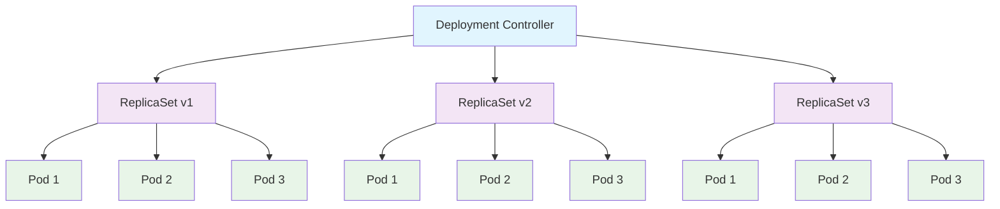
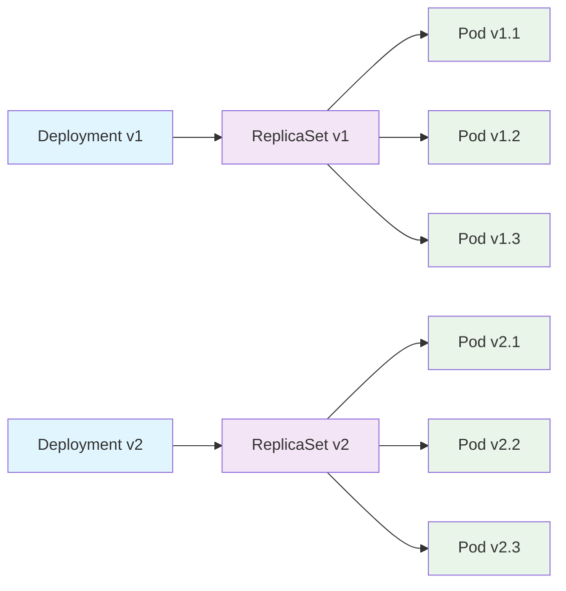

## Deployment 개요

Deployment는 Kubernetes에서 가장 일반적으로 사용되는 워크로드 리소스입니다. Pod와 ReplicaSet을 관리하여 애플리케이션의 배포, 업데이트, 스케일링을 자동화합니다.

### Deployment의 특징

1. **선언적 업데이트**: 원하는 상태를 선언하면 자동으로 현재 상태를 목표 상태로 변경
2. **롤링 업데이트**: 무중단 배포를 위한 점진적 업데이트
3. **롤백 기능**: 이전 버전으로 쉽게 되돌릴 수 있음
4. **스케일링**: Pod 개수를 쉽게 조정 가능
5. **Pod 셀렉터**: 라벨 기반으로 관리할 Pod를 선택

---

## Deployment 구조



---

## Deployment 셀렉터

### Pod 셀렉터 (Pod Selector)

Deployment는 `selector` 필드를 통해 관리할 Pod를 선택합니다. 셀렉터는 라벨을 기반으로 하며, 해당 라벨을 가진 Pod들을 Deployment가 관리합니다.

#### 기본 셀렉터 구조

```yaml
apiVersion: apps/v1
kind: Deployment
metadata:
  name: nginx-deployment
spec:
  replicas: 3
  selector:
    matchLabels:
      app: nginx
      tier: frontend
  template:
    metadata:
      labels:
        app: nginx
        tier: frontend
    spec:
      containers:
        - name: nginx
          image: nginx:1.14.2
```

#### 고급 셀렉터 (Set-based)

```yaml
apiVersion: apps/v1
kind: Deployment
metadata:
  name: advanced-deployment
spec:
  replicas: 3
  selector:
    matchExpressions:
      - key: app
        operator: In
        values: ["nginx", "web"]
      - key: environment
        operator: NotIn
        values: ["test", "dev"]
      - key: tier
        operator: Exists
  template:
    metadata:
      labels:
        app: nginx
        environment: production
        tier: frontend
    spec:
      containers:
        - name: nginx
          image: nginx:1.14.2
```

### 셀렉터 규칙

1. **라벨 일치**: `template.metadata.labels`는 반드시 `selector`와 일치해야 함
2. **불변성**: Deployment 생성 후 `selector`는 변경할 수 없음
3. **고유성**: 동일한 네임스페이스에서 셀렉터가 겹치면 안 됨

### 셀렉터 디버깅

```bash
# 셀렉터로 Pod 확인
kubectl get pods -l app=nginx

# 셀렉터 매칭 확인
kubectl get pods --show-labels -l app=nginx

# 셀렉터가 매칭하는 Pod 수 확인
kubectl get pods -l app=nginx --no-headers | wc -l

# 셀렉터 문제 진단
kubectl describe deployment nginx-deployment
```

---

## Deployment 예시

### 기본 Deployment

```yaml
apiVersion: apps/v1
kind: Deployment
metadata:
  name: nginx-deployment
  labels:
    app: nginx
spec:
  replicas: 3
  selector:
    matchLabels:
      app: nginx
  template:
    metadata:
      labels:
        app: nginx
    spec:
      containers:
        - name: nginx
          image: nginx:1.14.2
          ports:
            - containerPort: 80
          resources:
            requests:
              memory: "64Mi"
              cpu: "250m"
            limits:
              memory: "128Mi"
              cpu: "500m"
```

### 환경변수가 있는 Deployment

```yaml
apiVersion: apps/v1
kind: Deployment
metadata:
  name: web-app
  labels:
    app: web
spec:
  replicas: 2
  selector:
    matchLabels:
      app: web
  template:
    metadata:
      labels:
        app: web
    spec:
      containers:
        - name: web
          image: myapp:1.0
          ports:
            - containerPort: 8080
          env:
            - name: DATABASE_URL
              value: "postgresql://user:pass@db:5432/mydb"
            - name: API_KEY
              valueFrom:
                secretKeyRef:
                  name: app-secret
                  key: api-key
            - name: LOG_LEVEL
              value: "INFO"
          envFrom:
            - configMapRef:
                name: app-config
```

### 볼륨이 있는 Deployment

```yaml
apiVersion: apps/v1
kind: Deployment
metadata:
  name: app-with-storage
spec:
  replicas: 3
  selector:
    matchLabels:
      app: storage-app
  template:
    metadata:
      labels:
        app: storage-app
    spec:
      containers:
        - name: app
          image: myapp:1.0
          ports:
            - containerPort: 8080
          volumeMounts:
            - name: config-volume
              mountPath: /app/config
            - name: data-volume
              mountPath: /app/data
      volumes:
        - name: config-volume
          configMap:
            name: app-config
        - name: data-volume
          persistentVolumeClaim:
            claimName: app-data-pvc
```

---

## Deployment 업데이트 전략

### Rolling Update (기본값)

```yaml
apiVersion: apps/v1
kind: Deployment
metadata:
  name: rolling-update-deployment
spec:
  replicas: 5
  strategy:
    type: RollingUpdate
    rollingUpdate:
      maxSurge: 1 # 최대 추가 Pod 수
      maxUnavailable: 1 # 최대 사용 불가 Pod 수
  selector:
    matchLabels:
      app: nginx
  template:
    metadata:
      labels:
        app: nginx
    spec:
      containers:
        - name: nginx
          image: nginx:1.14.2
          ports:
            - containerPort: 80
```

### Recreate 전략

```yaml
apiVersion: apps/v1
kind: Deployment
metadata:
  name: recreate-deployment
spec:
  replicas: 3
  strategy:
    type: Recreate # 모든 Pod를 삭제 후 새로 생성
  selector:
    matchLabels:
      app: app
  template:
    metadata:
      labels:
        app: app
    spec:
      containers:
        - name: app
          image: myapp:1.0
          ports:
            - containerPort: 8080
```

---

## Deployment 업데이트 과정



---

## Deployment 관리 명령어

### 기본 명령어

```bash
# Deployment 생성
kubectl apply -f deployment.yaml

# Deployment 목록 확인
kubectl get deployments
kubectl get deployments -o wide

# Deployment 상세 정보 확인
kubectl describe deployment <deployment-name>

# Deployment 스케일링
kubectl scale deployment <deployment-name> --replicas=5

# Deployment 삭제
kubectl delete deployment <deployment-name>
```

### 업데이트 명령어

```bash
# 이미지 업데이트
kubectl set image deployment/<deployment-name> <container-name>=<new-image>

# 환경변수 설정
kubectl set env deployment/<deployment-name> KEY=value

# 롤아웃 상태 확인
kubectl rollout status deployment/<deployment-name>

# 롤아웃 히스토리 확인
kubectl rollout history deployment/<deployment-name>

# 이전 버전으로 롤백
kubectl rollout undo deployment/<deployment-name>

# 특정 리비전으로 롤백
kubectl rollout undo deployment/<deployment-name> --to-revision=2

# 롤아웃 일시 중지
kubectl rollout pause deployment/<deployment-name>

# 롤아웃 재개
kubectl rollout resume deployment/<deployment-name>
```

---

## Deployment 상태 모니터링

### 상태 확인

```bash
# Deployment 상태
kubectl get deployment nginx-deployment

# Pod 상태
kubectl get pods -l app=nginx

# ReplicaSet 상태
kubectl get rs -l app=nginx

# 이벤트 확인
kubectl get events --sort-by='.lastTimestamp'

# 로그 확인
kubectl logs -l app=nginx
```

### 상태 설명

| 상태               | 설명                                          |
| ------------------ | --------------------------------------------- |
| **Available**      | 최소 요구 복제본 수가 사용 가능               |
| **Progressing**    | 새로운 ReplicaSet이 생성 중이거나 업데이트 중 |
| **ReplicaFailure** | ReplicaSet 생성 중 오류 발생                  |
| **Condition**      | Deployment의 현재 상태를 나타내는 조건들      |

---

## Deployment 사용 사례

### 1. 웹 애플리케이션

```yaml
apiVersion: apps/v1
kind: Deployment
metadata:
  name: web-app
  labels:
    app: web
spec:
  replicas: 3
  selector:
    matchLabels:
      app: web
  template:
    metadata:
      labels:
        app: web
    spec:
      containers:
        - name: web
          image: nginx:1.14.2
          ports:
            - containerPort: 80
          livenessProbe:
            httpGet:
              path: /
              port: 80
            initialDelaySeconds: 30
            periodSeconds: 10
          readinessProbe:
            httpGet:
              path: /
              port: 80
            initialDelaySeconds: 5
            periodSeconds: 5
```

### 2. API 서버

```yaml
apiVersion: apps/v1
kind: Deployment
metadata:
  name: api-server
spec:
  replicas: 5
  selector:
    matchLabels:
      app: api
  template:
    metadata:
      labels:
        app: api
    spec:
      containers:
        - name: api
          image: myapi:2.0
          ports:
            - containerPort: 8080
          env:
            - name: NODE_ENV
              value: "production"
            - name: DB_HOST
              valueFrom:
                configMapKeyRef:
                  name: api-config
                  key: database_host
          resources:
            requests:
              memory: "256Mi"
              cpu: "500m"
            limits:
              memory: "512Mi"
              cpu: "1000m"
```

---

## Deployment vs StatefulSet

| 특징           | Deployment                | StatefulSet                     |
| -------------- | ------------------------- | ------------------------------- |
| **Pod 식별자** | 임의의 이름               | 고유한 이름 (app-0, app-1, ...) |
| **스토리지**   | 공유 스토리지             | 각 Pod마다 고유한 PVC           |
| **네트워크**   | 공통 서비스 이름          | 고유한 DNS 이름                 |
| **확장 순서**  | 무작위 순서               | 순서대로 확장/축소              |
| **용도**       | 웹 애플리케이션, API 서버 | 데이터베이스, 메시징 시스템     |

---

## 주의사항

1. **리소스 제한**: 적절한 리소스 요청과 제한을 설정해야 합니다
2. **헬스 체크**: livenessProbe와 readinessProbe를 설정하여 안정성을 확보해야 합니다
3. **업데이트 전략**: 애플리케이션 특성에 맞는 업데이트 전략을 선택해야 합니다
4. **모니터링**: Deployment의 상태와 메트릭을 지속적으로 모니터링해야 합니다
5. **백업**: 중요한 데이터는 적절한 백업 전략을 수립해야 합니다
