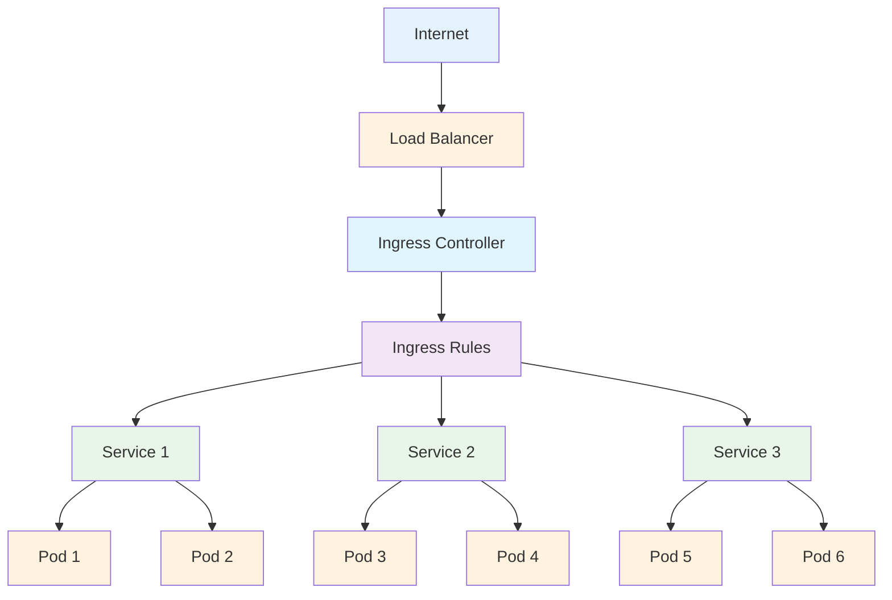

## Ingress 개요

Ingress는 Kubernetes에서 HTTP/HTTPS 트래픽을 클러스터 내부 서비스로 라우팅하는 API 객체입니다. 외부에서 클러스터로 들어오는 트래픽을 관리하고, SSL/TLS 종료, 가상 호스팅, 로드 밸런싱을 제공합니다.

### Ingress의 특징

1. **L7 로드 밸런싱**: 애플리케이션 레이어에서 트래픽 분산
2. **SSL/TLS 종료**: HTTPS 인증서 관리
3. **가상 호스팅**: 도메인 기반 라우팅
4. **Path 기반 라우팅**: URL 경로에 따른 서비스 분기
5. **인증서 관리**: 자동 SSL 인증서 발급 및 갱신

---

## Ingress 구조



---

## Ingress Controller

### Nginx Ingress Controller 설치

```bash
# Helm을 사용한 설치
helm repo add ingress-nginx https://kubernetes.github.io/ingress-nginx
helm repo update
helm install ingress-nginx ingress-nginx/ingress-nginx

# 또는 kubectl을 사용한 설치
kubectl apply -f https://raw.githubusercontent.com/kubernetes/ingress-nginx/controller-v1.8.2/deploy/static/provider/cloud/deploy.yaml
```

### AWS ALB Ingress Controller

```yaml
apiVersion: apps/v1
kind: Deployment
metadata:
  name: alb-ingress-controller
  namespace: kube-system
spec:
  replicas: 1
  selector:
    matchLabels:
      app: alb-ingress-controller
  template:
    metadata:
      labels:
        app: alb-ingress-controller
    spec:
      serviceAccountName: alb-ingress-controller
      containers:
        - name: alb-ingress-controller
          image: amazon/aws-alb-ingress-controller:v2.4.2
          args:
            - --ingress-class=alb
            - --cluster-name=my-cluster
```

---

## Ingress 예시

### 기본 Ingress

```yaml
apiVersion: networking.k8s.io/v1
kind: Ingress
metadata:
  name: basic-ingress
  annotations:
    nginx.ingress.kubernetes.io/rewrite-target: /
spec:
  ingressClassName: nginx
  rules:
    - host: example.com
      http:
        paths:
          - path: /
            pathType: Prefix
            backend:
              service:
                name: web-service
                port:
                  number: 80
```

### 다중 서비스 Ingress

```yaml
apiVersion: networking.k8s.io/v1
kind: Ingress
metadata:
  name: multi-service-ingress
  annotations:
    nginx.ingress.kubernetes.io/rewrite-target: /$2
spec:
  ingressClassName: nginx
  rules:
    - host: example.com
      http:
        paths:
          - path: /api(/|$)(.*)
            pathType: Prefix
            backend:
              service:
                name: api-service
                port:
                  number: 8080
          - path: /web(/|$)(.*)
            pathType: Prefix
            backend:
              service:
                name: web-service
                port:
                  number: 80
          - path: /admin(/|$)(.*)
            pathType: Prefix
            backend:
              service:
                name: admin-service
                port:
                  number: 8080
```

### SSL/TLS Ingress

```yaml
apiVersion: networking.k8s.io/v1
kind: Ingress
metadata:
  name: tls-ingress
  annotations:
    cert-manager.io/cluster-issuer: "letsencrypt-prod"
spec:
  ingressClassName: nginx
  tls:
    - hosts:
        - example.com
        - www.example.com
      secretName: example-tls
  rules:
    - host: example.com
      http:
        paths:
          - path: /
            pathType: Prefix
            backend:
              service:
                name: web-service
                port:
                  number: 80
    - host: www.example.com
      http:
        paths:
          - path: /
            pathType: Prefix
            backend:
              service:
                name: web-service
                port:
                  number: 80
```

---

## Ingress 타입

### 1. 단일 서비스 Ingress

```yaml
apiVersion: networking.k8s.io/v1
kind: Ingress
metadata:
  name: single-service-ingress
spec:
  ingressClassName: nginx
  defaultBackend:
    service:
      name: default-service
      port:
        number: 80
```

### 2. 가상 호스팅 Ingress

```yaml
apiVersion: networking.k8s.io/v1
kind: Ingress
metadata:
  name: virtual-hosting-ingress
spec:
  ingressClassName: nginx
  rules:
    - host: foo.example.com
      http:
        paths:
          - path: /
            pathType: Prefix
            backend:
              service:
                name: foo-service
                port:
                  number: 80
    - host: bar.example.com
      http:
        paths:
          - path: /
            pathType: Prefix
            backend:
              service:
                name: bar-service
                port:
                  number: 80
```

### 3. Path 기반 Ingress

```yaml
apiVersion: networking.k8s.io/v1
kind: Ingress
metadata:
  name: path-based-ingress
  annotations:
    nginx.ingress.kubernetes.io/rewrite-target: /$2
spec:
  ingressClassName: nginx
  rules:
    - host: example.com
      http:
        paths:
          - path: /api(/|$)(.*)
            pathType: Prefix
            backend:
              service:
                name: api-service
                port:
                  number: 8080
          - path: /web(/|$)(.*)
            pathType: Prefix
            backend:
              service:
                name: web-service
                port:
                  number: 80
          - path: /admin(/|$)(.*)
            pathType: Prefix
            backend:
              service:
                name: admin-service
                port:
                  number: 8080
```

---

## Ingress Annotations

### Nginx Ingress Annotations

```yaml
apiVersion: networking.k8s.io/v1
kind: Ingress
metadata:
  name: annotated-ingress
  annotations:
    # 기본 설정
    nginx.ingress.kubernetes.io/rewrite-target: /
    nginx.ingress.kubernetes.io/ssl-redirect: "true"

    # 로드 밸런싱
    nginx.ingress.kubernetes.io/load-balance: "round_robin"
    nginx.ingress.kubernetes.io/upstream-hash-by: "$remote_addr"

    # 세션 어피니티
    nginx.ingress.kubernetes.io/affinity: "cookie"
    nginx.ingress.kubernetes.io/session-cookie-name: "route"
    nginx.ingress.kubernetes.io/session-cookie-max-age: "172800"

    # 속도 제한
    nginx.ingress.kubernetes.io/rate-limit: "100"
    nginx.ingress.kubernetes.io/rate-limit-window: "1m"

    # CORS
    nginx.ingress.kubernetes.io/cors-allow-origin: "*"
    nginx.ingress.kubernetes.io/cors-allow-methods: "GET, POST, OPTIONS"
    nginx.ingress.kubernetes.io/cors-allow-headers: "DNT,User-Agent,X-Requested-With,If-Modified-Since,Cache-Control,Content-Type,Range,Authorization"

    # 인증
    nginx.ingress.kubernetes.io/auth-type: basic
    nginx.ingress.kubernetes.io/auth-secret: basic-auth
    nginx.ingress.kubernetes.io/auth-realm: "Authentication Required"
spec:
  ingressClassName: nginx
  rules:
    - host: example.com
      http:
        paths:
          - path: /
            pathType: Prefix
            backend:
              service:
                name: web-service
                port:
                  number: 80
```

---

## SSL/TLS 설정

### 자동 SSL 인증서 (cert-manager)

```yaml
apiVersion: cert-manager.io/v1
kind: ClusterIssuer
metadata:
  name: letsencrypt-prod
spec:
  acme:
    server: https://acme-v02.api.letsencrypt.org/directory
    email: admin@example.com
    privateKeySecretRef:
      name: letsencrypt-prod
    solvers:
      - http01:
          ingress:
            class: nginx
---
apiVersion: networking.k8s.io/v1
kind: Ingress
metadata:
  name: ssl-ingress
  annotations:
    cert-manager.io/cluster-issuer: "letsencrypt-prod"
spec:
  ingressClassName: nginx
  tls:
    - hosts:
        - example.com
      secretName: example-tls
  rules:
    - host: example.com
      http:
        paths:
          - path: /
            pathType: Prefix
            backend:
              service:
                name: web-service
                port:
                  number: 80
```

### 수동 SSL 인증서

```yaml
apiVersion: v1
kind: Secret
metadata:
  name: tls-secret
type: kubernetes.io/tls
data:
  tls.crt: <base64-encoded-certificate>
  tls.key: <base64-encoded-private-key>
---
apiVersion: networking.k8s.io/v1
kind: Ingress
metadata:
  name: manual-ssl-ingress
spec:
  ingressClassName: nginx
  tls:
    - hosts:
        - example.com
      secretName: tls-secret
  rules:
    - host: example.com
      http:
        paths:
          - path: /
            pathType: Prefix
            backend:
              service:
                name: web-service
                port:
                  number: 80
```

---

## Ingress 관리 명령어

### 기본 명령어

```bash
# Ingress 생성
kubectl apply -f ingress.yaml

# Ingress 목록 확인
kubectl get ingress
kubectl get ing

# Ingress 상세 정보 확인
kubectl describe ingress <ingress-name>

# Ingress 삭제
kubectl delete ingress <ingress-name>

# Ingress 상태 확인
kubectl get ingress <ingress-name> -o yaml
```

### 디버깅 명령어

```bash
# Ingress Controller 로그 확인
kubectl logs -n ingress-nginx -l app.kubernetes.io/name=ingress-nginx

# Ingress Controller 상태 확인
kubectl get pods -n ingress-nginx

# SSL 인증서 확인
kubectl get secrets

# DNS 확인
kubectl run test-dns --image=busybox --rm -it --restart=Never -- nslookup <hostname>
```

---

## Ingress 사용 사례

### 1. 마이크로서비스 아키텍처

```yaml
apiVersion: networking.k8s.io/v1
kind: Ingress
metadata:
  name: microservices-ingress
  annotations:
    nginx.ingress.kubernetes.io/rewrite-target: /$2
spec:
  ingressClassName: nginx
  rules:
    - host: api.example.com
      http:
        paths:
          - path: /users(/|$)(.*)
            pathType: Prefix
            backend:
              service:
                name: user-service
                port:
                  number: 8080
          - path: /orders(/|$)(.*)
            pathType: Prefix
            backend:
              service:
                name: order-service
                port:
                  number: 8080
          - path: /products(/|$)(.*)
            pathType: Prefix
            backend:
              service:
                name: product-service
                port:
                  number: 8080
```

### 2. 프론트엔드/백엔드 분리

```yaml
apiVersion: networking.k8s.io/v1
kind: Ingress
metadata:
  name: frontend-backend-ingress
spec:
  ingressClassName: nginx
  rules:
    - host: example.com
      http:
        paths:
          - path: /
            pathType: Prefix
            backend:
              service:
                name: frontend-service
                port:
                  number: 80
    - host: api.example.com
      http:
        paths:
          - path: /
            pathType: Prefix
            backend:
              service:
                name: backend-service
                port:
                  number: 8080
```

### 3. A/B 테스팅

```yaml
apiVersion: networking.k8s.io/v1
kind: Ingress
metadata:
  name: ab-testing-ingress
  annotations:
    nginx.ingress.kubernetes.io/canary: "true"
    nginx.ingress.kubernetes.io/canary-weight: "20"
spec:
  ingressClassName: nginx
  rules:
    - host: example.com
      http:
        paths:
          - path: /
            pathType: Prefix
            backend:
              service:
                name: new-version-service
                port:
                  number: 80
---
apiVersion: networking.k8s.io/v1
kind: Ingress
metadata:
  name: stable-ingress
spec:
  ingressClassName: nginx
  rules:
    - host: example.com
      http:
        paths:
          - path: /
            pathType: Prefix
            backend:
              service:
                name: stable-version-service
                port:
                  number: 80
```

---

## Ingress 보안

### NetworkPolicy

```yaml
apiVersion: networking.k8s.io/v1
kind: NetworkPolicy
metadata:
  name: ingress-network-policy
spec:
  podSelector:
    matchLabels:
      app: web
  policyTypes:
    - Ingress
  ingress:
    - from:
        - namespaceSelector:
            matchLabels:
              name: ingress-nginx
      ports:
        - protocol: TCP
          port: 80
```

### 인증 및 권한 부여

```yaml
apiVersion: v1
kind: Secret
metadata:
  name: basic-auth
type: Opaque
data:
  auth: <base64-encoded-htpasswd>
---
apiVersion: networking.k8s.io/v1
kind: Ingress
metadata:
  name: auth-ingress
  annotations:
    nginx.ingress.kubernetes.io/auth-type: basic
    nginx.ingress.kubernetes.io/auth-secret: basic-auth
    nginx.ingress.kubernetes.io/auth-realm: "Authentication Required"
spec:
  ingressClassName: nginx
  rules:
    - host: secure.example.com
      http:
        paths:
          - path: /
            pathType: Prefix
            backend:
              service:
                name: secure-service
                port:
                  number: 80
```

---

## Ingress 모니터링

### 메트릭 수집

```yaml
apiVersion: v1
kind: ConfigMap
metadata:
  name: nginx-configuration
  namespace: ingress-nginx
data:
  enable-real-ip: "true"
  use-proxy-protocol: "true"
  proxy-real-ip-cidr: "0.0.0.0/0"
  enable-vts-status: "true"
```

### 로그 설정

```yaml
apiVersion: v1
kind: ConfigMap
metadata:
  name: nginx-configuration
  namespace: ingress-nginx
data:
  log-format-escape-json: "true"
  log-format-upstream: '{"time": "$time_iso8601", "remote_addr": "$proxy_protocol_addr", "x_forward_for": "$proxy_add_x_forwarded_for", "request_id": "$req_id", "remote_user": "$remote_user", "bytes_sent": $bytes_sent, "request_time": $request_time, "status": $status, "vhost": "$host", "request_proto": "$server_protocol", "path": "$uri", "request_query": "$args", "request_length": $request_length, "duration": $request_time,"method": "$request_method", "http_referrer": "$http_referer", "http_user_agent": "$http_user_agent" }'
```

---

## Ingress vs Service

| 특징                 | Ingress          | Service          |
| -------------------- | ---------------- | ---------------- |
| **OSI 레이어**       | L7 (Application) | L4 (Transport)   |
| **로드 밸런싱**      | 고급 로드 밸런싱 | 기본 로드 밸런싱 |
| **SSL/TLS**          | 지원             | 지원 안함        |
| **Path 기반 라우팅** | 지원             | 지원 안함        |
| **Host 기반 라우팅** | 지원             | 지원 안함        |
| **사용 사례**        | 외부 웹 트래픽   | 내부 서비스      |

---

## 주의사항

1. **Ingress Controller**: Ingress를 사용하려면 Ingress Controller가 설치되어 있어야 합니다
2. **SSL 인증서**: 자동 SSL 인증서를 사용하려면 cert-manager가 필요합니다
3. **네트워크 정책**: 보안을 위해 NetworkPolicy를 설정해야 합니다
4. **모니터링**: Ingress의 상태와 성능을 지속적으로 모니터링해야 합니다
5. **리소스 제한**: Ingress Controller에 적절한 리소스 제한을 설정해야 합니다
