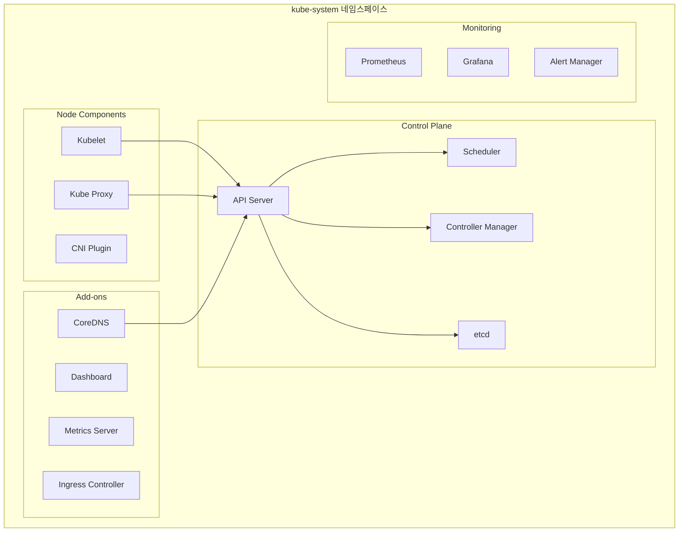

# kube-system

## 개요

kube-system은 Kubernetes 클러스터의 핵심 시스템 컴포넌트들이 실행되는 네임스페이스입니다. 클러스터의 정상적인 운영을 위해 필수적인 시스템 Pod, Service, ConfigMap 등이 이 네임스페이스에 위치합니다.

### 주요 특징

- **시스템 전용**: 클러스터 운영에 필수적인 컴포넌트들만 포함
- **보호된 네임스페이스**: 일반 사용자의 접근이 제한됨
- **자동 생성**: 클러스터 초기화 시 자동으로 생성
- **고가용성**: 클러스터의 안정적인 운영을 보장
- **모니터링**: 클러스터 상태 모니터링의 핵심

## 구조



## 주요 컴포넌트

### 1. Control Plane 컴포넌트

#### API Server

```yaml
apiVersion: v1
kind: Pod
metadata:
  name: kube-apiserver-master
  namespace: kube-system
  labels:
    component: kube-apiserver
    tier: control-plane
spec:
  containers:
    - name: kube-apiserver
      image: k8s.gcr.io/kube-apiserver:v1.24.0
      command:
        - kube-apiserver
        - --advertise-address=192.168.1.100
        - --allow-privileged=true
        - --authorization-mode=Node,RBAC
        - --client-ca-file=/etc/kubernetes/pki/ca.crt
        - --enable-admission-plugins=NodeRestriction
        - --enable-bootstrap-token-auth=true
        - --etcd-cafile=/etc/kubernetes/pki/etcd/ca.crt
        - --etcd-certfile=/etc/kubernetes/pki/apiserver-etcd-client.crt
        - --etcd-keyfile=/etc/kubernetes/pki/apiserver-etcd-client.key
        - --etcd-servers=https://127.0.0.1:2379
        - --kubelet-client-certificate=/etc/kubernetes/pki/apiserver-kubelet-client.crt
        - --kubelet-client-key=/etc/kubernetes/pki/apiserver-kubelet-client.key
        - --service-account-key-file=/etc/kubernetes/pki/sa.pub
        - --service-cluster-ip-range=10.96.0.0/12
        - --tls-cert-file=/etc/kubernetes/pki/apiserver.crt
        - --tls-private-key-file=/etc/kubernetes/pki/apiserver.key
      ports:
        - containerPort: 6443
          name: https
        - containerPort: 8080
          name: http
      volumeMounts:
        - name: k8s-certs
          mountPath: /etc/kubernetes/pki
          readOnly: true
        - name: kubeconfig
          mountPath: /etc/kubernetes/
          readOnly: true
```

#### Scheduler

```yaml
apiVersion: v1
kind: Pod
metadata:
  name: kube-scheduler-master
  namespace: kube-system
  labels:
    component: kube-scheduler
    tier: control-plane
spec:
  containers:
    - name: kube-scheduler
      image: k8s.gcr.io/kube-scheduler:v1.24.0
      command:
        - kube-scheduler
        - --authentication-kubeconfig=/etc/kubernetes/scheduler.conf
        - --authorization-kubeconfig=/etc/kubernetes/scheduler.conf
        - --bind-address=127.0.0.1
        - --kubeconfig=/etc/kubernetes/scheduler.conf
        - --leader-elect=true
        - --port=0
      volumeMounts:
        - name: kubeconfig
          mountPath: /etc/kubernetes
          readOnly: true
```

#### Controller Manager

```yaml
apiVersion: v1
kind: Pod
metadata:
  name: kube-controller-manager-master
  namespace: kube-system
  labels:
    component: kube-controller-manager
    tier: control-plane
spec:
  containers:
    - name: kube-controller-manager
      image: k8s.gcr.io/kube-controller-manager:v1.24.0
      command:
        - kube-controller-manager
        - --allocate-node-cidrs=true
        - --authentication-kubeconfig=/etc/kubernetes/controller-manager.conf
        - --authorization-kubeconfig=/etc/kubernetes/controller-manager.conf
        - --bind-address=127.0.0.1
        - --client-ca-file=/etc/kubernetes/pki/ca.crt
        - --cluster-cidr=10.244.0.0/16
        - --cluster-name=kubernetes
        - --cluster-signing-cert-file=/etc/kubernetes/pki/ca.crt
        - --cluster-signing-key-file=/etc/kubernetes/pki/ca.key
        - --kubeconfig=/etc/kubernetes/controller-manager.conf
        - --leader-elect=true
        - --port=0
        - --root-ca-file=/etc/kubernetes/pki/ca.crt
        - --service-account-private-key-file=/etc/kubernetes/pki/sa.key
        - --use-service-account-credentials=true
      volumeMounts:
        - name: kubeconfig
          mountPath: /etc/kubernetes
          readOnly: true
        - name: k8s-certs
          mountPath: /etc/kubernetes/pki
          readOnly: true
```

### 2. Node 컴포넌트

#### Kubelet

```yaml
apiVersion: v1
kind: Pod
metadata:
  name: kubelet
  namespace: kube-system
spec:
  containers:
    - name: kubelet
      image: k8s.gcr.io/kubelet:v1.24.0
      command:
        - kubelet
        - --config=/var/lib/kubelet/config.yaml
        - --container-runtime=remote
        - --container-runtime-endpoint=unix:///var/run/containerd/containerd.sock
        - --pod-infra-container-image=k8s.gcr.io/pause:3.6
        - --kubeconfig=/etc/kubernetes/kubelet.conf
        - --register-node=true
        - --v=2
      volumeMounts:
        - name: var-lib-kubelet
          mountPath: /var/lib/kubelet
        - name: etc-kubernetes
          mountPath: /etc/kubernetes
          readOnly: true
        - name: var-lib-docker
          mountPath: /var/lib/docker
        - name: dev-shm
          mountPath: /dev/shm
        - name: sys
          mountPath: /sys
        - name: proc
          mountPath: /proc
```

#### Kube Proxy

```yaml
apiVersion: apps/v1
kind: DaemonSet
metadata:
  name: kube-proxy
  namespace: kube-system
  labels:
    k8s-app: kube-proxy
spec:
  selector:
    matchLabels:
      k8s-app: kube-proxy
  template:
    metadata:
      labels:
        k8s-app: kube-proxy
    spec:
      containers:
        - name: kube-proxy
          image: k8s.gcr.io/kube-proxy:v1.24.0
          command:
            - /usr/local/bin/kube-proxy
            - --config=/var/lib/kube-proxy/config.conf
            - --hostname-override=$(NODE_NAME)
          env:
            - name: NODE_NAME
              valueFrom:
                fieldRef:
                  fieldPath: spec.nodeName
          securityContext:
            privileged: true
          volumeMounts:
            - name: kube-proxy
              mountPath: /var/lib/kube-proxy
            - name: xtables-lock
              mountPath: /run/xtables.lock
      volumes:
        - name: kube-proxy
          configMap:
            name: kube-proxy
        - name: xtables-lock
          hostPath:
            path: /run/xtables.lock
            type: FileOrCreate
```

### 3. Add-on 컴포넌트

#### CoreDNS

```yaml
apiVersion: v1
kind: ServiceAccount
metadata:
  name: coredns
  namespace: kube-system
  labels:
    kubernetes.io/cluster-service: "true"
    addonmanager.kubernetes.io/mode: Reconcile

---
apiVersion: v1
kind: ConfigMap
metadata:
  name: coredns
  namespace: kube-system
  labels:
    addonmanager.kubernetes.io/mode: EnsureExists
data:
  Corefile: |
    .:53 {
        errors
        health {
            lameduck 5s
        }
        ready
        kubernetes cluster.local in-addr.arpa ip6.arpa {
            pods insecure
            fallthrough in-addr.arpa ip6.arpa
            ttl 30
        }
        prometheus :9153
        forward . /etc/resolv.conf {
            max_concurrent 1000
        }
        cache 30
        loop
        reload
        loadbalance
    }

---
apiVersion: apps/v1
kind: Deployment
metadata:
  name: coredns
  namespace: kube-system
  labels:
    k8s-app: kube-dns
    kubernetes.io/cluster-service: "true"
    addonmanager.kubernetes.io/mode: Reconcile
    kubernetes.io/name: "CoreDNS"
spec:
  replicas: 2
  strategy:
    type: RollingUpdate
    rollingUpdate:
      maxUnavailable: 1
  selector:
    matchLabels:
      k8s-app: kube-dns
  template:
    metadata:
      labels:
        k8s-app: kube-dns
    spec:
      priorityClassName: system-cluster-critical
      serviceAccountName: coredns
      tolerations:
        - key: "CriticalAddonsOnly"
          operator: "Exists"
      nodeSelector:
        beta.kubernetes.io/os: linux
      containers:
        - name: coredns
          image: coredns/coredns:1.8.6
          imagePullPolicy: IfNotPresent
          resources:
            limits:
              memory: 170Mi
            requests:
              cpu: 100m
              memory: 70Mi
          args: ["-conf", "/etc/coredns/Corefile"]
          volumeMounts:
            - name: config-volume
              mountPath: /etc/coredns
              readOnly: true
          ports:
            - containerPort: 53
              name: dns
              protocol: UDP
            - containerPort: 53
              name: dns-tcp
              protocol: TCP
            - containerPort: 9153
              name: metrics
              protocol: TCP
          livenessProbe:
            httpGet:
              path: /health
              port: 8080
              scheme: HTTP
          readinessProbe:
            httpGet:
              path: /ready
              port: 8181
              scheme: HTTP
      volumes:
        - name: config-volume
          configMap:
            name: coredns
            items:
              - key: Corefile
                path: Corefile

---
apiVersion: v1
kind: Service
metadata:
  name: kube-dns
  namespace: kube-system
  labels:
    k8s-app: kube-dns
    kubernetes.io/cluster-service: "true"
    addonmanager.kubernetes.io/mode: Reconcile
    kubernetes.io/name: "CoreDNS"
spec:
  selector:
    k8s-app: kube-dns
  clusterIP: 10.96.0.10
  ports:
    - name: dns
      port: 53
      protocol: UDP
    - name: dns-tcp
      port: 53
      protocol: TCP
    - name: metrics
      port: 9153
      protocol: TCP
```

#### Metrics Server

```yaml
apiVersion: v1
kind: ServiceAccount
metadata:
  name: metrics-server
  namespace: kube-system

---
apiVersion: apps/v1
kind: Deployment
metadata:
  name: metrics-server
  namespace: kube-system
  labels:
    k8s-app: metrics-server
spec:
  selector:
    matchLabels:
      k8s-app: metrics-server
  template:
    metadata:
      labels:
        k8s-app: metrics-server
    spec:
      serviceAccountName: metrics-server
      containers:
        - name: metrics-server
          image: k8s.gcr.io/metrics-server/metrics-server:v0.6.1
          args:
            - --cert-dir=/tmp
            - --secure-port=4443
            - --kubelet-preferred-address-types=InternalIP,ExternalIP,Hostname
            - --kubelet-insecure-tls
          ports:
            - name: main-port
              containerPort: 4443
              protocol: TCP
          securityContext:
            readOnlyRootFilesystem: true
            runAsNonRoot: true
            runAsUser: 1000
          volumeMounts:
            - name: tmp-dir
              mountPath: /tmp
      volumes:
        - name: tmp-dir
          emptyDir: {}

---
apiVersion: v1
kind: Service
metadata:
  name: metrics-server
  namespace: kube-system
  labels:
    kubernetes.io/name: "Metrics-server"
    kubernetes.io/cluster-service: "true"
spec:
  selector:
    k8s-app: metrics-server
  ports:
    - port: 443
      protocol: TCP
      targetPort: main-port
```

## 관리 명령어

### kube-system 네임스페이스 조회

```bash
# kube-system 네임스페이스의 모든 리소스 조회
kubectl get all -n kube-system

# Pod 목록 조회
kubectl get pods -n kube-system

# Service 목록 조회
kubectl get services -n kube-system

# ConfigMap 목록 조회
kubectl get configmaps -n kube-system
```

### 시스템 컴포넌트 상태 확인

```bash
# Control Plane 컴포넌트 상태 확인
kubectl get pods -n kube-system -l tier=control-plane

# Node 컴포넌트 상태 확인
kubectl get pods -n kube-system -l k8s-app=kube-proxy

# DNS 상태 확인
kubectl get pods -n kube-system -l k8s-app=kube-dns

# Metrics Server 상태 확인
kubectl get pods -n kube-system -l k8s-app=metrics-server
```

### 로그 확인

```bash
# API Server 로그 확인
kubectl logs kube-apiserver-master -n kube-system

# Scheduler 로그 확인
kubectl logs kube-scheduler-master -n kube-system

# Controller Manager 로그 확인
kubectl logs kube-controller-manager-master -n kube-system

# CoreDNS 로그 확인
kubectl logs -l k8s-app=kube-dns -n kube-system
```

### 시스템 컴포넌트 디버깅

```bash
# API Server 상세 정보
kubectl describe pod kube-apiserver-master -n kube-system

# CoreDNS 상세 정보
kubectl describe pod -l k8s-app=kube-dns -n kube-system

# Metrics Server 상세 정보
kubectl describe pod -l k8s-app=metrics-server -n kube-system
```

## 모니터링

### 클러스터 상태 확인

```bash
# 노드 상태 확인
kubectl get nodes

# 클러스터 정보 확인
kubectl cluster-info

# API 서버 상태 확인
kubectl get --raw='/readyz?verbose'

# 클러스터 버전 확인
kubectl version --short
```

### 시스템 리소스 사용량

```bash
# kube-system 네임스페이스 리소스 사용량
kubectl top pods -n kube-system

# 노드별 리소스 사용량
kubectl top nodes

# 특정 Pod 리소스 사용량
kubectl top pod kube-apiserver-master -n kube-system
```

### 이벤트 확인

```bash
# kube-system 네임스페이스 이벤트
kubectl get events -n kube-system

# 특정 Pod 이벤트
kubectl get events -n kube-system --field-selector involvedObject.name=kube-apiserver-master
```

## 보안 고려사항

### 1. 접근 제어

```yaml
# kube-system 네임스페이스 접근 제한
apiVersion: rbac.authorization.k8s.io/v1
kind: ClusterRole
metadata:
  name: kube-system-reader
rules:
  - apiGroups: [""]
    resources: ["pods", "services", "configmaps"]
    verbs: ["get", "list", "watch"]
    resourceNames: ["kube-system"]

---
apiVersion: rbac.authorization.k8s.io/v1
kind: ClusterRoleBinding
metadata:
  name: kube-system-reader-binding
subjects:
  - kind: ServiceAccount
    name: monitoring-sa
    namespace: monitoring
roleRef:
  kind: ClusterRole
  name: kube-system-reader
  apiGroup: rbac.authorization.k8s.io
```

### 2. 네트워크 정책

```yaml
# kube-system 네임스페이스 네트워크 정책
apiVersion: networking.k8s.io/v1
kind: NetworkPolicy
metadata:
  name: kube-system-network-policy
  namespace: kube-system
spec:
  podSelector: {}
  policyTypes:
    - Ingress
    - Egress
  ingress:
    - from:
        - namespaceSelector:
            matchLabels:
              name: kube-system
      ports:
        - protocol: TCP
          port: 53
        - protocol: UDP
          port: 53
  egress:
    - to:
        - namespaceSelector:
            matchLabels:
              name: kube-system
      ports:
        - protocol: TCP
          port: 53
        - protocol: UDP
          port: 53
```

## 문제 해결

### 1. API Server 문제

```bash
# API Server 상태 확인
kubectl get pods -n kube-system -l component=kube-apiserver

# API Server 로그 확인
kubectl logs kube-apiserver-master -n kube-system --tail=100

# API Server 설정 확인
kubectl describe pod kube-apiserver-master -n kube-system
```

### 2. DNS 문제

```bash
# CoreDNS Pod 상태 확인
kubectl get pods -n kube-system -l k8s-app=kube-dns

# DNS 서비스 확인
kubectl get service kube-dns -n kube-system

# DNS 로그 확인
kubectl logs -l k8s-app=kube-dns -n kube-system

# DNS 테스트
kubectl run test-dns --image=busybox --rm -it --restart=Never -- nslookup kubernetes.default
```

### 3. Metrics Server 문제

```bash
# Metrics Server 상태 확인
kubectl get pods -n kube-system -l k8s-app=metrics-server

# Metrics Server 로그 확인
kubectl logs -l k8s-app=metrics-server -n kube-system

# Metrics API 테스트
kubectl get --raw /apis/metrics.k8s.io/v1beta1/nodes
```

## 주의사항

### 1. 수동 수정 금지

- kube-system 네임스페이스의 리소스는 수동으로 수정하지 않음
- 클러스터 관리 도구를 통해서만 관리
- 직접적인 Pod 삭제나 수정은 클러스터 장애를 야기할 수 있음

### 2. 리소스 모니터링

- 시스템 컴포넌트의 리소스 사용량 정기 확인
- 메모리나 CPU 부족 시 클러스터 성능 저하 가능
- 적절한 리소스 제한 설정

### 3. 백업 및 복구

- etcd 데이터 정기 백업
- 클러스터 설정 파일 백업
- 재해 복구 계획 수립

### 4. 보안 업데이트

- 정기적인 Kubernetes 버전 업데이트
- 보안 패치 적용
- 취약점 스캔 및 모니터링

## 결론

kube-system 네임스페이스는 Kubernetes 클러스터의 핵심 시스템 컴포넌트들이 위치하는 중요한 네임스페이스입니다. 클러스터의 안정적인 운영을 위해 Control Plane 컴포넌트, Node 컴포넌트, 그리고 다양한 Add-on들이 이 네임스페이스에서 실행됩니다. 적절한 모니터링과 보안 설정을 통해 클러스터의 안정성을 보장하는 것이 중요합니다.
