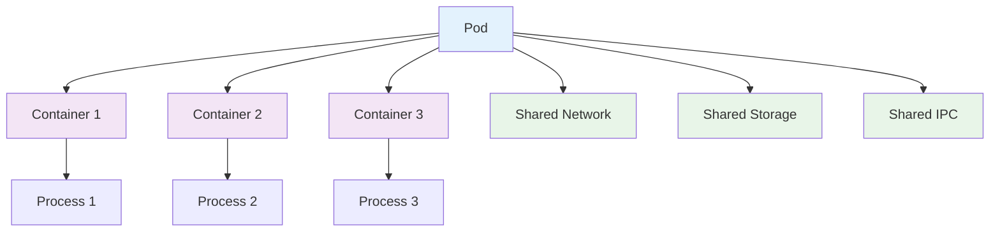
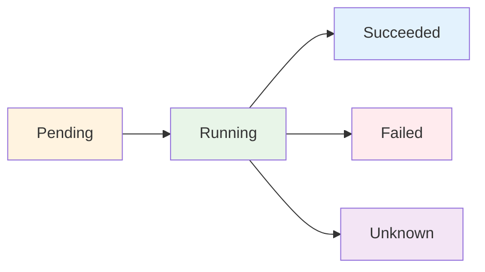
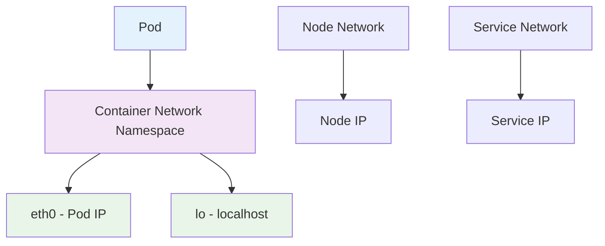

## Pod 개요

Pod는 Kubernetes에서 가장 작은 배포 가능한 컴퓨팅 단위입니다. Pod는 하나 이상의 컨테이너를 포함할 수 있으며, 이러한 컨테이너들은 네트워크와 스토리지를 공유합니다.

### Pod의 특징

1. **최소 배포 단위**: Kubernetes에서 관리하는 가장 작은 단위
2. **컨테이너 그룹**: 하나 이상의 컨테이너를 포함
3. **공유 리소스**: 네트워크, 스토리지, IPC 공유
4. **수명 주기**: 생성, 실행, 종료의 생명주기를 가짐

---

## Pod 구조



---

## Pod 예시

### 단일 컨테이너 Pod

```yaml
apiVersion: v1
kind: Pod
metadata:
  name: nginx-pod
  labels:
    app: nginx
spec:
  containers:
    - name: nginx
      image: nginx:1.14.2
      ports:
        - containerPort: 80
      resources:
        requests:
          memory: "64Mi"
          cpu: "250m"
        limits:
          memory: "128Mi"
          cpu: "500m"
```

### 다중 컨테이너 Pod (Sidecar 패턴)

```yaml
apiVersion: v1
kind: Pod
metadata:
  name: web-app
  labels:
    app: web
spec:
  containers:
    - name: web
      image: nginx:1.14.2
      ports:
        - containerPort: 80
      volumeMounts:
        - name: shared-data
          mountPath: /usr/share/nginx/html
    - name: log-collector
      image: busybox
      command:
        [
          "sh",
          "-c",
          'while true; do echo "$(date) - Log entry" >> /logs/app.log; sleep 10; done',
        ]
      volumeMounts:
        - name: shared-data
          mountPath: /logs
  volumes:
    - name: shared-data
      emptyDir: {}
```

### Init Container가 있는 Pod

```yaml
apiVersion: v1
kind: Pod
metadata:
  name: init-demo
spec:
  containers:
    - name: nginx
      image: nginx:1.14.2
      ports:
        - containerPort: 80
      volumeMounts:
        - name: workdir
          mountPath: /usr/share/nginx/html
  initContainers:
    - name: init-myservice
      image: busybox
      command:
        [
          "sh",
          "-c",
          "until nslookup myservice.$(cat /var/run/secrets/kubernetes.io/serviceaccount/namespace).svc.cluster.local; do echo waiting for myservice; sleep 2; done",
        ]
    - name: init-mydb
      image: busybox
      command:
        [
          "sh",
          "-c",
          "until nslookup mydb.$(cat /var/run/secrets/kubernetes.io/serviceaccount/namespace).svc.cluster.local; do echo waiting for mydb; sleep 2; done",
        ]
  volumes:
    - name: workdir
      emptyDir: {}
```

---

## Pod 생명주기



### Pod 상태 설명

| 상태          | 설명                                                                                                         |
| ------------- | ------------------------------------------------------------------------------------------------------------ |
| **Pending**   | Pod가 Kubernetes 시스템에 수락되었지만, 하나 이상의 컨테이너가 설정되지 않았거나 실행되지 않음               |
| **Running**   | Pod가 노드에 바인딩되었고, 모든 컨테이너가 생성되었으며, 최소 하나의 컨테이너가 실행 중이거나 시작/재시작 중 |
| **Succeeded** | Pod의 모든 컨테이너가 성공적으로 종료되었고 재시작되지 않음                                                  |
| **Failed**    | Pod의 모든 컨테이너가 종료되었고, 최소 하나의 컨테이너가 실패로 종료됨                                       |
| **Unknown**   | Pod의 상태를 확인할 수 없음                                                                                  |

---

## Pod 네트워킹

### Pod 네트워크 모델



### Pod 간 통신

```yaml
apiVersion: v1
kind: Pod
metadata:
  name: pod-1
  labels:
    app: frontend
spec:
  containers:
    - name: nginx
      image: nginx:1.14.2
      ports:
        - containerPort: 80
---
apiVersion: v1
kind: Pod
metadata:
  name: pod-2
  labels:
    app: backend
spec:
  containers:
    - name: app
      image: myapp:1.0
      ports:
        - containerPort: 8080
```

---

## Pod 스토리지

### 볼륨 마운트 예시

```yaml
apiVersion: v1
kind: Pod
metadata:
  name: storage-pod
spec:
  containers:
    - name: app
      image: nginx:1.14.2
      volumeMounts:
        - name: config-volume
          mountPath: /etc/nginx/conf.d
        - name: data-volume
          mountPath: /var/www/html
        - name: secret-volume
          mountPath: /etc/secrets
          readOnly: true
  volumes:
    - name: config-volume
      configMap:
        name: nginx-config
    - name: data-volume
      persistentVolumeClaim:
        claimName: data-pvc
    - name: secret-volume
      secret:
        secretName: app-secret
```

---

## Pod 리소스 관리

### 리소스 요청과 제한

```yaml
apiVersion: v1
kind: Pod
metadata:
  name: resource-pod
spec:
  containers:
    - name: app
      image: nginx:1.14.2
      resources:
        requests:
          memory: "64Mi"
          cpu: "250m"
          ephemeral-storage: "2Gi"
        limits:
          memory: "128Mi"
          cpu: "500m"
          ephemeral-storage: "4Gi"
      ports:
        - containerPort: 80
```

### QoS 클래스

| QoS 클래스     | 조건                             | 설명               |
| -------------- | -------------------------------- | ------------------ |
| **Guaranteed** | requests = limits (모든 리소스)  | 가장 높은 우선순위 |
| **Burstable**  | requests < limits                | 중간 우선순위      |
| **BestEffort** | requests와 limits 모두 설정 안함 | 가장 낮은 우선순위 |

---

## Pod 관리 명령어

```bash
# Pod 생성
kubectl apply -f pod.yaml

# Pod 목록 확인
kubectl get pods
kubectl get pods -o wide

# Pod 상세 정보 확인
kubectl describe pod <pod-name>

# Pod 로그 확인
kubectl logs <pod-name>
kubectl logs <pod-name> -c <container-name>

# Pod에 접속
kubectl exec -it <pod-name> -- /bin/bash
kubectl exec -it <pod-name> -c <container-name> -- /bin/bash

# Pod 삭제
kubectl delete pod <pod-name>

# Pod 복사
kubectl cp <pod-name>:/path/to/file /local/path
```

---

## Pod 보안

### Security Context 예시

```yaml
apiVersion: v1
kind: Pod
metadata:
  name: security-pod
spec:
  securityContext:
    runAsUser: 1000
    runAsGroup: 3000
    fsGroup: 2000
  containers:
    - name: app
      image: nginx:1.14.2
      securityContext:
        allowPrivilegeEscalation: false
        readOnlyRootFilesystem: true
        runAsNonRoot: true
        capabilities:
          drop:
            - ALL
      volumeMounts:
        - name: tmp
          mountPath: /tmp
  volumes:
    - name: tmp
      emptyDir: {}
```

---

## Pod 디버깅

### 일반적인 Pod 문제 해결

1. **Pod가 Pending 상태인 경우**

   ```bash
   kubectl describe pod <pod-name>
   kubectl get events --sort-by='.lastTimestamp'
   ```

2. **Pod가 Running이지만 애플리케이션이 응답하지 않는 경우**

   ```bash
   kubectl logs <pod-name>
   kubectl exec -it <pod-name> -- /bin/bash
   ```

3. **Pod가 계속 재시작되는 경우**
   ```bash
   kubectl logs <pod-name> --previous
   kubectl describe pod <pod-name>
   ```

---

## 주의사항

1. **Pod는 일시적**: Pod는 재시작되면 새로운 IP를 받습니다
2. **리소스 제한**: 적절한 리소스 요청과 제한을 설정해야 합니다
3. **보안**: Security Context를 사용하여 보안을 강화해야 합니다
4. **모니터링**: Pod의 상태와 리소스 사용량을 지속적으로 모니터링해야 합니다
