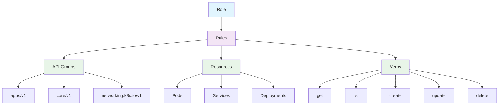
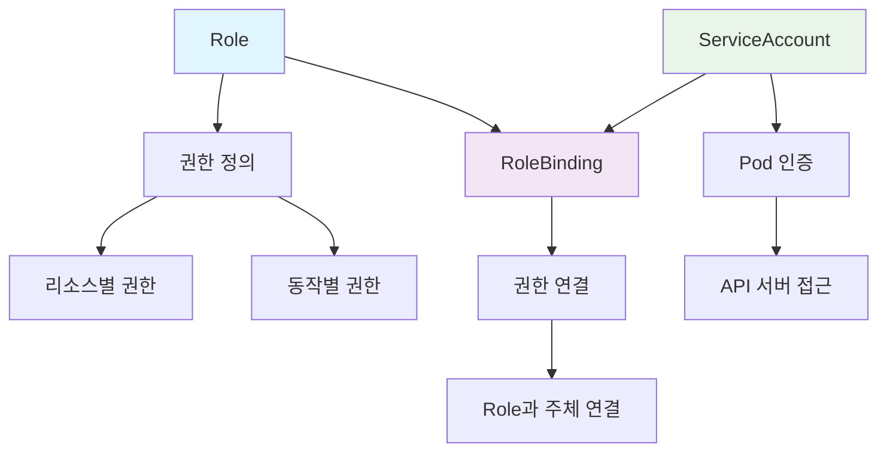
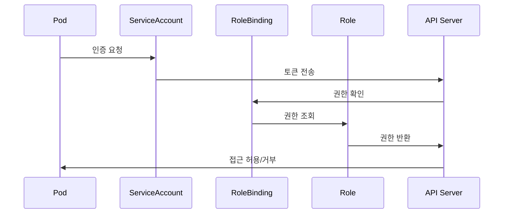

## Role 개요

Role은 Kubernetes에서 네임스페이스 범위의 권한을 정의하는 리소스입니다. 특정 네임스페이스 내에서 리소스에 대한 권한을 세밀하게 제어할 수 있으며, RBAC(Role-Based Access Control)의 핵심 구성 요소입니다.

### Role의 특징

1. **네임스페이스 범위**: 특정 네임스페이스 내에서만 유효
2. **세밀한 권한 제어**: 리소스별, 동작별 권한 정의
3. **RBAC 기반**: Role-Based Access Control 시스템의 일부
4. **조합 가능**: 여러 Role을 하나의 사용자에게 할당 가능
5. **RoleBinding 필요**: 권한을 실제 주체에게 할당하려면 RoleBinding이 필요

---

## Role 구조



---

## Role 예시

### 기본 Role

```yaml
apiVersion: rbac.authorization.k8s.io/v1
kind: Role
metadata:
  namespace: default
  name: pod-reader
rules:
  - apiGroups: [""]
    resources: ["pods"]
    verbs: ["get", "list", "watch"]
```

### 복합 권한 Role

```yaml
apiVersion: rbac.authorization.k8s.io/v1
kind: Role
metadata:
  namespace: production
  name: app-admin
rules:
  # Pod 관리 권한
  - apiGroups: [""]
    resources: ["pods", "pods/log"]
    verbs: ["get", "list", "watch", "create", "update", "patch", "delete"]
  # Service 관리 권한
  - apiGroups: [""]
    resources: ["services"]
    verbs: ["get", "list", "watch", "create", "update", "patch", "delete"]
  # Deployment 관리 권한
  - apiGroups: ["apps"]
    resources: ["deployments"]
    verbs: ["get", "list", "watch", "create", "update", "patch", "delete"]
  # ConfigMap 관리 권한
  - apiGroups: [""]
    resources: ["configmaps"]
    verbs: ["get", "list", "watch", "create", "update", "patch", "delete"]
```

### 특정 리소스만 접근하는 Role

```yaml
apiVersion: rbac.authorization.k8s.io/v1
kind: Role
metadata:
  namespace: monitoring
  name: metrics-reader
rules:
  # Pod 메트릭 읽기 권한
  - apiGroups: [""]
    resources: ["pods"]
    verbs: ["get", "list", "watch"]
  # Pod 로그 읽기 권한
  - apiGroups: [""]
    resources: ["pods/log"]
    verbs: ["get", "list"]
  # ConfigMap 읽기 권한 (설정 파일용)
  - apiGroups: [""]
    resources: ["configmaps"]
    verbs: ["get", "list", "watch"]
```

---

## Role 타입

### 1. 읽기 전용 Role

```yaml
apiVersion: rbac.authorization.k8s.io/v1
kind: Role
metadata:
  namespace: default
  name: read-only
rules:
  - apiGroups: [""]
    resources: ["pods", "services", "configmaps", "secrets"]
    verbs: ["get", "list", "watch"]
  - apiGroups: ["apps"]
    resources: ["deployments", "replicasets"]
    verbs: ["get", "list", "watch"]
```

### 2. 개발자 Role

```yaml
apiVersion: rbac.authorization.k8s.io/v1
kind: Role
metadata:
  namespace: development
  name: developer
rules:
  # Pod 관리
  - apiGroups: [""]
    resources: ["pods", "pods/log"]
    verbs: ["get", "list", "watch", "create", "update", "patch", "delete"]
  # Service 관리
  - apiGroups: [""]
    resources: ["services"]
    verbs: ["get", "list", "watch", "create", "update", "patch", "delete"]
  # Deployment 관리
  - apiGroups: ["apps"]
    resources: ["deployments"]
    verbs: ["get", "list", "watch", "create", "update", "patch", "delete"]
  # ConfigMap 관리
  - apiGroups: [""]
    resources: ["configmaps"]
    verbs: ["get", "list", "watch", "create", "update", "patch", "delete"]
  # Secret 읽기 (민감한 정보는 읽기만)
  - apiGroups: [""]
    resources: ["secrets"]
    verbs: ["get", "list", "watch"]
```

### 3. 운영자 Role

```yaml
apiVersion: rbac.authorization.k8s.io/v1
kind: Role
metadata:
  namespace: production
  name: operator
rules:
  # 모든 리소스 관리
  - apiGroups: [""]
    resources:
      ["pods", "services", "configmaps", "secrets", "persistentvolumeclaims"]
    verbs: ["get", "list", "watch", "create", "update", "patch", "delete"]
  - apiGroups: ["apps"]
    resources: ["deployments", "replicasets", "statefulsets"]
    verbs: ["get", "list", "watch", "create", "update", "patch", "delete"]
  - apiGroups: ["networking.k8s.io"]
    resources: ["ingresses"]
    verbs: ["get", "list", "watch", "create", "update", "patch", "delete"]
  # 이벤트 읽기
  - apiGroups: [""]
    resources: ["events"]
    verbs: ["get", "list", "watch"]
```

---

## RBAC 컴포넌트 간 상호작용

### Role, RoleBinding, ServiceAccount의 관계

RBAC 시스템은 Role, RoleBinding, ServiceAccount가 함께 작동하여 완전한 권한 관리 시스템을 구성합니다.



### 함께 사용되어야 하는 이유

1. **완전한 권한 체계**: Role만으로는 실제 권한이 부여되지 않음
2. **Pod 인증**: ServiceAccount 없이는 Pod가 API 서버에 접근할 수 없음
3. **보안 강화**: 세 컴포넌트가 함께 작동하여 세밀한 보안 제어 가능
4. **운영 효율성**: 명확한 권한 분리와 관리 가능

### RBAC 워크플로우



---

## Role과 RoleBinding 조합

### RoleBinding 예시

```yaml
apiVersion: rbac.authorization.k8s.io/v1
kind: RoleBinding
metadata:
  name: read-pods
  namespace: default
subjects:
  - kind: User
    name: jane
    apiGroup: rbac.authorization.k8s.io
roleRef:
  kind: Role
  name: pod-reader
  apiGroup: rbac.authorization.k8s.io
```

### 여러 Role을 하나의 사용자에게 할당

```yaml
# 첫 번째 Role
apiVersion: rbac.authorization.k8s.io/v1
kind: Role
metadata:
  namespace: default
  name: pod-reader
rules:
  - apiGroups: [""]
    resources: ["pods"]
    verbs: ["get", "list", "watch"]
---
# 두 번째 Role
apiVersion: rbac.authorization.k8s.io/v1
kind: Role
metadata:
  namespace: default
  name: service-reader
rules:
  - apiGroups: [""]
    resources: ["services"]
    verbs: ["get", "list", "watch"]
---
# 첫 번째 RoleBinding
apiVersion: rbac.authorization.k8s.io/v1
kind: RoleBinding
metadata:
  name: read-pods
  namespace: default
subjects:
  - kind: User
    name: john
    apiGroup: rbac.authorization.k8s.io
roleRef:
  kind: Role
  name: pod-reader
  apiGroup: rbac.authorization.k8s.io
---
# 두 번째 RoleBinding
apiVersion: rbac.authorization.k8s.io/v1
kind: RoleBinding
metadata:
  name: read-services
  namespace: default
subjects:
  - kind: User
    name: john
    apiGroup: rbac.authorization.k8s.io
roleRef:
  kind: Role
  name: service-reader
  apiGroup: rbac.authorization.k8s.io
```

---

## Role 관리 명령어

### 기본 명령어

```bash
# Role 생성
kubectl apply -f role.yaml

# Role 목록 확인
kubectl get roles
kubectl get roles -n <namespace>

# Role 상세 정보 확인
kubectl describe role <role-name> -n <namespace>

# Role 삭제
kubectl delete role <role-name> -n <namespace>

# Role YAML 확인
kubectl get role <role-name> -n <namespace> -o yaml
```

### 권한 테스트

```bash
# 사용자 권한 확인
kubectl auth can-i get pods --as=user@example.com -n default

# 특정 동작 권한 확인
kubectl auth can-i create deployments --as=user@example.com -n default

# 모든 권한 확인
kubectl auth can-i --list --as=user@example.com -n default
```

---

## Role 사용 사례

### 1. 개발팀 Role

```yaml
apiVersion: rbac.authorization.k8s.io/v1
kind: Role
metadata:
  namespace: development
  name: developer
rules:
  # 애플리케이션 리소스 관리
  - apiGroups: [""]
    resources: ["pods", "services", "configmaps"]
    verbs: ["get", "list", "watch", "create", "update", "patch", "delete"]
  - apiGroups: ["apps"]
    resources: ["deployments", "replicasets"]
    verbs: ["get", "list", "watch", "create", "update", "patch", "delete"]
  # 로그 읽기
  - apiGroups: [""]
    resources: ["pods/log"]
    verbs: ["get", "list"]
  # 이벤트 읽기
  - apiGroups: [""]
    resources: ["events"]
    verbs: ["get", "list", "watch"]
```

### 2. QA팀 Role

```yaml
apiVersion: rbac.authorization.k8s.io/v1
kind: Role
metadata:
  namespace: testing
  name: qa-tester
rules:
  # 테스트 환경 리소스 읽기
  - apiGroups: [""]
    resources: ["pods", "services", "configmaps"]
    verbs: ["get", "list", "watch"]
  - apiGroups: ["apps"]
    resources: ["deployments", "replicasets"]
    verbs: ["get", "list", "watch"]
  # 로그 읽기
  - apiGroups: [""]
    resources: ["pods/log"]
    verbs: ["get", "list"]
  # 테스트용 Pod 생성/삭제
  - apiGroups: [""]
    resources: ["pods"]
    verbs: ["create", "delete"]
```

### 3. 모니터링팀 Role

```yaml
apiVersion: rbac.authorization.k8s.io/v1
kind: Role
metadata:
  namespace: monitoring
  name: monitoring
rules:
  # 모든 리소스 읽기
  - apiGroups: [""]
    resources: ["pods", "services", "nodes", "events"]
    verbs: ["get", "list", "watch"]
  - apiGroups: ["apps"]
    resources: ["deployments", "replicasets", "statefulsets"]
    verbs: ["get", "list", "watch"]
  # 메트릭 수집용 ConfigMap 관리
  - apiGroups: [""]
    resources: ["configmaps"]
    verbs: ["get", "list", "watch", "create", "update", "patch", "delete"]
  # Pod 로그 읽기
  - apiGroups: [""]
    resources: ["pods/log"]
    verbs: ["get", "list"]
```

---

## Role vs ClusterRole

| 특징             | Role               | ClusterRole          |
| ---------------- | ------------------ | -------------------- |
| **범위**         | 네임스페이스       | 클러스터 전체        |
| **네임스페이스** | 특정 네임스페이스  | 모든 네임스페이스    |
| **사용 사례**    | 일반적인 권한 관리 | 클러스터 관리자 권한 |
| **바인딩**       | RoleBinding        | ClusterRoleBinding   |

---

## Role 모범 사례

### 1. 최소 권한 원칙

```yaml
# 필요한 권한만 부여
apiVersion: rbac.authorization.k8s.io/v1
kind: Role
metadata:
  namespace: default
  name: minimal-pod-reader
rules:
  - apiGroups: [""]
    resources: ["pods"]
    verbs: ["get", "list"] # watch 권한 제거
```

### 2. 명확한 네이밍

```yaml
# 역할을 명확히 하는 이름 사용
apiVersion: rbac.authorization.k8s.io/v1
kind: Role
metadata:
  namespace: production
  name: production-app-deployer # 명확한 역할
rules:
  - apiGroups: ["apps"]
    resources: ["deployments"]
    verbs: ["get", "list", "watch", "create", "update", "patch"]
```

### 3. 리소스별 분리

```yaml
# Pod 관리 Role
apiVersion: rbac.authorization.k8s.io/v1
kind: Role
metadata:
  namespace: default
  name: pod-manager
rules:
  - apiGroups: [""]
    resources: ["pods"]
    verbs: ["get", "list", "watch", "create", "update", "patch", "delete"]
---
# Service 관리 Role
apiVersion: rbac.authorization.k8s.io/v1
kind: Role
metadata:
  namespace: default
  name: service-manager
rules:
  - apiGroups: [""]
    resources: ["services"]
    verbs: ["get", "list", "watch", "create", "update", "patch", "delete"]
```

---

## RBAC 통합 예시

### 완전한 RBAC 설정

```yaml
# 1. ServiceAccount 생성
apiVersion: v1
kind: ServiceAccount
metadata:
  name: app-service-account
  namespace: production

---
# 2. Role 생성
apiVersion: rbac.authorization.k8s.io/v1
kind: Role
metadata:
  namespace: production
  name: app-role
rules:
  - apiGroups: [""]
    resources: ["pods", "services", "configmaps"]
    verbs: ["get", "list", "watch", "create", "update", "patch", "delete"]
  - apiGroups: ["apps"]
    resources: ["deployments"]
    verbs: ["get", "list", "watch", "create", "update", "patch", "delete"]

---
# 3. RoleBinding 생성
apiVersion: rbac.authorization.k8s.io/v1
kind: RoleBinding
metadata:
  name: app-binding
  namespace: production
subjects:
  - kind: ServiceAccount
    name: app-service-account
    namespace: production
roleRef:
  kind: Role
  name: app-role
  apiGroup: rbac.authorization.k8s.io

---
# 4. Pod에서 ServiceAccount 사용
apiVersion: apps/v1
kind: Deployment
metadata:
  name: app-deployment
  namespace: production
spec:
  replicas: 3
  selector:
    matchLabels:
      app: myapp
  template:
    metadata:
      labels:
        app: myapp
    spec:
      serviceAccountName: app-service-account
      containers:
        - name: app
          image: myapp:1.0
```

### 마이크로서비스별 RBAC 분리

```yaml
# Frontend Service
apiVersion: v1
kind: ServiceAccount
metadata:
  name: frontend-sa
  namespace: frontend
---
apiVersion: rbac.authorization.k8s.io/v1
kind: Role
metadata:
  namespace: frontend
  name: frontend-role
rules:
  - apiGroups: [""]
    resources: ["pods", "services"]
    verbs: ["get", "list", "watch"]
---
apiVersion: rbac.authorization.k8s.io/v1
kind: RoleBinding
metadata:
  name: frontend-binding
  namespace: frontend
subjects:
  - kind: ServiceAccount
    name: frontend-sa
    namespace: frontend
roleRef:
  kind: Role
  name: frontend-role
  apiGroup: rbac.authorization.k8s.io

---
# Backend Service
apiVersion: v1
kind: ServiceAccount
metadata:
  name: backend-sa
  namespace: backend
---
apiVersion: rbac.authorization.k8s.io/v1
kind: Role
metadata:
  namespace: backend
  name: backend-role
rules:
  - apiGroups: [""]
    resources: ["pods", "services", "configmaps", "secrets"]
    verbs: ["get", "list", "watch", "create", "update", "patch", "delete"]
---
apiVersion: rbac.authorization.k8s.io/v1
kind: RoleBinding
metadata:
  name: backend-binding
  namespace: backend
subjects:
  - kind: ServiceAccount
    name: backend-sa
    namespace: backend
roleRef:
  kind: Role
  name: backend-role
  apiGroup: rbac.authorization.k8s.io
```

---

## 주의사항

1. **최소 권한**: 필요한 최소한의 권한만 부여해야 합니다
2. **정기 검토**: Role과 권한을 정기적으로 검토해야 합니다
3. **네임스페이스 분리**: 환경별로 네임스페이스를 분리하여 권한을 제한해야 합니다
4. **테스트**: 권한 설정 후 실제 테스트를 통해 검증해야 합니다
5. **문서화**: Role의 목적과 권한을 명확히 문서화해야 합니다
