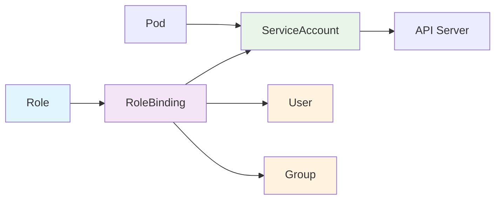
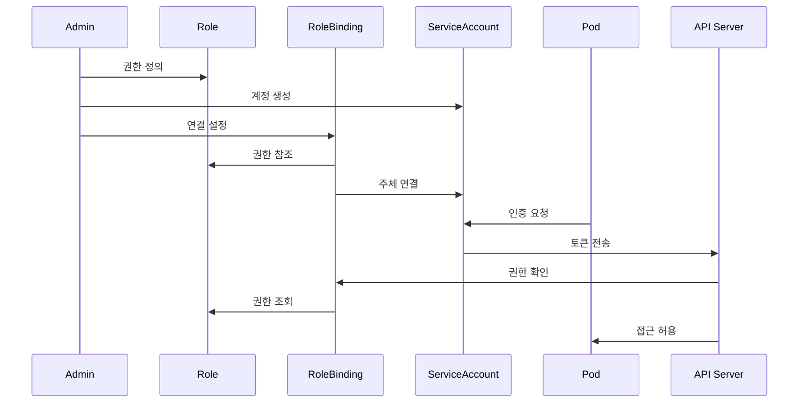

## RoleBinding 개요

RoleBinding은 Kubernetes에서 Role과 사용자/그룹/서비스 계정을 연결하는 리소스입니다. RBAC(Role-Based Access Control) 시스템에서 권한을 실제 주체에게 할당하는 역할을 합니다.

### RoleBinding의 특징

1. **권한 연결**: Role과 주체(Subject)를 연결
2. **네임스페이스 범위**: 특정 네임스페이스 내에서만 유효
3. **다중 주체**: 하나의 Role을 여러 주체에게 할당 가능
4. **동적 권한**: Role 변경 시 바인딩된 모든 주체에게 자동 적용
5. **RBAC 핵심**: Role과 ServiceAccount를 연결하는 필수 컴포넌트

---

## RoleBinding 구조

```mermaid
graph TD
    A[RoleBinding] --> B[Subjects]
    A --> C[RoleRef]

    B --> D[User]
    B --> E[Group]
    B --> F[ServiceAccount]

    C --> G[Role]
    C --> H[ClusterRole]

    D --> I[user@example.com]
    E --> J[developers]
    F --> K[app-service-account]

    G --> L[pod-reader]
    H --> M[admin]

    style A fill:#e1f5fe
    style B fill:#f3e5f5
    style C fill:#f3e5f5
    style D fill:#e8f5e8
    style E fill:#e8f5e8
    style F fill:#e8f5e8
    style G fill:#fff3e0
    style H fill:#fff3e0
```

---

## RoleBinding 예시

### 기본 RoleBinding

```yaml
apiVersion: rbac.authorization.k8s.io/v1
kind: RoleBinding
metadata:
  name: read-pods
  namespace: default
subjects:
  - kind: User
    name: jane@example.com
    apiGroup: rbac.authorization.k8s.io
roleRef:
  kind: Role
  name: pod-reader
  apiGroup: rbac.authorization.k8s.io
```

### 다중 주체 RoleBinding

```yaml
apiVersion: rbac.authorization.k8s.io/v1
kind: RoleBinding
metadata:
  name: app-admin
  namespace: production
subjects:
  # 사용자
  - kind: User
    name: admin@example.com
    apiGroup: rbac.authorization.k8s.io
  # 그룹
  - kind: Group
    name: developers
    apiGroup: rbac.authorization.k8s.io
  # 서비스 계정
  - kind: ServiceAccount
    name: app-service-account
    namespace: production
roleRef:
  kind: Role
  name: app-admin
  apiGroup: rbac.authorization.k8s.io
```

### ClusterRole을 사용하는 RoleBinding

```yaml
apiVersion: rbac.authorization.k8s.io/v1
kind: RoleBinding
metadata:
  name: admin-binding
  namespace: default
subjects:
  - kind: User
    name: cluster-admin@example.com
    apiGroup: rbac.authorization.k8s.io
roleRef:
  kind: ClusterRole
  name: admin
  apiGroup: rbac.authorization.k8s.io
```

---

## RBAC 컴포넌트 간 상호작용

### RoleBinding의 역할과 중요성

RoleBinding은 RBAC 시스템에서 **중간 다리 역할**을 하며, Role과 ServiceAccount/User/Group을 연결합니다.



### 함께 사용되어야 하는 이유

1. **권한 활성화**: Role만으로는 실제 권한이 작동하지 않음
2. **인증 연결**: ServiceAccount의 인증을 Role의 권한과 연결
3. **보안 체계**: 세 컴포넌트가 함께 완전한 보안 체계 구성
4. **운영 관리**: 명확한 권한 분리와 책임 소재 명확화

### RBAC 권한 부여 프로세스



### RBAC 컴포넌트 의존성

| 컴포넌트           | 의존성         | 역할           |
| ------------------ | -------------- | -------------- |
| **Role**           | 독립적         | 권한 정의      |
| **RoleBinding**    | Role + Subject | 권한 연결      |
| **ServiceAccount** | 독립적         | Pod 인증       |
| **Pod**            | ServiceAccount | 실제 권한 사용 |

---

## RoleBinding 타입

### 1. 사용자 RoleBinding

```yaml
apiVersion: rbac.authorization.k8s.io/v1
kind: RoleBinding
metadata:
  name: developer-binding
  namespace: development
subjects:
  - kind: User
    name: developer@example.com
    apiGroup: rbac.authorization.k8s.io
roleRef:
  kind: Role
  name: developer
  apiGroup: rbac.authorization.k8s.io
```

### 2. 그룹 RoleBinding

```yaml
apiVersion: rbac.authorization.k8s.io/v1
kind: RoleBinding
metadata:
  name: qa-team-binding
  namespace: testing
subjects:
  - kind: Group
    name: qa-team
    apiGroup: rbac.authorization.k8s.io
roleRef:
  kind: Role
  name: qa-tester
  apiGroup: rbac.authorization.k8s.io
```

### 3. 서비스 계정 RoleBinding

```yaml
apiVersion: rbac.authorization.k8s.io/v1
kind: RoleBinding
metadata:
  name: monitoring-binding
  namespace: monitoring
subjects:
  - kind: ServiceAccount
    name: prometheus
    namespace: monitoring
roleRef:
  kind: Role
  name: monitoring
  apiGroup: rbac.authorization.k8s.io
```

---

## RoleBinding 관리 명령어

### 기본 명령어

```bash
# RoleBinding 생성
kubectl apply -f rolebinding.yaml

# RoleBinding 목록 확인
kubectl get rolebindings
kubectl get rolebindings -n <namespace>

# RoleBinding 상세 정보 확인
kubectl describe rolebinding <rolebinding-name> -n <namespace>

# RoleBinding 삭제
kubectl delete rolebinding <rolebinding-name> -n <namespace>

# RoleBinding YAML 확인
kubectl get rolebinding <rolebinding-name> -n <namespace> -o yaml
```

### 권한 확인 명령어

```bash
# 사용자 권한 확인
kubectl auth can-i get pods --as=user@example.com -n default

# 특정 동작 권한 확인
kubectl auth can-i create deployments --as=user@example.com -n default

# 모든 권한 확인
kubectl auth can-i --list --as=user@example.com -n default

# 서비스 계정 권한 확인
kubectl auth can-i get pods --as=system:serviceaccount:default:app-sa -n default
```

---

## RoleBinding 사용 사례

### 1. 개발팀 권한 관리

```yaml
# 개발자 Role
apiVersion: rbac.authorization.k8s.io/v1
kind: Role
metadata:
  namespace: development
  name: developer
rules:
  - apiGroups: [""]
    resources: ["pods", "services", "configmaps"]
    verbs: ["get", "list", "watch", "create", "update", "patch", "delete"]
  - apiGroups: ["apps"]
    resources: ["deployments"]
    verbs: ["get", "list", "watch", "create", "update", "patch", "delete"]
---
# 개발팀 RoleBinding
apiVersion: rbac.authorization.k8s.io/v1
kind: RoleBinding
metadata:
  name: developer-binding
  namespace: development
subjects:
  - kind: Group
    name: developers
    apiGroup: rbac.authorization.k8s.io
  - kind: User
    name: lead-developer@example.com
    apiGroup: rbac.authorization.k8s.io
roleRef:
  kind: Role
  name: developer
  apiGroup: rbac.authorization.k8s.io
```

### 2. 애플리케이션 서비스 계정

```yaml
# 애플리케이션 Role
apiVersion: rbac.authorization.k8s.io/v1
kind: Role
metadata:
  namespace: production
  name: app-role
rules:
  - apiGroups: [""]
    resources: ["configmaps", "secrets"]
    verbs: ["get", "list", "watch"]
  - apiGroups: [""]
    resources: ["pods/log"]
    verbs: ["get", "list"]
---
# 서비스 계정
apiVersion: v1
kind: ServiceAccount
metadata:
  name: app-service-account
  namespace: production
---
# 애플리케이션 RoleBinding
apiVersion: rbac.authorization.k8s.io/v1
kind: RoleBinding
metadata:
  name: app-binding
  namespace: production
subjects:
  - kind: ServiceAccount
    name: app-service-account
    namespace: production
roleRef:
  kind: Role
  name: app-role
  apiGroup: rbac.authorization.k8s.io
```

### 3. 모니터링 시스템

```yaml
# 모니터링 Role
apiVersion: rbac.authorization.k8s.io/v1
kind: Role
metadata:
  namespace: monitoring
  name: monitoring-role
rules:
  - apiGroups: [""]
    resources: ["pods", "services", "nodes"]
    verbs: ["get", "list", "watch"]
  - apiGroups: [""]
    resources: ["pods/log"]
    verbs: ["get", "list"]
  - apiGroups: [""]
    resources: ["configmaps"]
    verbs: ["get", "list", "watch", "create", "update", "patch", "delete"]
---
# Prometheus 서비스 계정
apiVersion: v1
kind: ServiceAccount
metadata:
  name: prometheus
  namespace: monitoring
---
# 모니터링 RoleBinding
apiVersion: rbac.authorization.k8s.io/v1
kind: RoleBinding
metadata:
  name: monitoring-binding
  namespace: monitoring
subjects:
  - kind: ServiceAccount
    name: prometheus
    namespace: monitoring
roleRef:
  kind: Role
  name: monitoring-role
  apiGroup: rbac.authorization.k8s.io
```

---

## RoleBinding vs ClusterRoleBinding

| 특징             | RoleBinding        | ClusterRoleBinding   |
| ---------------- | ------------------ | -------------------- |
| **범위**         | 네임스페이스       | 클러스터 전체        |
| **Role 타입**    | Role, ClusterRole  | ClusterRole만        |
| **사용 사례**    | 일반적인 권한 관리 | 클러스터 관리자 권한 |
| **네임스페이스** | 특정 네임스페이스  | 모든 네임스페이스    |

---

## RoleBinding 모범 사례

### 1. 명확한 네이밍

```yaml
# 역할과 주체를 명확히 하는 이름 사용
apiVersion: rbac.authorization.k8s.io/v1
kind: RoleBinding
metadata:
  name: developer-team-binding # 명확한 역할
  namespace: development
subjects:
  - kind: Group
    name: developers
    apiGroup: rbac.authorization.k8s.io
roleRef:
  kind: Role
  name: developer
  apiGroup: rbac.authorization.k8s.io
```

### 2. 최소 권한 원칙

```yaml
# 필요한 최소한의 권한만 부여
apiVersion: rbac.authorization.k8s.io/v1
kind: RoleBinding
metadata:
  name: read-only-binding
  namespace: production
subjects:
  - kind: User
    name: auditor@example.com
    apiGroup: rbac.authorization.k8s.io
roleRef:
  kind: Role
  name: read-only # 읽기 전용 권한만
  apiGroup: rbac.authorization.k8s.io
```

### 3. 환경별 분리

```yaml
# 개발 환경
apiVersion: rbac.authorization.k8s.io/v1
kind: RoleBinding
metadata:
  name: dev-team-binding
  namespace: development
subjects:
  - kind: Group
    name: developers
    apiGroup: rbac.authorization.k8s.io
roleRef:
  kind: Role
  name: developer
  apiGroup: rbac.authorization.k8s.io
---
# 프로덕션 환경
apiVersion: rbac.authorization.k8s.io/v1
kind: RoleBinding
metadata:
  name: prod-admin-binding
  namespace: production
subjects:
  - kind: User
    name: admin@example.com
    apiGroup: rbac.authorization.k8s.io
roleRef:
  kind: Role
  name: production-admin
  apiGroup: rbac.authorization.k8s.io
```

---

## RBAC 통합 관리

### RBAC 컴포넌트 생성 순서

```bash
# 1. ServiceAccount 생성
kubectl create serviceaccount app-sa -n production

# 2. Role 생성
kubectl apply -f role.yaml

# 3. RoleBinding 생성
kubectl apply -f rolebinding.yaml

# 4. Pod에서 ServiceAccount 사용
kubectl apply -f deployment.yaml
```

### RBAC 상태 확인

```bash
# 전체 RBAC 상태 확인
kubectl get serviceaccounts,roles,rolebindings -n production

# 권한 테스트
kubectl auth can-i get pods --as=system:serviceaccount:production:app-sa

# RoleBinding 상세 정보
kubectl describe rolebinding app-binding -n production

# ServiceAccount 토큰 확인
kubectl get secret app-sa-token-xxxxx -n production -o yaml
```

### RBAC 문제 해결

```bash
# 권한 문제 진단
kubectl auth can-i --list --as=system:serviceaccount:production:app-sa

# RoleBinding 연결 확인
kubectl get rolebinding app-binding -n production -o yaml

# ServiceAccount 확인
kubectl get serviceaccount app-sa -n production -o yaml

# 이벤트 확인
kubectl get events -n production --sort-by='.lastTimestamp'
```

---

## 주의사항

1. **최소 권한**: 필요한 최소한의 권한만 부여해야 합니다
2. **정기 검토**: RoleBinding을 정기적으로 검토하고 정리해야 합니다
3. **네임스페이스 분리**: 환경별로 네임스페이스를 분리하여 권한을 제한해야 합니다
4. **테스트**: 권한 설정 후 실제 테스트를 통해 검증해야 합니다
5. **문서화**: RoleBinding의 목적과 권한을 명확히 문서화해야 합니다
