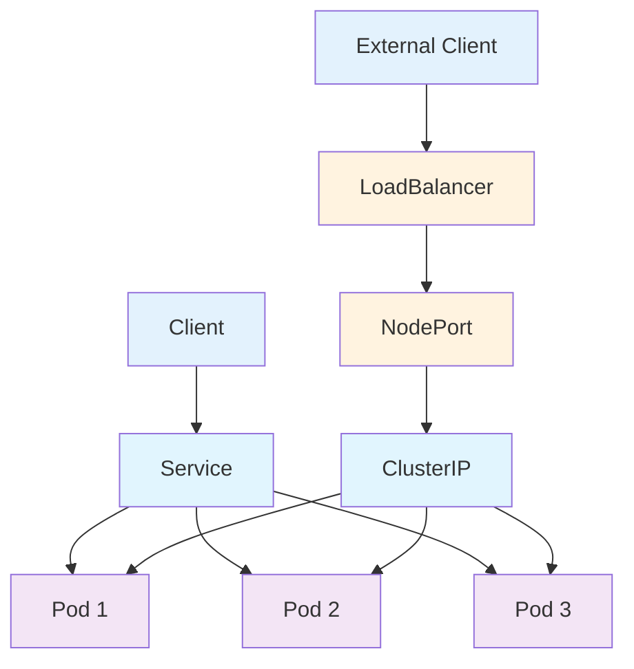
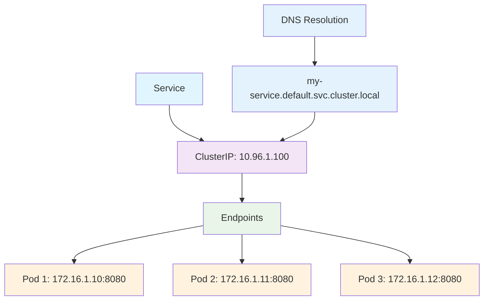

## Service 개요

Service는 Kubernetes에서 Pod 집합에 대한 네트워크 엔드포인트를 제공하는 리소스입니다. Pod의 IP는 일시적이므로, Service를 통해 안정적인 네트워크 접근을 제공합니다.

### Service의 특징

1. **안정적인 엔드포인트**: Pod가 재시작되어도 동일한 IP와 포트로 접근 가능
2. **로드 밸런싱**: 여러 Pod에 트래픽을 분산
3. **서비스 디스커버리**: DNS를 통한 자동 서비스 발견
4. **다양한 타입**: ClusterIP, NodePort, LoadBalancer, ExternalName
5. **Pod 셀렉터**: 라벨 기반으로 트래픽을 받을 Pod 선택

---

## Service 구조



---

## Service 셀렉터

### Pod 셀렉터 (Pod Selector)

Service는 `selector` 필드를 통해 트래픽을 받을 Pod를 선택합니다. 셀렉터는 라벨을 기반으로 하며, 해당 라벨을 가진 Pod들이 Service의 백엔드가 됩니다.

#### 기본 셀렉터 구조

```yaml
apiVersion: v1
kind: Service
metadata:
  name: my-service
spec:
  selector:
    app: myapp
    tier: frontend
  ports:
    - port: 80
      targetPort: 8080
```

#### 고급 셀렉터 (Set-based)

```yaml
apiVersion: v1
kind: Service
metadata:
  name: advanced-service
spec:
  selector:
    matchExpressions:
      - key: app
        operator: In
        values: ["web", "api"]
      - key: environment
        operator: NotIn
        values: ["test"]
      - key: version
        operator: Exists
  ports:
    - port: 80
      targetPort: 8080
```

### 셀렉터 없는 Service

셀렉터가 없는 Service는 수동으로 Endpoints를 생성해야 합니다.

```yaml
apiVersion: v1
kind: Service
metadata:
  name: external-service
spec:
  ports:
    - port: 80
      targetPort: 8080
---
apiVersion: v1
kind: Endpoints
metadata:
  name: external-service
subsets:
  - addresses:
      - ip: 192.168.1.100
    ports:
      - port: 8080
```

### 셀렉터 규칙

1. **라벨 매칭**: Service 셀렉터와 Pod 라벨이 일치해야 함
2. **동적 업데이트**: Pod 라벨이 변경되면 자동으로 Endpoints 업데이트
3. **네임스페이스**: 셀렉터는 동일한 네임스페이스 내의 Pod만 선택

### 셀렉터 디버깅

```bash
# 셀렉터로 Pod 확인
kubectl get pods -l app=myapp

# Service의 Endpoints 확인
kubectl get endpoints my-service

# 셀렉터 매칭 확인
kubectl get pods --show-labels -l app=myapp

# Service 연결 테스트
kubectl run test --image=busybox --rm -it --restart=Never -- wget -O- my-service:80
```

---

## Service 타입

### 1. ClusterIP (기본값)

```yaml
apiVersion: v1
kind: Service
metadata:
  name: my-service
  labels:
    app: myapp
spec:
  type: ClusterIP
  ports:
    - port: 80 # Service 포트
      targetPort: 8080 # Pod 포트
      protocol: TCP
      name: http
    - port: 443
      targetPort: 8443
      protocol: TCP
      name: https
  selector:
    app: myapp
```

### 2. NodePort

```yaml
apiVersion: v1
kind: Service
metadata:
  name: my-nodeport-service
spec:
  type: NodePort
  ports:
    - port: 80
      targetPort: 8080
      nodePort: 30080 # 노드 포트 (30000-32767)
      protocol: TCP
      name: http
  selector:
    app: myapp
```

### 3. LoadBalancer

```yaml
apiVersion: v1
kind: Service
metadata:
  name: my-loadbalancer-service
spec:
  type: LoadBalancer
  ports:
    - port: 80
      targetPort: 8080
      protocol: TCP
      name: http
  selector:
    app: myapp
  externalTrafficPolicy: Local # 노드 로컬 트래픽 정책
```

### 4. ExternalName

```yaml
apiVersion: v1
kind: Service
metadata:
  name: my-external-service
spec:
  type: ExternalName
  externalName: api.example.com
  ports:
    - port: 80
      protocol: TCP
      name: http
```

---

## Service 네트워킹

### Service IP 할당



### DNS 서비스 디스커버리

```bash
# Service DNS 이름 형식
<service-name>.<namespace>.svc.<cluster-domain>

# 예시
my-service.default.svc.cluster.local
web-app.production.svc.cluster.local
```

---

## Service 예시

### 기본 웹 서비스

```yaml
apiVersion: v1
kind: Service
metadata:
  name: web-service
  labels:
    app: web
spec:
  ports:
    - port: 80
      targetPort: 8080
      protocol: TCP
      name: http
  selector:
    app: web
```

### 다중 포트 서비스

```yaml
apiVersion: v1
kind: Service
metadata:
  name: multi-port-service
spec:
  ports:
    - name: http
      port: 80
      targetPort: 8080
      protocol: TCP
    - name: https
      port: 443
      targetPort: 8443
      protocol: TCP
    - name: metrics
      port: 9090
      targetPort: 9090
      protocol: TCP
  selector:
    app: myapp
```

### 세션 어피니티가 있는 서비스

```yaml
apiVersion: v1
kind: Service
metadata:
  name: session-service
spec:
  ports:
    - port: 80
      targetPort: 8080
      protocol: TCP
  selector:
    app: session-app
  sessionAffinity: ClientIP
  sessionAffinityConfig:
    clientIP:
      timeoutSeconds: 3600
```

---

## Endpoints

### 자동 생성되는 Endpoints

```yaml
apiVersion: v1
kind: Endpoints
metadata:
  name: my-service
subsets:
  - addresses:
      - ip: 172.16.1.10
        nodeName: node-1
      - ip: 172.16.1.11
        nodeName: node-2
      - ip: 172.16.1.12
        nodeName: node-3
    ports:
      - port: 8080
        protocol: TCP
```

### 수동 Endpoints

```yaml
apiVersion: v1
kind: Service
metadata:
  name: external-service
spec:
  ports:
    - port: 80
      protocol: TCP
---
apiVersion: v1
kind: Endpoints
metadata:
  name: external-service
subsets:
  - addresses:
      - ip: 192.168.1.100
    ports:
      - port: 80
        protocol: TCP
```

---

## Service 관리 명령어

### 기본 명령어

```bash
# Service 생성
kubectl apply -f service.yaml

# Service 목록 확인
kubectl get services
kubectl get svc

# Service 상세 정보 확인
kubectl describe service <service-name>

# Service 삭제
kubectl delete service <service-name>

# Service IP 확인
kubectl get service <service-name> -o wide
```

### 디버깅 명령어

```bash
# Endpoints 확인
kubectl get endpoints <service-name>

# Service DNS 확인
kubectl run test-dns --image=busybox --rm -it --restart=Never -- nslookup <service-name>

# Service 연결 테스트
kubectl run test-connection --image=busybox --rm -it --restart=Never -- wget -O- <service-name>:<port>

# Service 로그 확인
kubectl logs -l app=<app-label>
```

---

## Service 사용 사례

### 1. 웹 애플리케이션

```yaml
apiVersion: v1
kind: Service
metadata:
  name: web-app-service
  labels:
    app: web-app
spec:
  type: LoadBalancer
  ports:
    - port: 80
      targetPort: 8080
      protocol: TCP
      name: http
    - port: 443
      targetPort: 8443
      protocol: TCP
      name: https
  selector:
    app: web-app
  sessionAffinity: ClientIP
```

### 2. 데이터베이스 서비스

```yaml
apiVersion: v1
kind: Service
metadata:
  name: database-service
spec:
  type: ClusterIP
  ports:
    - port: 5432
      targetPort: 5432
      protocol: TCP
      name: postgresql
  selector:
    app: database
  sessionAffinity: None
```

### 3. API 서비스

```yaml
apiVersion: v1
kind: Service
metadata:
  name: api-service
  annotations:
    service.beta.kubernetes.io/aws-load-balancer-type: "nlb"
spec:
  type: LoadBalancer
  ports:
    - port: 80
      targetPort: 8080
      protocol: TCP
      name: http
    - port: 443
      targetPort: 8443
      protocol: TCP
      name: https
  selector:
    app: api
  externalTrafficPolicy: Local
```

---

## Service 네트워크 정책

### NetworkPolicy 예시

```yaml
apiVersion: networking.k8s.io/v1
kind: NetworkPolicy
metadata:
  name: api-network-policy
spec:
  podSelector:
    matchLabels:
      app: api
  policyTypes:
    - Ingress
    - Egress
  ingress:
    - from:
        - podSelector:
            matchLabels:
              app: web
      ports:
        - protocol: TCP
          port: 8080
  egress:
    - to:
        - podSelector:
            matchLabels:
              app: database
      ports:
        - protocol: TCP
          port: 5432
```

---

## Service 모니터링

### 헬스 체크

```yaml
apiVersion: v1
kind: Service
metadata:
  name: health-check-service
  annotations:
    service.beta.kubernetes.io/aws-load-balancer-health-check-path: "/health"
    service.beta.kubernetes.io/aws-load-balancer-health-check-port: "8080"
spec:
  type: LoadBalancer
  ports:
    - port: 80
      targetPort: 8080
      protocol: TCP
  selector:
    app: web
```

### 메트릭 수집

```yaml
apiVersion: v1
kind: Service
metadata:
  name: metrics-service
spec:
  ports:
    - port: 9090
      targetPort: 9090
      protocol: TCP
      name: metrics
  selector:
    app: myapp
```

---

## Service vs Ingress

| 특징                 | Service          | Ingress          |
| -------------------- | ---------------- | ---------------- |
| **OSI 레이어**       | L4 (Transport)   | L7 (Application) |
| **로드 밸런싱**      | 기본 로드 밸런싱 | 고급 로드 밸런싱 |
| **SSL/TLS**          | 지원 안함        | 지원             |
| **Path 기반 라우팅** | 지원 안함        | 지원             |
| **Host 기반 라우팅** | 지원 안함        | 지원             |
| **사용 사례**        | 내부 서비스      | 외부 웹 트래픽   |

---

## 주의사항

1. **포트 매핑**: Service 포트와 Pod 포트를 올바르게 매핑해야 합니다
2. **세션 어피니티**: 필요한 경우 세션 어피니티를 설정해야 합니다
3. **네트워크 정책**: 보안을 위해 NetworkPolicy를 설정해야 합니다
4. **모니터링**: Service의 상태와 성능을 지속적으로 모니터링해야 합니다
5. **DNS 캐싱**: DNS 캐싱으로 인한 문제를 고려해야 합니다
