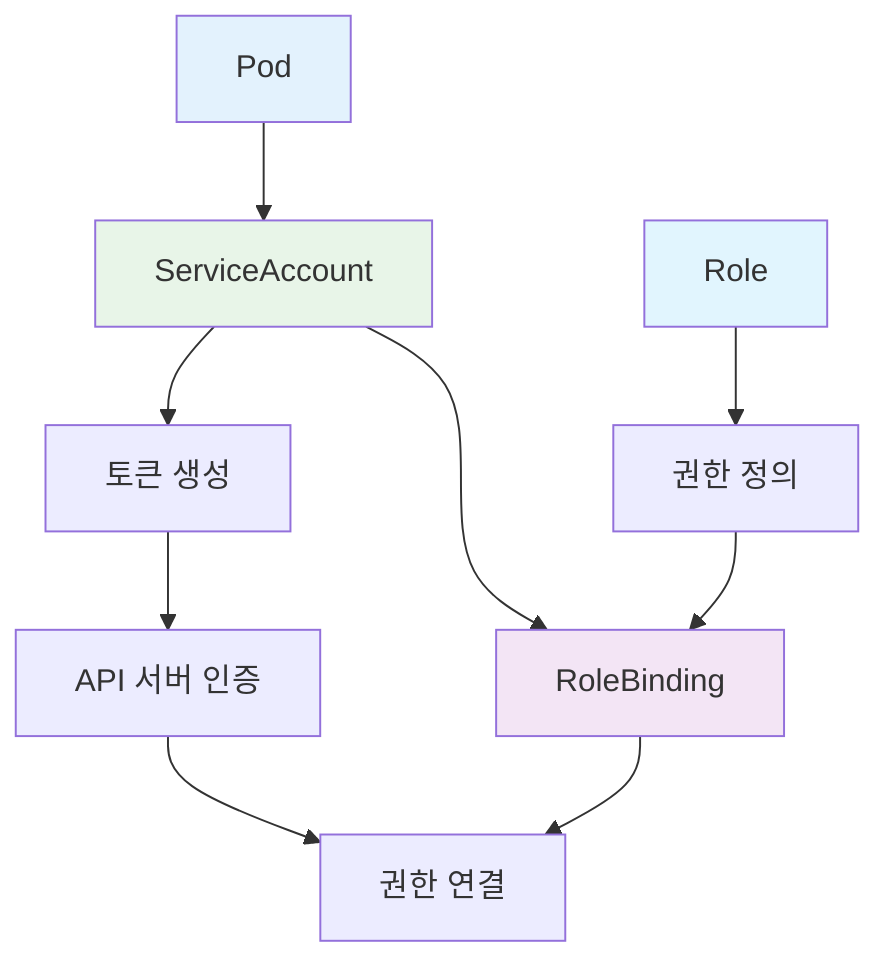
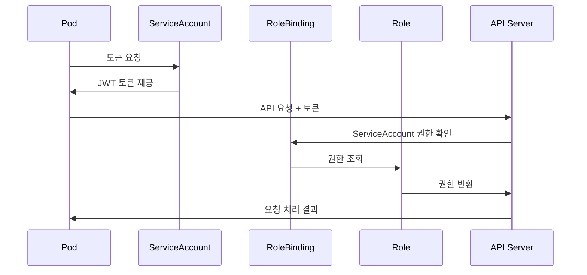

# ServiceAccount

## 개요

ServiceAccount는 Kubernetes에서 Pod가 클러스터 내에서 인증할 때 사용하는 계정입니다. Pod가 API 서버와 통신하거나 다른 서비스에 접근할 때 필요한 권한을 제공합니다.

### 주요 특징

- **Pod 인증**: Pod가 Kubernetes API 서버에 인증할 때 사용
- **자동 마운트**: Pod에 자동으로 토큰과 인증서 마운트
- **네임스페이스 스코프**: 기본적으로 네임스페이스 내에서만 유효
- **RBAC 연동**: Role/ClusterRole과 결합하여 세밀한 권한 제어
- **토큰 기반**: JWT 토큰을 통한 인증
- **RoleBinding 필요**: 권한을 받으려면 RoleBinding을 통해 Role과 연결되어야 함

## 구조

```mermaid
graph TB
    subgraph "ServiceAccount"
        SA[ServiceAccount]
        SA --> Token[토큰 생성]
        Token --> Mount[Pod에 마운트]
    end

    subgraph "Pod"
        Pod[Pod]
        Mount --> Pod
        Pod --> API[API 서버]
    end

    subgraph "RBAC"
        RB[RoleBinding]
        RB --> SA
        RB --> Role[Role/ClusterRole]
    end

    API --> Auth[인증]
    Auth --> RB
```

## RBAC 컴포넌트 간 상호작용

### ServiceAccount의 역할과 중요성

ServiceAccount는 RBAC 시스템에서 **인증 주체** 역할을 하며, Pod가 API 서버에 접근할 때 사용하는 신원을 제공합니다.



### 함께 사용되어야 하는 이유

1. **인증 기반**: ServiceAccount 없이는 Pod가 API 서버에 인증할 수 없음
2. **권한 연결**: RoleBinding을 통해 Role의 권한을 ServiceAccount에 연결
3. **보안 체계**: 인증(ServiceAccount) + 권한(Role) + 연결(RoleBinding)의 완전한 보안 체계
4. **운영 관리**: 각 애플리케이션별로 독립적인 권한 관리 가능

### RBAC 인증 프로세스



## 예시

### 기본 ServiceAccount

```yaml
apiVersion: v1
kind: ServiceAccount
metadata:
  name: my-app-sa
  namespace: default
```

### Pod에서 ServiceAccount 사용

```yaml
apiVersion: v1
kind: Pod
metadata:
  name: my-pod
spec:
  serviceAccountName: my-app-sa
  containers:
    - name: my-container
      image: nginx:1.14.2
      ports:
        - containerPort: 80
```

### RBAC과 결합

```yaml
# ServiceAccount 생성
apiVersion: v1
kind: ServiceAccount
metadata:
  name: app-sa
  namespace: default

---
# Role 생성
apiVersion: rbac.authorization.k8s.io/v1
kind: Role
metadata:
  namespace: default
  name: app-role
rules:
  - apiGroups: [""]
    resources: ["pods"]
    verbs: ["get", "list", "watch"]

---
# RoleBinding 생성
apiVersion: rbac.authorization.k8s.io/v1
kind: RoleBinding
metadata:
  name: app-binding
  namespace: default
subjects:
  - kind: ServiceAccount
    name: app-sa
    namespace: default
roleRef:
  kind: Role
  name: app-role
  apiGroup: rbac.authorization.k8s.io
```

### 클러스터 레벨 권한

```yaml
# ClusterRole 생성
apiVersion: rbac.authorization.k8s.io/v1
kind: ClusterRole
metadata:
  name: cluster-reader
rules:
  - apiGroups: [""]
    resources: ["pods", "services"]
    verbs: ["get", "list", "watch"]

---
# ClusterRoleBinding 생성
apiVersion: rbac.authorization.k8s.io/v1
kind: ClusterRoleBinding
metadata:
  name: cluster-reader-binding
subjects:
  - kind: ServiceAccount
    name: cluster-reader-sa
    namespace: default
roleRef:
  kind: ClusterRole
  name: cluster-reader
  apiGroup: rbac.authorization.k8s.io
```

## ServiceAccount 타입

| 타입                            | 설명                       | 사용 사례                  |
| ------------------------------- | -------------------------- | -------------------------- |
| **기본 ServiceAccount**         | 네임스페이스별로 자동 생성 | 모든 Pod에 기본 제공       |
| **애플리케이션 ServiceAccount** | 특정 애플리케이션용        | 마이크로서비스별 권한 분리 |
| **시스템 ServiceAccount**       | 시스템 컴포넌트용          | kube-system 네임스페이스   |
| **관리자 ServiceAccount**       | 관리 작업용                | 클러스터 관리 도구         |

## 관리 명령어

### ServiceAccount 생성

```bash
# 기본 ServiceAccount 생성
kubectl create serviceaccount my-sa

# YAML 파일로 생성
kubectl apply -f serviceaccount.yaml

# 네임스페이스 지정
kubectl create serviceaccount my-sa -n my-namespace
```

### ServiceAccount 조회

```bash
# ServiceAccount 목록 조회
kubectl get serviceaccounts

# 특정 ServiceAccount 상세 정보
kubectl describe serviceaccount my-sa

# YAML 형태로 출력
kubectl get serviceaccount my-sa -o yaml
```

### ServiceAccount 삭제

```bash
# ServiceAccount 삭제
kubectl delete serviceaccount my-sa

# 네임스페이스 지정
kubectl delete serviceaccount my-sa -n my-namespace
```

### 토큰 관리

```bash
# ServiceAccount 토큰 생성
kubectl create token my-sa

# 토큰 만료 시간 지정
kubectl create token my-sa --duration=1h

# 토큰 정보 확인
kubectl get secret my-sa-token-xxxxx -o yaml
```

## 사용 사례

### 1. 마이크로서비스 권한 분리

```yaml
# 각 서비스별 ServiceAccount
apiVersion: v1
kind: ServiceAccount
metadata:
  name: frontend-sa
  namespace: frontend

---
apiVersion: v1
kind: ServiceAccount
metadata:
  name: backend-sa
  namespace: backend

---
apiVersion: v1
kind: ServiceAccount
metadata:
  name: database-sa
  namespace: database
```

### 2. 완전한 RBAC 설정 예시

```yaml
# ServiceAccount
apiVersion: v1
kind: ServiceAccount
metadata:
  name: app-sa
  namespace: production

---
# Role
apiVersion: rbac.authorization.k8s.io/v1
kind: Role
metadata:
  namespace: production
  name: app-role
rules:
  - apiGroups: [""]
    resources: ["pods", "services", "configmaps"]
    verbs: ["get", "list", "watch", "create", "update", "patch", "delete"]

---
# RoleBinding
apiVersion: rbac.authorization.k8s.io/v1
kind: RoleBinding
metadata:
  name: app-binding
  namespace: production
subjects:
  - kind: ServiceAccount
    name: app-sa
    namespace: production
roleRef:
  kind: Role
  name: app-role
  apiGroup: rbac.authorization.k8s.io

---
# Deployment에서 사용
apiVersion: apps/v1
kind: Deployment
metadata:
  name: app-deployment
  namespace: production
spec:
  replicas: 3
  selector:
    matchLabels:
      app: myapp
  template:
    metadata:
      labels:
        app: myapp
    spec:
      serviceAccountName: app-sa
      containers:
        - name: app
          image: myapp:1.0
```

### 3. CI/CD 파이프라인

```yaml
apiVersion: v1
kind: ServiceAccount
metadata:
  name: ci-cd-sa
  namespace: ci-cd
```

### 4. 모니터링 시스템

```yaml
apiVersion: v1
kind: ServiceAccount
metadata:
  name: monitoring-sa
  namespace: monitoring
```

## 보안 고려사항

### 1. 최소 권한 원칙

```yaml
# 필요한 최소 권한만 부여
apiVersion: rbac.authorization.k8s.io/v1
kind: Role
metadata:
  namespace: default
  name: minimal-role
rules:
  - apiGroups: [""]
    resources: ["pods"]
    verbs: ["get", "list"]
    resourceNames: ["specific-pod"]
```

### 2. 토큰 보안

```yaml
# 토큰 자동 마운트 비활성화
apiVersion: v1
kind: ServiceAccount
metadata:
  name: no-token-sa
automountServiceAccountToken: false
```

### 3. 네임스페이스 격리

```yaml
# 네임스페이스별 ServiceAccount 분리
apiVersion: v1
kind: ServiceAccount
metadata:
  name: app-sa
  namespace: app-namespace
```

## 모니터링

### ServiceAccount 사용량 확인

```bash
# ServiceAccount별 Pod 수 확인
kubectl get pods --all-namespaces -o jsonpath='{range .items[*]}{.spec.serviceAccountName}{"\n"}{end}' | sort | uniq -c

# 토큰 사용량 확인
kubectl get secrets --all-namespaces | grep token
```

### 권한 확인

```bash
# ServiceAccount 권한 확인
kubectl auth can-i --as=system:serviceaccount:default:my-sa get pods

# 특정 네임스페이스에서 권한 확인
kubectl auth can-i --as=system:serviceaccount:default:my-sa --namespace=kube-system get pods
```

## ServiceAccount vs User

| 특징       | ServiceAccount | User        |
| ---------- | -------------- | ----------- |
| **스코프** | 네임스페이스   | 클러스터    |
| **생성**   | 자동/수동      | 외부 시스템 |
| **토큰**   | 자동 생성      | 수동 관리   |
| **권한**   | RBAC 기반      | RBAC 기반   |
| **사용**   | Pod 인증       | 사용자 인증 |

## RBAC 통합 관리

### RBAC 컴포넌트 생성 및 관리

```bash
# 1. ServiceAccount 생성
kubectl create serviceaccount app-sa -n production

# 2. Role 생성
kubectl apply -f role.yaml

# 3. RoleBinding 생성
kubectl apply -f rolebinding.yaml

# 4. 권한 테스트
kubectl auth can-i get pods --as=system:serviceaccount:production:app-sa
```

### RBAC 상태 모니터링

```bash
# 전체 RBAC 상태 확인
kubectl get serviceaccounts,roles,rolebindings -n production

# ServiceAccount별 권한 확인
kubectl auth can-i --list --as=system:serviceaccount:production:app-sa

# 토큰 정보 확인
kubectl get secret app-sa-token-xxxxx -n production -o yaml

# Pod에서 ServiceAccount 사용 확인
kubectl get pods -n production -o jsonpath='{range .items[*]}{.spec.serviceAccountName}{"\n"}{end}' | sort | uniq -c
```

## 주의사항

### 1. 토큰 보안

- ServiceAccount 토큰은 민감한 정보
- 토큰 만료 시간 설정 권장
- 불필요한 토큰 자동 마운트 비활성화

### 2. 권한 관리

- 최소 권한 원칙 적용
- 정기적인 권한 검토
- 네임스페이스별 권한 분리

### 3. 네이밍 규칙

- 명확하고 일관된 이름 사용
- 팀/프로젝트별 접두사 사용
- 환경별 구분

### 4. 리소스 정리

- 사용하지 않는 ServiceAccount 정리
- 관련 Role/RoleBinding 함께 삭제
- 정기적인 리소스 정리

## 결론

ServiceAccount는 Kubernetes에서 Pod의 인증과 권한 관리를 위한 핵심 컴포넌트입니다. RBAC과 결합하여 세밀한 권한 제어가 가능하며, 마이크로서비스 아키텍처에서 각 서비스별 권한 분리를 구현할 수 있습니다. 보안을 고려한 적절한 권한 설정과 정기적인 관리가 중요합니다.
