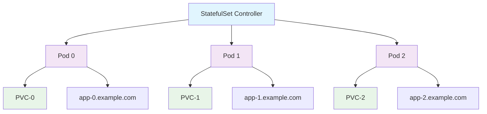

## StatefulSet 개요

StatefulSet은 Kubernetes에서 상태가 있는 애플리케이션을 관리하기 위한 워크로드 리소스입니다. Deployment와 달리 StatefulSet은 각 Pod에 고유한 식별자를 제공하고, 순서대로 배포 및 확장됩니다.

### StatefulSet의 특징

1. **고유한 네트워크 식별자**: 각 Pod는 고유한 DNS 이름을 가집니다
2. **순서가 있는 배포**: Pod는 순서대로 생성되고 삭제됩니다
3. **안정적인 스토리지**: 각 Pod는 고유한 PersistentVolumeClaim을 가집니다
4. **순서가 있는 확장**: 확장 시에도 순서를 유지합니다

---

## StatefulSet 구조



---

## StatefulSet 예시

### 기본 StatefulSet 정의

```yaml
apiVersion: apps/v1
kind: StatefulSet
metadata:
  name: web
spec:
  serviceName: "nginx"
  replicas: 3
  selector:
    matchLabels:
      app: nginx
  template:
    metadata:
      labels:
        app: nginx
    spec:
      containers:
        - name: nginx
          image: nginx:1.14.2
          ports:
            - containerPort: 80
              name: web
          volumeMounts:
            - name: www
              mountPath: /usr/share/nginx/html
  volumeClaimTemplates:
    - metadata:
        name: www
      spec:
        accessModes: ["ReadWriteOnce"]
        resources:
          requests:
            storage: 1Gi
```

### Headless Service 정의

```yaml
apiVersion: v1
kind: Service
metadata:
  name: nginx
  labels:
    app: nginx
spec:
  ports:
    - port: 80
      name: web
  clusterIP: None
  selector:
    app: nginx
```

---

## StatefulSet vs Deployment

| 특징           | StatefulSet                     | Deployment       |
| -------------- | ------------------------------- | ---------------- |
| **Pod 식별자** | 고유한 이름 (web-0, web-1, ...) | 임의의 이름      |
| **스토리지**   | 각 Pod마다 고유한 PVC           | 공유 스토리지    |
| **네트워크**   | 고유한 DNS 이름                 | 공통 서비스 이름 |
| **확장 순서**  | 순서대로 확장/축소              | 무작위 순서      |
| **용도**       | 데이터베이스, 메시징 시스템     | 웹 애플리케이션  |

---

## StatefulSet 사용 사례

### 1. 데이터베이스 (MySQL, PostgreSQL)

```yaml
apiVersion: apps/v1
kind: StatefulSet
metadata:
  name: mysql
spec:
  serviceName: mysql
  replicas: 3
  selector:
    matchLabels:
      app: mysql
  template:
    metadata:
      labels:
        app: mysql
    spec:
      containers:
        - name: mysql
          image: mysql:8.0
          env:
            - name: MYSQL_ROOT_PASSWORD
              value: "password"
          ports:
            - containerPort: 3306
          volumeMounts:
            - name: mysql-data
              mountPath: /var/lib/mysql
  volumeClaimTemplates:
    - metadata:
        name: mysql-data
      spec:
        accessModes: ["ReadWriteOnce"]
        resources:
          requests:
            storage: 10Gi
```

### 2. 메시징 시스템 (RabbitMQ)

```yaml
apiVersion: apps/v1
kind: StatefulSet
metadata:
  name: rabbitmq
spec:
  serviceName: rabbitmq
  replicas: 3
  selector:
    matchLabels:
      app: rabbitmq
  template:
    metadata:
      labels:
        app: rabbitmq
    spec:
      containers:
        - name: rabbitmq
          image: rabbitmq:3-management
          ports:
            - containerPort: 5672
            - containerPort: 15672
          volumeMounts:
            - name: rabbitmq-data
              mountPath: /var/lib/rabbitmq
  volumeClaimTemplates:
    - metadata:
        name: rabbitmq-data
      spec:
        accessModes: ["ReadWriteOnce"]
        resources:
          requests:
            storage: 5Gi
```

---

## StatefulSet 관리 명령어

```bash
# StatefulSet 생성
kubectl apply -f statefulset.yaml

# StatefulSet 상태 확인
kubectl get statefulset
kubectl describe statefulset web

# Pod 확인 (순서대로 생성됨)
kubectl get pods -l app=nginx

# StatefulSet 확장
kubectl scale statefulset web --replicas=5

# StatefulSet 삭제
kubectl delete statefulset web

# 특정 Pod만 삭제 (자동으로 재생성됨)
kubectl delete pod web-1
```

---

## StatefulSet의 네트워크 식별자

StatefulSet의 각 Pod는 다음과 같은 DNS 이름을 가집니다:

- **Pod DNS**: `web-0.nginx.default.svc.cluster.local`
- **Pod DNS**: `web-1.nginx.default.svc.cluster.local`
- **Pod DNS**: `web-2.nginx.default.svc.cluster.local`

이를 통해 각 Pod는 고유한 네트워크 식별자를 가지게 되어, 클러스터 내에서 안정적인 통신이 가능합니다.

---

## 주의사항

1. **스토리지 비용**: 각 Pod마다 별도의 PVC가 생성되므로 스토리지 비용이 증가할 수 있습니다.
2. **복잡성**: Deployment보다 복잡한 설정이 필요합니다.
3. **순서 의존성**: Pod가 순서대로 생성되므로 초기 배포 시간이 길어질 수 있습니다.
4. **스케일링 제한**: 축소 시에도 순서를 지켜야 하므로 즉시 축소되지 않을 수 있습니다.
