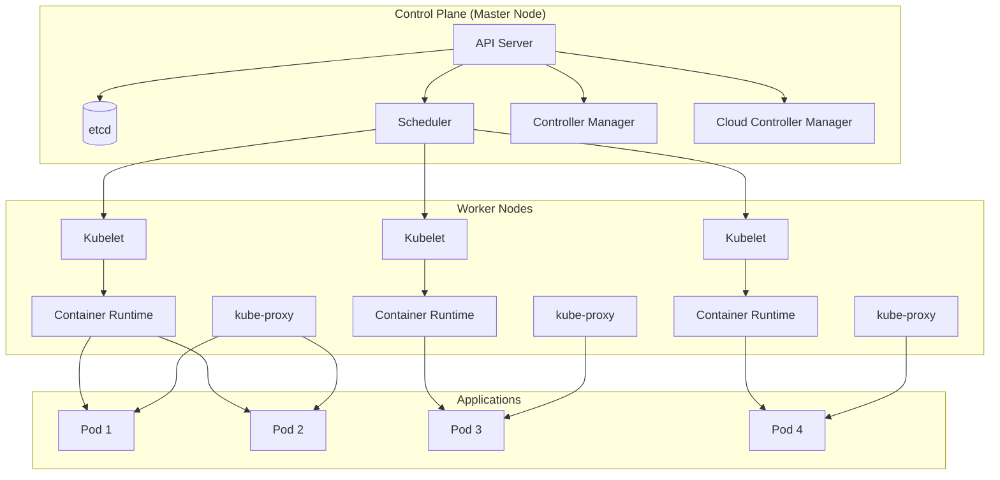
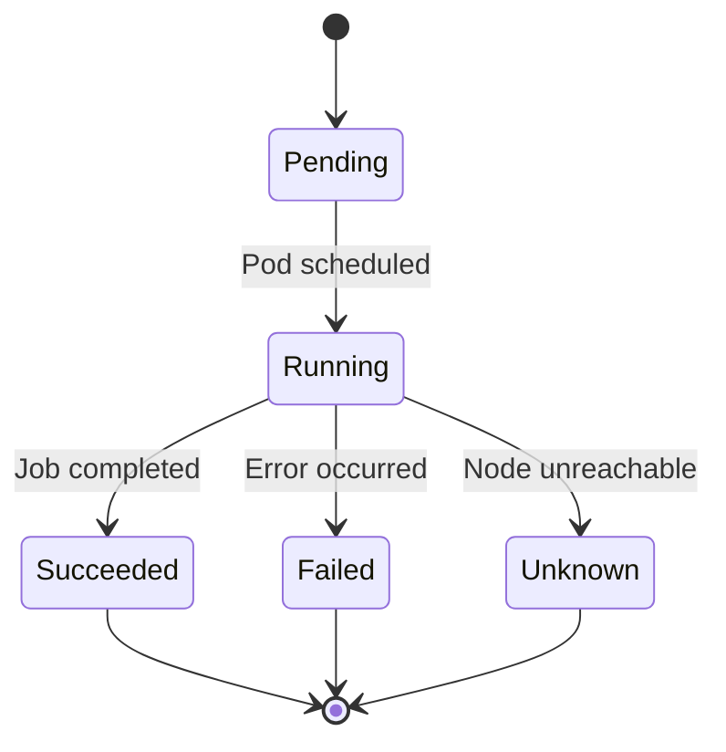
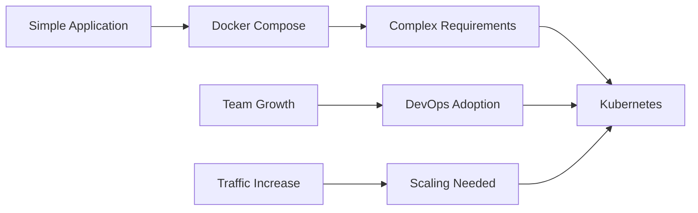

# Kubernetes란?

Kubernetes(쿠버네티스)는 컨테이너화된 애플리케이션의 배포, 확장, 관리를 자동화하는 오픈소스 오케스트레이션 플랫폼입니다. Google에서 개발했으며, 현재는 Cloud Native Computing Foundation(CNCF)에서 관리하고 있습니다.

## 핵심 특징

- **자동화된 배포**: 애플리케이션을 원하는 상태로 자동 배포
- **자동 스케일링**: 트래픽에 따라 자동으로 확장/축소
- **자동 복구**: 장애 발생 시 자동으로 복구
- **로드 밸런싱**: 트래픽을 여러 인스턴스에 분산
- **서비스 디스커버리**: 마이크로서비스 간 통신 자동화

# kubernetes 쓰는 이유

## 1. **컨테이너 오케스트레이션**

- 수백, 수천 개의 컨테이너를 효율적으로 관리
- 복잡한 마이크로서비스 아키텍처 지원

## 2. **높은 가용성**

- 노드 장애 시 자동으로 다른 노드로 이동
- 무중단 배포(Zero-downtime deployment) 지원

## 3. **자동 스케일링**

- CPU, 메모리 사용량에 따른 자동 확장
- 수평적 확장(Horizontal scaling) 지원

## 4. **클라우드 네이티브**

- 클라우드 환경에 최적화
- 멀티 클라우드 지원

## 5. **생태계**

- 풍부한 도구와 플러그인
- 대규모 커뮤니티 지원

# kubernetes를 쓰면 좋은 상황

## ✅ **Kubernetes가 적합한 상황**

### 1. **대규모 마이크로서비스**

- 수십 개 이상의 서비스
- 복잡한 서비스 간 의존성
- 높은 트래픽 처리 필요

### 2. **클라우드 네이티브 애플리케이션**

- 컨테이너 기반 아키텍처
- 자동 스케일링 필요
- 멀티 클라우드 환경

### 3. **엔터프라이즈 환경**

- 높은 가용성 요구
- 복잡한 배포 전략
- 보안 및 규정 준수

### 4. **DevOps 문화**

- CI/CD 파이프라인
- 자동화된 운영
- 모니터링 및 로깅

## Kubernetes가 과도한 상황

### 1. **단순한 애플리케이션**

- 단일 서비스
- 낮은 트래픽
- 간단한 배포 요구사항

### 2. **소규모 팀**

- 학습 곡선이 높음
- 복잡한 운영 오버헤드
- 리소스 제약

### 3. **레거시 시스템**

- 모놀리식 아키텍처
- 컨테이너화되지 않은 애플리케이션
- 급진적인 변화가 어려운 환경

# kubernetes architecture diagram

## 전체 아키텍처

## 컴포넌트 설명

### **Control Plane (마스터 노드)**

- **API Server**: 클러스터의 통합 엔트리 포인트
- **etcd**: 클러스터 데이터 저장소
- **Scheduler**: Pod를 적절한 노드에 배치
- **Controller Manager**: 클러스터 상태 관리
- **Cloud Controller Manager**: 클라우드 제공자와 연동

### **Worker Nodes (워커 노드)**

- **Kubelet**: 노드의 Pod 관리
- **kube-proxy**: 네트워크 통신 관리
- **Container Runtime**: 컨테이너 실행 (Docker, containerd 등)

## Pod 생명주기

# kubernetes vs docker compose

## 비교표

| 구분                  | Kubernetes                   | Docker Compose     |
| --------------------- | ---------------------------- | ------------------ |
| **용도**              | 프로덕션 오케스트레이션      | 개발/테스트 환경   |
| **규모**              | 수백~수천 컨테이너           | 수십 개 컨테이너   |
| **복잡도**            | 높음 (학습 곡선 가파름)      | 낮음 (간단한 YAML) |
| **자동화**            | 고도 자동화 (스케일링, 복구) | 수동 관리          |
| **스케일링**          | 자동 수평 스케일링           | 수동 스케일링      |
| **로드 밸런싱**       | 내장 로드 밸런서             | 외부 도구 필요     |
| **서비스 디스커버리** | 내장                         | 수동 설정          |
| **배포 전략**         | Rolling, Blue/Green, Canary  | 단순 배포          |
| **모니터링**          | 풍부한 메트릭                | 기본 로그만        |
| **보안**              | RBAC, 네트워크 정책          | 기본 보안          |
| **리소스 관리**       | CPU/메모리 제한              | 기본 제한          |
| **학습 비용**         | 높음 (몇 주~몇 달)           | 낮음 (몇 시간)     |
| **운영 오버헤드**     | 높음                         | 낮음               |
| **클라우드 지원**     | 모든 클라우드 지원           | 제한적             |

## 언제 어떤 것을 사용할까?

### **Docker Compose 사용 시기**

- ✅ **개발 환경**에서 빠른 프로토타이핑
- ✅ **단순한 애플리케이션** (웹앱 + DB)
- ✅ **소규모 팀** (DevOps 전문가 없음)
- ✅ **테스트 환경** 구축
- ✅ **학습 목적** (컨테이너 개념 이해)

### **Kubernetes 사용 시기**

- ✅ **프로덕션 환경**에서 대규모 서비스
- ✅ **마이크로서비스 아키텍처**
- ✅ **높은 가용성** 요구
- ✅ **자동 스케일링** 필요
- ✅ **복잡한 배포 전략** (Canary, Blue/Green)
- ✅ **멀티 클라우드** 환경

## 마이그레이션 전략

