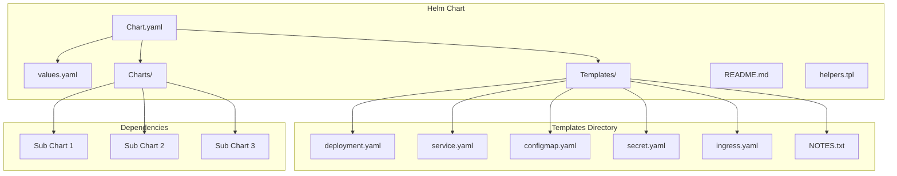
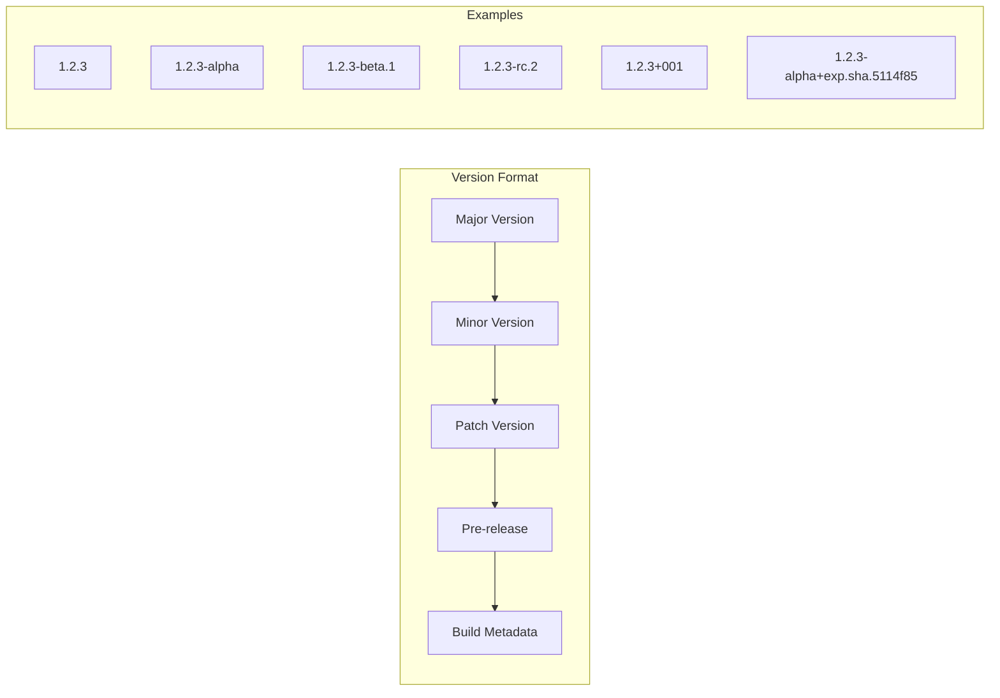
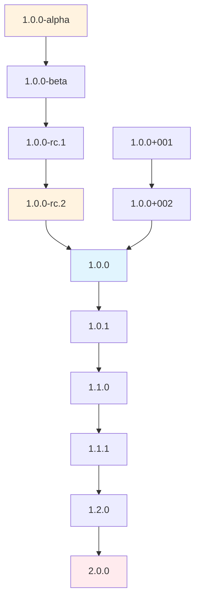
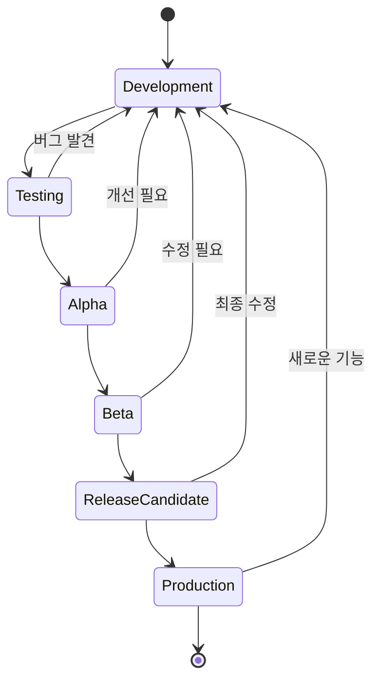

# Chart grammer

```yaml
apiVersion: The chart API version (required)
name: The name of the chart (required)
version: A SemVer 2 version (required) # 1.2.3-alpha.1+ef365
description: A single-sentence description of this project (optional)
dependencies: # A list of the chart requirements (optional)
  - name: The name of the chart (nginx)
    version: The version of the chart ("1.2.3")
    repository: (optional) The repository URL ("https://example.com/charts") or alias ("@repo-name")
    condition: (optional) A yaml path that resolves to a boolean, used for enabling/disabling charts (e.g. subchart1.enabled )
    tags: # (optional)
      - Tags can be used to group charts for enabling/disabling together
    import-values: # (optional)
      - ImportValues holds the mapping of source values to parent key to be imported. Each item can be a string or pair of child/parent sublist items.
    alias: (optional) Alias to be used for the chart. Useful when you have to add the same chart multiple times
appVersion: The version of the app that this contains (optional). Needn't be SemVer. Quotes recommended. # "8.2.1"
```

## Helm Chart 구조 다이어그램



# SemVersion

## version

- `major version`.`minor version`.`patches`
  - major
    - 호환되지 않는 API 변경
  - minor
    - 하위 호환되는 기능 추가
  - patch
    - 하위 호환되는 기능 추가

## alpha

- 하이픈(`-`) 사용
  - `-` 뒤에 오는 값은 정식 릴리즈 전의 버전을 나타낸다.
  - 정식 버전보다 낮은 버전
  - 예시
    - `1.2.3-alpha`
    - `1.2.3-beta.1`
    - `1.2.3-rc.2`
- 플러스(`+`) 사용: 빌드 메타데이터
  - 빌드 메타데이터(Build Metadata)
  - 플러스 뒤에 오는 값은 빌드 정보를 나타냅니다.
  - 빌드 메타데이터는 버전 우선순위에 영향을 주지 않습니다 (동일 버전으로 간주).
  - 예시
    - `1.2.3+001`
    - `1.2.3-alpha+exp.sha.5114f85`

## Semantic Versioning 다이어그램



## 버전 우선순위 다이어그램



## Helm Chart 생명주기



## Chart.yaml 예시

```mermaid
graph TD
    A[Chart.yaml] --> B[apiVersion: v2]
    A --> C[name: my-app]
    A --> D[version: 1.2.3]
    A --> E[description: My application]
    A --> F[appVersion: "1.0.0"]
    A --> G[dependencies]

    G --> H[name: nginx]
    G --> I[version: "1.2.3"]
    G --> J[repository: https://charts.bitnami.com/bitnami]

    style A fill:#e8f5e8
    style B fill:#f0f8ff
    style C fill:#f0f8ff
    style D fill:#f0f8ff
    style E fill:#f0f8ff
    style F fill:#f0f8ff
    style G fill:#fff8dc
```
