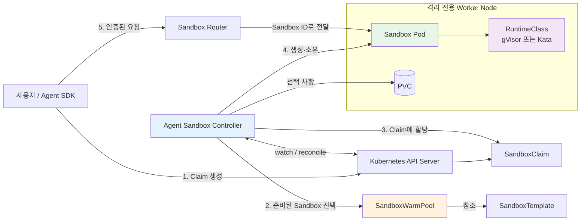
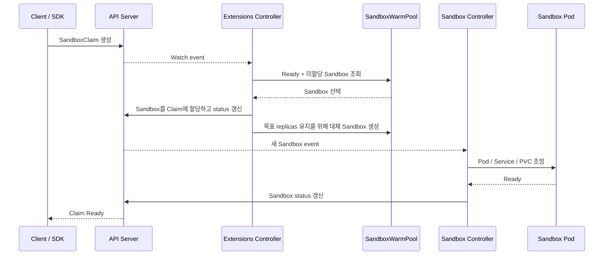
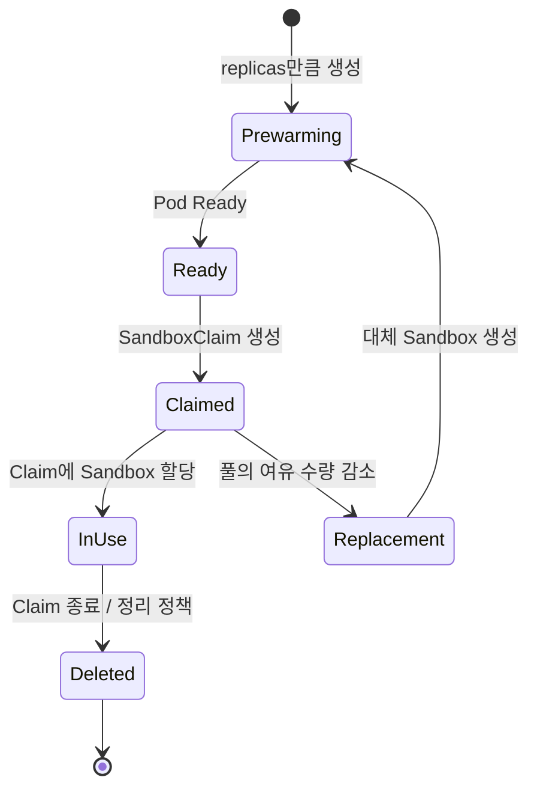
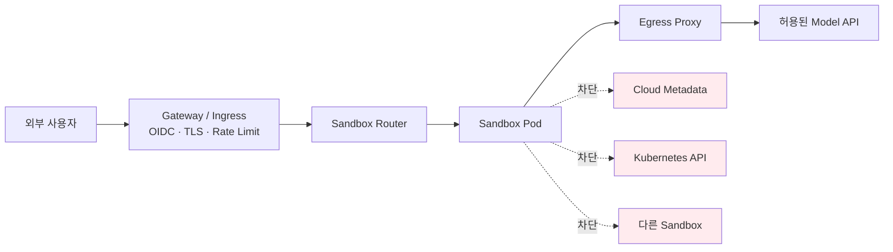

# Agent Sandbox on Kubernetes

> 이 글에서 다루는 프로젝트의 공식 이름과 저장소는 **Agent Sandbox**(`kubernetes-sigs/agent-sandbox`)이다. `sandbox-agent`는 검색하거나 대화할 때 자주 뒤바뀌어 사용되는 표현이므로 주의한다.

Agent Sandbox는 AI 에이전트나 사용자가 만든 신뢰할 수 없는 코드를 Kubernetes에서 실행하기 위한 **샌드박스 오케스트레이터**다. `Sandbox`라는 CRD(Custom Resource Definition)를 제공하고, 컨트롤러가 그 선언을 실제 Pod, Service, PVC, NetworkPolicy로 조정(reconcile)한다.

중요한 점은 Agent Sandbox 자체가 컨테이너 탈출을 막는 런타임은 아니라는 것이다. 실제 격리는 `RuntimeClass`로 선택한 gVisor, Kata Containers 같은 런타임이 담당한다. 기본 `runc`만 사용하면서 리소스 이름에 Sandbox가 들어간다고 해서 신뢰할 수 없는 코드가 안전해지는 것은 아니다.

이 글은 **2026-09-12 기준 v0.5.3 / v1beta1 API**를 기준으로 작성했다. 아직 API와 설치 방법이 변할 수 있으므로 운영 환경에서는 반드시 릴리스 버전을 고정한다.

---

## 언제 사용하는가

- LLM이 생성한 Python, JavaScript, 셸 명령을 실행할 때
- 코딩 에이전트마다 독립된 작업 공간과 파일 시스템이 필요할 때
- 브라우저 자동화, Jupyter, CI 작업을 사용자별로 격리할 때
- RL/Evaluation처럼 짧은 샌드박스를 대량으로 빠르게 할당할 때
- Deployment나 StatefulSet보다 명확한 단일 실행 환경의 생명주기가 필요할 때

반대로 일반적인 무상태 웹 서버나 동일한 복제본을 여러 개 운영하는 서비스에는 Deployment가 더 적합하다. Agent Sandbox의 핵심 모델은 복제 서비스가 아니라 **안정적인 식별자를 가진 단일 상태 실행 환경**이다.

---

## 주요 리소스

| 리소스 | API 그룹 | 역할 | 일반적인 생성 주체 |
| --- | --- | --- | --- |
| `Sandbox` | `agents.x-k8s.io/v1beta1` | Pod 한 개의 실행 환경과 생명주기 관리 | 컨트롤러 또는 관리자 |
| `SandboxTemplate` | `extensions.agents.x-k8s.io/v1beta1` | 이미지, 런타임, 보안 설정의 재사용 가능한 원본 | 플랫폼 관리자 |
| `SandboxWarmPool` | `extensions.agents.x-k8s.io/v1beta1` | 미리 시작된 Sandbox 수량 유지 | 플랫폼 관리자 |
| `SandboxClaim` | `extensions.agents.x-k8s.io/v1beta1` | 승인된 WarmPool에서 Sandbox 한 개 요청 | 사용자 또는 SDK |

멀티 테넌트 환경에서는 사용자가 임의의 `Sandbox`나 `SandboxTemplate`을 만들게 하지 않는 편이 안전하다. 플랫폼 관리자가 검증한 Template과 WarmPool을 만들고, 일반 사용자는 `SandboxClaim`만 생성하게 한다.

---

## Kubernetes에서의 전체 아키텍처



컨트롤 플레인 흐름과 데이터 플레인 흐름을 구분해야 한다.

- **컨트롤 플레인**: SDK 또는 사용자가 API Server에 Claim을 만들고, 컨트롤러가 CRD를 관찰하여 Sandbox와 하위 리소스를 생성한다.
- **데이터 플레인**: 실제 명령 실행, 파일 업로드, HTTP 요청은 Sandbox Router를 거쳐 Sandbox Pod로 전달된다.
- **격리 경계**: Pod 이름이나 네임스페이스가 아니라 gVisor/Kata 런타임, NetworkPolicy, 자격 증명, 노드 경계의 조합이다.

### 컨트롤러의 Reconcile 흐름



컨트롤러는 일회성 스크립트가 아니다. 원하는 상태와 실제 상태가 달라질 때까지 같은 조정을 반복한다. 따라서 하위 Pod를 직접 수정하면 컨트롤러가 되돌리거나 다시 만들 수 있으며, 설정 변경은 원본 Sandbox 또는 Template에서 해야 한다.

---

## 설치

### 사전 조건

- Kubernetes 1.28 이상
- `kubectl`
- 신뢰할 수 없는 코드를 실행한다면 gVisor 또는 Kata Containers를 지원하는 노드
- NetworkPolicy를 실제로 집행하는 CNI(Cilium, Calico 등)
- 운영 환경이라면 격리 워크로드 전용 Node Pool

### 릴리스 버전을 고정하여 설치

WarmPool, Template, Claim을 사용하려면 extensions가 포함된 매니페스트를 설치해야 한다.

```bash
VERSION="v0.5.3"

kubectl apply -f \
  "https://github.com/kubernetes-sigs/agent-sandbox/releases/download/${VERSION}/sandbox-with-extensions.yaml"

kubectl -n agent-sandbox-system rollout status \
  deployment/agent-sandbox-controller --timeout=120s
```

설치 확인:

```bash
kubectl get crd sandboxes.agents.x-k8s.io
kubectl get crd sandboxtemplates.extensions.agents.x-k8s.io
kubectl get crd sandboxwarmpools.extensions.agents.x-k8s.io
kubectl get crd sandboxclaims.extensions.agents.x-k8s.io
kubectl get pods -n agent-sandbox-system
```

`main`, `latest` 이미지나 원격 매니페스트를 그대로 운영에 사용하지 않는다. GitOps 저장소에 검토한 매니페스트를 저장하거나 특정 릴리스 URL과 이미지 digest를 고정한다.

> Helm은 업그레이드할 때 `crds/` 아래 CRD를 자동으로 갱신하지 않는다. 이전 `v1alpha1` 설치에서 올리는 경우 공식 API migration guide의 순서를 따라야 한다.

---

## 기본 예시: Template, WarmPool, Claim

아래 예시는 플랫폼 관리자가 보안 설정이 포함된 Template과 WarmPool을 만들고, 일반 사용자는 Claim만 만드는 형태다. 클러스터에 등록된 RuntimeClass 이름에 맞게 `gvisor`를 변경해야 한다.

### 1. 전용 Namespace

```yaml
apiVersion: v1
kind: Namespace
metadata:
  name: agent-sandbox-demo
  labels:
    # 생성되는 Pod에도 Restricted 정책을 한 번 더 적용한다.
    pod-security.kubernetes.io/enforce: restricted
    pod-security.kubernetes.io/audit: restricted
    pod-security.kubernetes.io/warn: restricted
```

### 2. 관리자가 SandboxTemplate 생성

```yaml
apiVersion: extensions.agents.x-k8s.io/v1beta1
kind: SandboxTemplate
metadata:
  name: secure-python
  namespace: agent-sandbox-demo
spec:
  # Claim이 보안 설정이나 스토리지를 임의로 바꾸지 못하게 한다.
  envVarsInjectionPolicy: Disallowed
  volumeClaimTemplatesPolicy: Disallowed
  podTemplate:
    spec:
      runtimeClassName: gvisor
      automountServiceAccountToken: false
      enableServiceLinks: false
      hostNetwork: false
      hostPID: false
      hostIPC: false
      securityContext:
        runAsNonRoot: true
        runAsUser: 10000
        runAsGroup: 10000
        fsGroup: 10000
        seccompProfile:
          type: RuntimeDefault
      containers:
        - name: runtime
          image: python:3.12.6-slim@sha256:<검증한-digest>
          command: ["sh", "-c", "sleep infinity"]
          ports:
            - name: agent
              containerPort: 8080
          resources:
            requests:
              cpu: 100m
              memory: 128Mi
            limits:
              cpu: "1"
              memory: 1Gi
          securityContext:
            allowPrivilegeEscalation: false
            privileged: false
            readOnlyRootFilesystem: true
            capabilities:
              drop: ["ALL"]
          volumeMounts:
            - name: workspace
              mountPath: /workspace
            - name: tmp
              mountPath: /tmp
      volumes:
        - name: workspace
          emptyDir:
            sizeLimit: 2Gi
        - name: tmp
          emptyDir:
            sizeLimit: 256Mi

  # 컨트롤러가 이 Template의 Sandbox에 공통 NetworkPolicy를 관리한다.
  networkPolicyManagement: Managed
  networkPolicy:
    ingress:
      - from:
          - namespaceSelector:
              matchLabels:
                kubernetes.io/metadata.name: agent-sandbox-system
            podSelector:
              matchLabels:
                app: sandbox-router
        ports:
          - protocol: TCP
            port: 8080
    egress:
      # CoreDNS의 실제 Namespace와 label은 클러스터마다 확인한다.
      - to:
          - namespaceSelector:
              matchLabels:
                kubernetes.io/metadata.name: kube-system
            podSelector:
              matchLabels:
                k8s-app: kube-dns
        ports:
          - protocol: UDP
            port: 53
          - protocol: TCP
            port: 53
      # 예시일 뿐 목적지 제한이 아니다. 운영에서는 아래 보안 설명을 참고한다.
      - ports:
          - protocol: TCP
            port: 443
```

`readOnlyRootFilesystem: true`일 때 애플리케이션이 쓰는 디렉터리는 `emptyDir` 또는 PVC로 별도 마운트해야 한다. 이미지 digest는 실제 레지스트리에서 확인한 값으로 교체한다.

### 3. 관리자가 SandboxWarmPool 생성

```yaml
apiVersion: extensions.agents.x-k8s.io/v1beta1
kind: SandboxWarmPool
metadata:
  name: secure-python-pool
  namespace: agent-sandbox-demo
spec:
  replicas: 3
  sandboxTemplateRef:
    name: secure-python
  updateStrategy:
    type: Recreate
```

### 4. 사용자가 SandboxClaim 생성

```yaml
apiVersion: extensions.agents.x-k8s.io/v1beta1
kind: SandboxClaim
metadata:
  name: session-a
  namespace: agent-sandbox-demo
spec:
  warmPoolRef:
    name: secure-python-pool
```

상태 확인:

```bash
kubectl wait -n agent-sandbox-demo \
  --for=condition=Ready sandboxclaim/session-a --timeout=60s

kubectl get sandboxclaim session-a -n agent-sandbox-demo -o yaml
kubectl get sandboxwarmpool secure-python-pool -n agent-sandbox-demo
kubectl get sandboxes,pods -n agent-sandbox-demo
```

Claim에 할당된 실제 Sandbox 이름은 status에서 확인한다.

```bash
kubectl get sandboxclaim session-a -n agent-sandbox-demo \
  -o jsonpath='{.status.sandbox.name}{"\n"}'
```

### Python SDK 예시

Router와 Python client가 준비된 경우 다음처럼 사용할 수 있다.

```python
from k8s_agent_sandbox import SandboxClient

client = SandboxClient()

sandbox = client.create_sandbox(
    warmpool="secure-python-pool",
    namespace="agent-sandbox-demo",
)

try:
    result = sandbox.commands.run("python -c 'print(6 * 7)'")
    print(result.stdout)
finally:
    sandbox.terminate()
```

애플리케이션이 비정상 종료해도 Claim이 남지 않도록 `finally`, context manager 또는 별도 TTL/정리 작업을 둔다.

---

## WarmPool이란

WarmPool은 Sandbox 요청이 오기 **전에** 이미지 pull, Pod scheduling, 런타임 부팅까지 끝난 Sandbox를 일정 수만큼 유지하는 풀이다. 일반적인 cold start가 필요할 때보다 요청 지연을 크게 줄이는 대신, 사용하지 않는 동안에도 CPU/메모리와 PVC 비용을 사용한다.



### 실제 동작 순서

1. `SandboxWarmPool`이 `SandboxTemplate`을 참조한다.
2. 컨트롤러가 `spec.replicas`만큼 Sandbox와 backing Pod를 미리 만든다.
3. 준비된 Sandbox에는 WarmPool 식별 label이 붙고 Pod까지 전파된다.
4. Claim이 생성되면 extensions controller가 Ready 상태인 미할당 Sandbox 하나를 채택한다.
5. 할당된 Sandbox의 이름은 유지되고 `SandboxClaim.status.sandbox.name`에 기록된다.
6. 풀은 빈 자리를 감지하여 새 Sandbox를 생성하고 목표 replicas를 복원한다.

즉 `replicas: 3`은 전체 세션 수 제한이 아니라 **할당을 기다리는 준비된 Sandbox 목표 수**다. 세 개가 동시에 할당되면 사용 중 Sandbox 세 개와 새로 채우는 Sandbox 세 개가 잠시 함께 존재할 수 있다.

### WarmPool 운영 시 주의점

- 준비된 Pod는 무료가 아니다. 최소 replicas는 p95 요청량과 cold-start 허용 시간을 기준으로 정한다.
- 큰 이미지, Kata VM, PVC provisioning이 느릴수록 WarmPool의 효과가 크다.
- Template 변경은 이미 할당된 Sandbox에 자동 반영되는 배포 전략으로 생각하면 안 된다. `Recreate` 전략과 점진적인 풀 교체 절차를 검증한다.
- 준비된 Sandbox가 노드 리소스를 선점하므로 ResourceQuota, 노드 오토스케일러, eviction 정책을 함께 설계한다.
- 사용자 입력이나 이전 세션의 파일이 남은 Sandbox를 다른 사용자에게 재할당하면 안 된다. Claim이 끝난 실행 환경은 폐기하고 풀은 깨끗한 Template에서 대체본을 만들어야 한다.
- PVC를 미리 만들면 할당 지연은 줄지만 유휴 스토리지 비용이 늘고, 삭제/Retain 정책에 따라 데이터가 남을 수 있다.
- 현재 API에서 Claim별 환경 변수나 `volumeClaimTemplates`를 지정하면 미리 준비된 Sandbox를 채택하지 않고 cold start한다. Template의 injection/merge 정책과 사용하는 SDK 버전을 확인한다.
- 수요가 큰 환경에서는 고정 replicas 대신 공식 metric과 HPA/KEDA를 이용할 수 있지만, 급격한 scale-down이 준비 중인 Sandbox를 반복 제거하지 않도록 안정화 시간을 둔다.

---

## ClusterRole은 어디까지 줘야 하는가

먼저 권한을 받는 주체를 네 가지로 분리한다.

| 주체 | 권장 범위 | 핵심 원칙 |
| --- | --- | --- |
| 설치 관리자 | 일시적인 cluster-scoped 관리 권한 | CRD, ClusterRole, webhook 설치 후 상시 자격 증명으로 사용하지 않음 |
| Agent Sandbox Controller SA | 공식 릴리스의 ClusterRole | 하위 리소스와 CRD status를 reconcile하는 데 필요한 권한만 사용 |
| 일반 사용자 / SDK SA | Namespace의 Role + RoleBinding | 승인된 풀의 `SandboxClaim`만 생성·조회·삭제 |
| Sandbox workload SA | 기본적으로 Kubernetes API 권한 없음 | token 자동 mount를 끄고 정말 필요할 때 별도 Role 부여 |

### 컨트롤러 권한

v0.5.3 공식 생성 매니페스트에서 core controller는 대략 다음 권한을 사용한다.

- `pods`, `services`, `persistentvolumeclaims`: CRUD + watch
- `sandboxes`: CRUD + watch
- `sandboxes/status`, `sandboxes/finalizers`: get, patch, update
- leader election용 `leases`
- Kubernetes event 생성
- 정해진 Agent Sandbox CRD의 conversion/webhook 설정을 위한 get, patch, update

extensions controller는 추가로 다음 권한을 사용한다.

- `sandboxclaims`, `sandboxtemplates`, `sandboxwarmpools`: CRUD + watch
- 각 status/finalizer 갱신
- `sandboxes` 생성과 관리
- 관리형 `networkpolicies`: CRUD + watch
- Pod 상태 조회와 label/status 조정

이 컨트롤러들은 기본적으로 여러 Namespace의 리소스를 조정하므로 공식 설치는 ClusterRole을 사용한다. 그렇더라도 `cluster-admin` 또는 `apiGroups: ["*"]`, `resources: ["*"]`, `verbs: ["*"]`는 필요하지 않다. 릴리스 매니페스트의 생성된 RBAC을 기준으로 diff를 검토하고, 임의로 wildcard 권한을 추가하지 않는다.

컨트롤러를 특정 Namespace만 watch하도록 구성할 수 있는 릴리스/배포라면, namespaced 리소스 권한은 ClusterRole을 **RoleBinding**으로 그 Namespace에만 묶을 수 있다. 그러나 CRD 자체의 patch처럼 cluster-scoped 작업은 별도 ClusterRoleBinding이 필요할 수 있으므로 실제 controller flag와 시작 로그를 확인해야 한다.

### 일반 사용자에게 권장하는 최소 Role

일반 사용자는 Template이나 WarmPool을 바꾸지 않고 Claim만 다루게 한다.

```yaml
apiVersion: rbac.authorization.k8s.io/v1
kind: Role
metadata:
  name: sandbox-claim-user
  namespace: agent-sandbox-demo
rules:
  - apiGroups: ["extensions.agents.x-k8s.io"]
    resources: ["sandboxclaims"]
    verbs: ["create", "get", "list", "watch", "delete"]
---
apiVersion: rbac.authorization.k8s.io/v1
kind: RoleBinding
metadata:
  name: sandbox-claim-users
  namespace: agent-sandbox-demo
subjects:
  - kind: Group
    name: sandbox-users
    apiGroup: rbac.authorization.k8s.io
roleRef:
  kind: Role
  name: sandbox-claim-user
  apiGroup: rbac.authorization.k8s.io
```

업데이트가 꼭 필요한 클라이언트만 `patch` 또는 `update`를 추가한다. `sandboxes`, `sandboxtemplates`, `sandboxwarmpools`, `pods/exec`, `pods/attach`, `secrets` 권한을 편의상 같이 주지 않는다.

Claim의 lifecycle, 환경 변수, PVC override도 admission policy로 제한한다. Claim만 만들 수 있다는 사실이 무제한 실행 시간이나 무제한 스토리지 생성을 자동으로 막아 주지는 않는다.

특히 `pods/exec`은 Sandbox Router를 우회하여 코드 실행 통로가 될 수 있고, `secrets get/list`는 같은 Namespace의 다른 tenant 자격 증명을 읽게 만들 수 있다. 디버깅 권한도 별도의 짧은 수명 RoleBinding으로 관리하는 편이 안전하다.

### Sandbox Pod 자체의 ServiceAccount

신뢰할 수 없는 코드에는 Kubernetes API token을 주지 않는 것이 기본이다.

```yaml
spec:
  podTemplate:
    spec:
      automountServiceAccountToken: false
```

업무상 API 접근이 필요하다면 tenant별 전용 ServiceAccount와 namespaced Role을 만들고 `resourceNames`까지 좁힐 수 있는 동작은 좁힌다. Secret 전체 조회, RBAC 생성, Pod 생성, `pods/exec`, impersonate, TokenRequest 권한은 cluster takeover 경로가 될 수 있으므로 피한다.

권한 확인 예시:

```bash
# 사용자/그룹이 Claim만 다룰 수 있는지 확인
kubectl auth can-i create sandboxclaims.extensions.agents.x-k8s.io \
  -n agent-sandbox-demo --as-group=sandbox-users --as=user@example.com

kubectl auth can-i create sandboxtemplates.extensions.agents.x-k8s.io \
  -n agent-sandbox-demo --as-group=sandbox-users --as=user@example.com

# Sandbox workload SA에 과도한 권한이 없는지 확인
kubectl auth can-i --list \
  --as=system:serviceaccount:agent-sandbox-demo:sandbox-runtime \
  -n agent-sandbox-demo
```

### Sandbox Router 권한

Router가 Pod IP cache를 사용하면 Sandbox Pod를 찾기 위해 `pods`에 대한 `get`, `list`, `watch`가 필요하다.

- 여러 Namespace를 라우팅하면 read-only ClusterRole을 사용한다.
- 한 Namespace만 라우팅하면 Router의 cache namespace를 고정하고 Role + RoleBinding으로 줄인다.
- DNS-only 모드를 사용할 수 있는 규모라면 Pod 조회 권한 자체를 제거할 수 있다.

Kubernetes RBAC은 “모든 Namespace에서 `kube-system`만 제외” 같은 deny 규칙을 표현하지 못한다. label selector는 Router가 실제로 cache할 대상을 줄여 주지만 RBAC 권한 경계 자체는 아니다.

---

## 보안 설정

### 1. 런타임 격리

| 런타임 | 격리 방식 | 장점 | 주의점 |
| --- | --- | --- | --- |
| 기본 OCI/runc | Host kernel 공유 | 빠르고 호환성이 높음 | 적대적 멀티 테넌트 코드의 강한 경계로 보기 어려움 |
| gVisor | userspace kernel이 syscall 중재 | 비교적 가볍고 host kernel 공격면 축소 | 일부 syscall/성능 호환성 테스트 필요 |
| Kata Containers | Sandbox별 경량 VM과 별도 kernel | 강한 VM 수준 격리 | 부팅 시간, 메모리, nested virtualization 비용 |

신뢰 수준이 낮고 tenant가 다른 워크로드라면 Kata를 우선 검토하고, 성능과 호환성 균형이 필요하면 gVisor를 검토한다. 어떤 런타임을 선택하든 전용 Node Pool, taint/toleration, nodeSelector 또는 node affinity로 일반 워크로드와 분리한다.

`runtimeClassName`은 문서에 나온 값을 복사하지 말고 클러스터에서 확인한다.

```bash
kubectl get runtimeclass
```

### 2. Pod 보안

Template과 admission policy로 다음을 강제한다.

- `runAsNonRoot: true`
- `allowPrivilegeEscalation: false`
- 모든 Linux capability drop, capability add 금지
- `seccompProfile.type: RuntimeDefault`
- `privileged: false`
- `hostNetwork`, `hostPID`, `hostIPC`, `hostPort` 금지
- `hostPath`와 임의 projected service account token 금지
- CPU, memory, ephemeral storage request/limit 설정
- 가능한 경우 read-only root filesystem
- initContainer, sidecar, ephemeralContainer에도 같은 규칙 적용

사용자가 직접 Sandbox CR을 만들 수 있다면 Pod Security Admission만 믿지 말고 `agents.x-k8s.io`의 Sandbox CR을 검사하는 ValidatingAdmissionPolicy 또는 Gatekeeper/Kyverno 정책도 적용한다. 생성된 Pod 단계에서만 거부하면 컨트롤러가 실패와 재시도를 반복할 수 있다.

### 3. 네트워크 격리

최소 권장 흐름은 다음과 같다.



NetworkPolicy를 작성하는 것만으로 충분하지 않다. CNI가 이를 집행하는지 확인해야 한다. 또한 `TCP/443`만 허용하는 규칙은 **목적지를 제한하지 않는다**. 공격자는 443을 사용하는 Kubernetes API나 임의의 외부 서버에 연결할 수 있다.

운영 환경에서는 다음 중 하나를 사용한다.

- egress proxy를 거치게 하고 Model API allowlist를 적용
- Cilium 같은 CNI의 FQDN/L7 policy 사용
- 고정 IP를 제공하는 목적지에 제한된 `ipBlock` 사용
- cloud metadata IP, Pod CIDR, Service CIDR, Node CIDR로 가는 경로를 명시적으로 차단

NetworkPolicy는 보통 allow 규칙 기반이므로 “모든 외부 허용 + 일부 IP만 deny”를 표준 API만으로 간단히 표현하기 어렵다. 네트워크 설계에 맞춰 CNI 기능이나 egress gateway를 사용한다.

### 4. Router와 외부 노출

- Router 앞에 인증 가능한 Gateway/Ingress를 둔다.
- TLS 또는 mTLS를 적용하고 tenant identity를 검증된 토큰에서 얻는다.
- 사용자가 보내는 `X-Sandbox-ID`, `X-Owner` 같은 header를 신뢰 경계로 사용하지 않는다.
- 요청자가 해당 Sandbox의 소유자인지 authorization을 별도로 검사한다.
- request body 크기, WebSocket 수/수명, 실행 시간, 동시 요청 수를 제한한다.
- Router Service를 곧바로 public `LoadBalancer`로 노출하지 않는다.
- 운영에서 unauthenticated router 옵션을 켜지 않는다.

Router가 올바른 Sandbox로 전달해 준다는 사실과 사용자가 그 Sandbox에 접근할 권한이 있다는 사실은 서로 다르다. 라우팅과 인가를 반드시 분리해서 검증한다.

### 5. Secret과 외부 자격 증명

- Secret을 이미지나 Template YAML에 넣지 않는다.
- tenant별 또는 세션별로 자격 증명을 분리하고 짧은 TTL을 사용한다.
- 클라우드 Workload Identity를 사용하더라도 대상 API와 권한을 최소화한다.
- 장기 API key를 환경 변수로 주입하면 프로세스와 crash dump에서 노출될 수 있음을 고려한다.
- 가능하면 credential broker/egress proxy가 요청을 대신 서명하게 한다.
- 로그, trace, 명령 결과에서 token과 prompt의 민감정보를 마스킹한다.

### 6. 자원 고갈 방지

공격자가 컨테이너를 탈출하지 않아도 CPU fork bomb, 메모리 고갈, 디스크 채우기, 과도한 네트워크 요청으로 장애를 만들 수 있다.

- Namespace `ResourceQuota`와 `LimitRange`
- 컨테이너 requests/limits와 `emptyDir.sizeLimit`
- Claim 생성 rate limit 및 사용자별 동시 Sandbox 수 제한
- WarmPool 최대 크기와 노드 오토스케일 한도
- 실행 command timeout, 출력 크기, 업로드 크기 제한
- 오래된 Claim, PVC, Snapshot을 정리하는 TTL 정책

를 함께 적용한다.

---

## 운영 체크리스트

### 배포 전

- [ ] Agent Sandbox와 Router 이미지 tag/digest를 고정했는가?
- [ ] gVisor 또는 Kata RuntimeClass가 실제 노드에서 동작하는가?
- [ ] Sandbox 전용 Node Pool과 taint가 있는가?
- [ ] 일반 사용자는 SandboxClaim만 만들 수 있는가?
- [ ] workload의 ServiceAccount token 자동 mount가 꺼져 있는가?
- [ ] ValidatingAdmissionPolicy/Gatekeeper/Kyverno가 위험한 Pod spec을 막는가?
- [ ] CNI가 NetworkPolicy를 실제로 집행하는가?
- [ ] metadata, API Server, tenant 간 통신이 차단되는가?
- [ ] Router 앞에 인증, 인가, TLS, rate limit이 있는가?
- [ ] ResourceQuota와 Claim 수 제한이 있는가?

### 배포 후 검증

```bash
# CRD와 controller
kubectl get crd | grep agents.x-k8s.io
kubectl get pods -n agent-sandbox-system

# WarmPool 준비 수량과 backing Pod
kubectl get sandboxwarmpool -A
kubectl get sandboxes,pods -n agent-sandbox-demo
kubectl get pods -n agent-sandbox-demo \
  -l agents.x-k8s.io/warm-pool-sandbox

# 실제 RuntimeClass와 보안 설정
kubectl get pod -n agent-sandbox-demo <sandbox-pod> \
  -o jsonpath='{.spec.runtimeClassName}{"\n"}'
kubectl get pod -n agent-sandbox-demo <sandbox-pod> \
  -o jsonpath='{.spec.automountServiceAccountToken}{"\n"}'

# NetworkPolicy 생성 여부
kubectl get networkpolicy -n agent-sandbox-demo

# 이벤트와 controller 오류
kubectl get events -n agent-sandbox-demo --sort-by=.lastTimestamp
kubectl logs -n agent-sandbox-system \
  deployment/agent-sandbox-controller --since=10m
```

격리는 이름이나 YAML만 보고 확인하지 않는다. Sandbox 내부에서 다음을 실제로 시험한다.

- Kubernetes API token이 mount되지 않았는가?
- `169.254.169.254` cloud metadata에 접근할 수 없는가?
- 다른 tenant의 Pod IP와 Service에 접근할 수 없는가?
- 허용되지 않은 외부 도메인으로 egress할 수 없는가?
- host namespace, host filesystem, privileged syscall에 접근할 수 없는가?
- CPU, memory, process, disk 제한이 실제로 적용되는가?

---

## 자주 발생하는 문제

### Claim이 Ready가 되지 않는다

```bash
kubectl describe sandboxclaim session-a -n agent-sandbox-demo
kubectl describe sandboxwarmpool secure-python-pool -n agent-sandbox-demo
kubectl get events -n agent-sandbox-demo --sort-by=.lastTimestamp
```

- `warmPoolRef.name` 오타
- Template과 WarmPool의 Namespace 불일치
- RuntimeClass 미설치
- 전용 노드의 taint/toleration 또는 nodeSelector 불일치
- ResourceQuota 초과
- 이미지 pull 실패
- admission policy 거부
- PVC가 bind되지 않음

을 순서대로 확인한다.

### WarmPool의 Ready 수량이 계속 부족하다

- 노드 용량과 Pod scheduling 상태 확인
- 이미지 registry rate limit 및 pull latency 확인
- Kata VM에 필요한 CPU/메모리 요청 확인
- readiness probe와 controller readiness grace period 확인
- Claim 도착률이 보충 속도보다 빠른지 metric으로 확인

### NetworkPolicy가 있는데도 외부로 연결된다

- CNI가 NetworkPolicy를 지원하고 집행하는지 확인
- Pod를 선택하는 label selector가 실제 label과 일치하는지 확인
- 다른 allow policy가 합쳐져 egress를 허용하는지 확인
- service mesh sidecar 또는 node-local DNS 경로 확인
- 표준 NetworkPolicy가 host/node 트래픽을 어떻게 처리하는지 CNI 문서 확인

### 설정을 바꿨는데 기존 Sandbox에 반영되지 않는다

Template은 새 Sandbox를 위한 원본이다. 기존에 Claim된 Sandbox는 장기 실행 환경일 수 있으므로 Deployment rolling update처럼 생각하면 안 된다. 새 버전의 Template/Pool을 별도 이름으로 만들고 새 Claim부터 이동한 다음 기존 세션을 종료하는 blue/green 방식이 안전하다.

---

## 삭제 시 주의점

CRD를 삭제하면 해당 타입의 Custom Resource가 클러스터 전체에서 연쇄 삭제될 수 있다. 먼저 사용 중인 리소스와 PVC 보존 정책을 확인한다.

```bash
kubectl get sandboxclaims,sandboxwarmpools,sandboxtemplates -A
kubectl get sandboxes -A
kubectl get pvc -A
```

데모 Namespace만 제거할 때도 PVC와 cloud LoadBalancer 같은 외부 자원이 함께 제거되는지 확인한다.

```bash
kubectl delete namespace agent-sandbox-demo
```

운영 환경에서는 프로젝트 전체 제거 명령보다 tenant/Pool 단위의 단계적 정리를 우선한다.

---

## 핵심 정리

1. Agent Sandbox는 격리를 직접 구현하는 런타임이 아니라 Kubernetes 오케스트레이터다.
2. 적대적 코드는 gVisor 또는 Kata, 전용 노드, admission policy와 함께 실행한다.
3. WarmPool은 미리 Ready인 Sandbox를 유지하여 cold start를 줄이는 대신 유휴 비용을 사용한다.
4. 사용자는 검증된 WarmPool에 대한 SandboxClaim만 만들게 하는 것이 가장 단순한 최소 권한 모델이다.
5. Controller에는 공식 생성 ClusterRole을 주되 `cluster-admin`이나 wildcard 권한은 주지 않는다.
6. Sandbox workload에는 Kubernetes API token을 주지 않는 것이 기본이다.
7. NetworkPolicy의 443 허용은 목적지 allowlist가 아니다. egress proxy 또는 CNI의 FQDN/L7 정책을 함께 사용한다.
8. Router header는 identity가 아니다. 외부 Gateway에서 인증하고 Sandbox 소유권을 인가해야 한다.

---

## 참고 자료

- [Agent Sandbox 공식 문서](https://agent-sandbox.sigs.k8s.io/docs/)
- [kubernetes-sigs/agent-sandbox GitHub](https://github.com/kubernetes-sigs/agent-sandbox)
- [공식 Secure Agent Sandbox Quickstart](https://agent-sandbox.sigs.k8s.io/docs/use-cases/examples/quickstart/)
- [공식 Secure Sandbox Admission Policy 예시](https://agent-sandbox.sigs.k8s.io/docs/use-cases/examples/secure-sandbox-vap/)
- [gVisor Isolation](https://agent-sandbox.sigs.k8s.io/docs/use-cases/gvisor-isolation/)
- [Kata Containers Isolation](https://agent-sandbox.sigs.k8s.io/docs/use-cases/kata-containers-isolation/)
- [API Migration Guide](https://github.com/kubernetes-sigs/agent-sandbox/blob/main/docs/api-migration-guide.md)
- [Kubernetes RBAC Good Practices](https://kubernetes.io/docs/concepts/security/rbac-good-practices/)
- [Kubernetes Network Policies](https://kubernetes.io/docs/concepts/services-networking/network-policies/)
