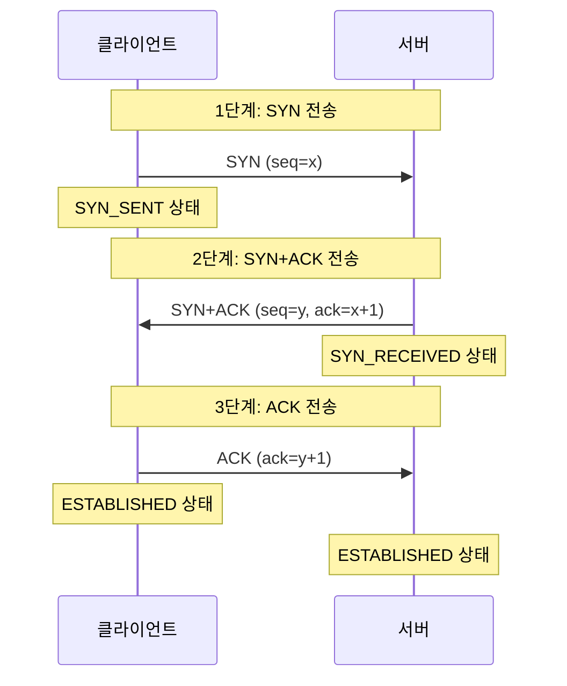
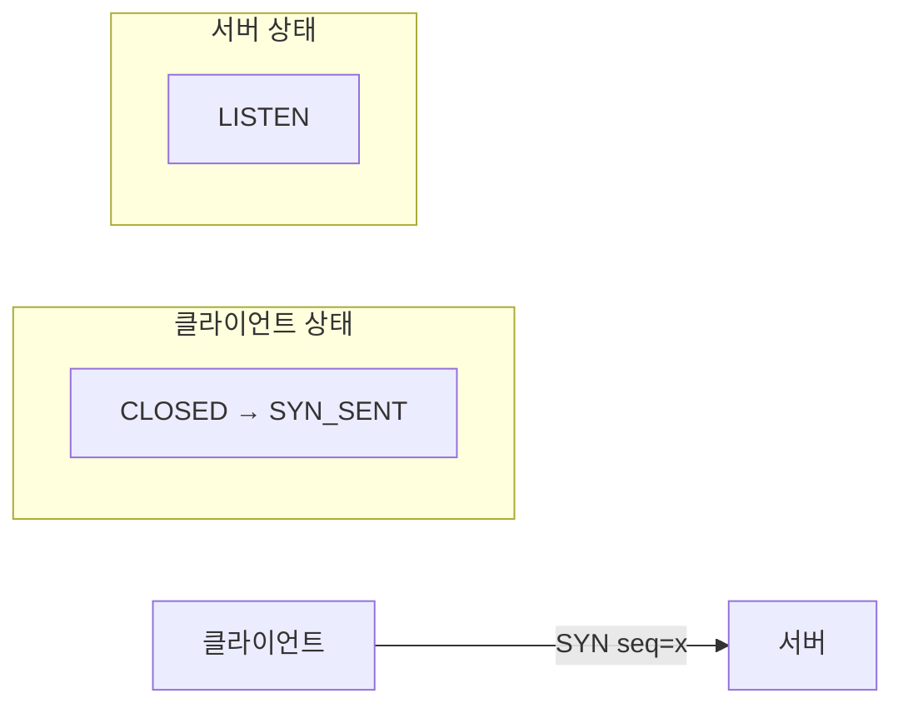
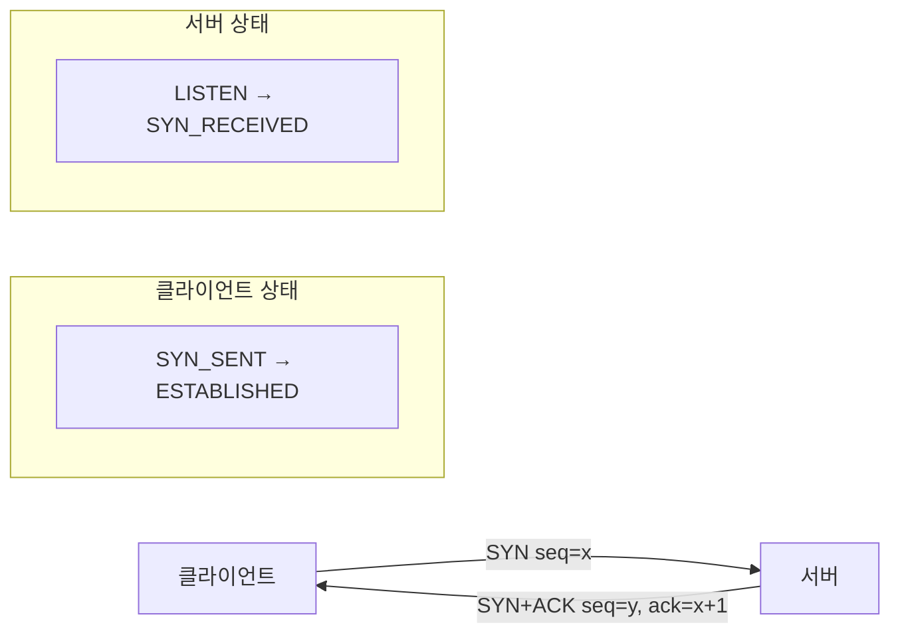
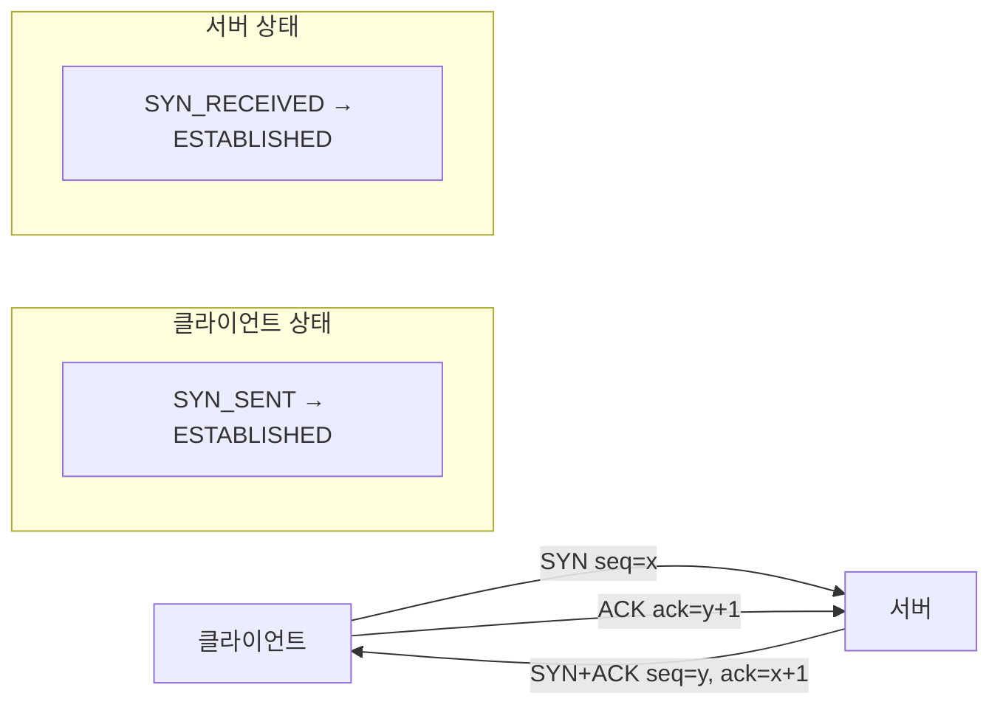
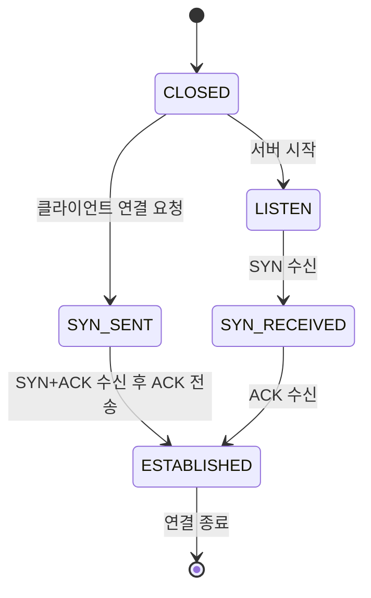
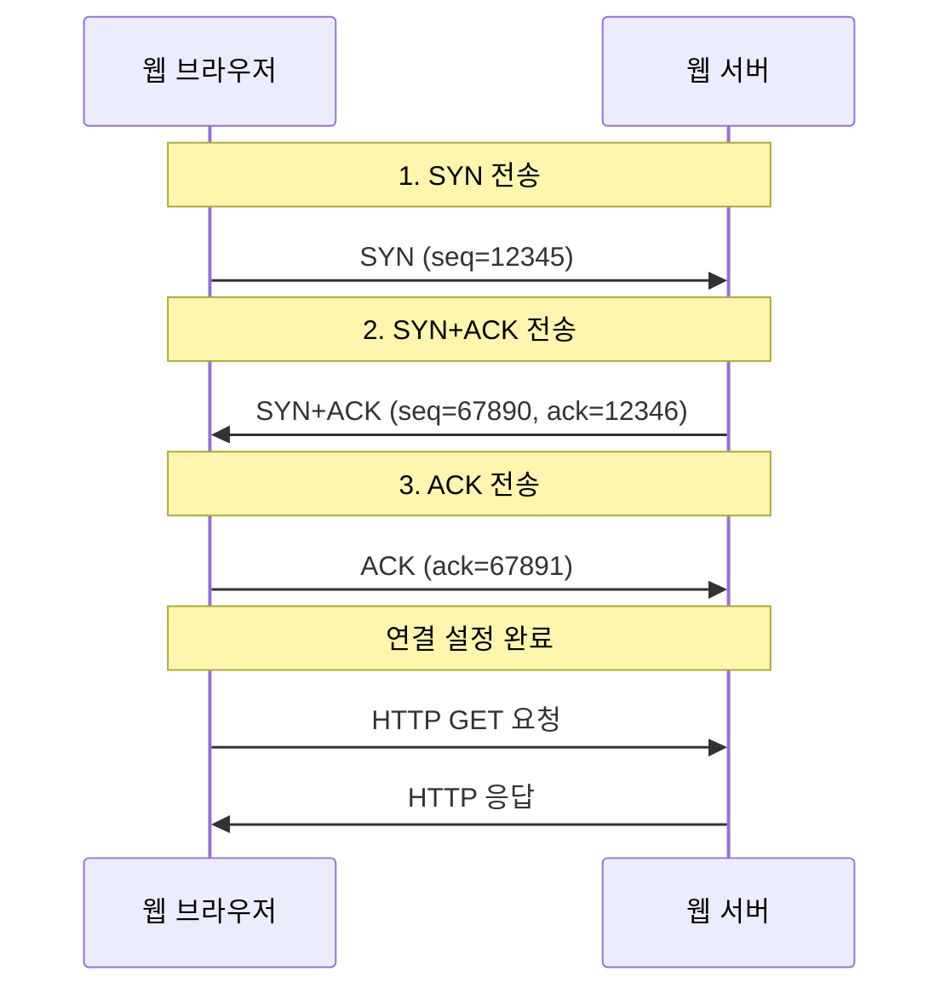
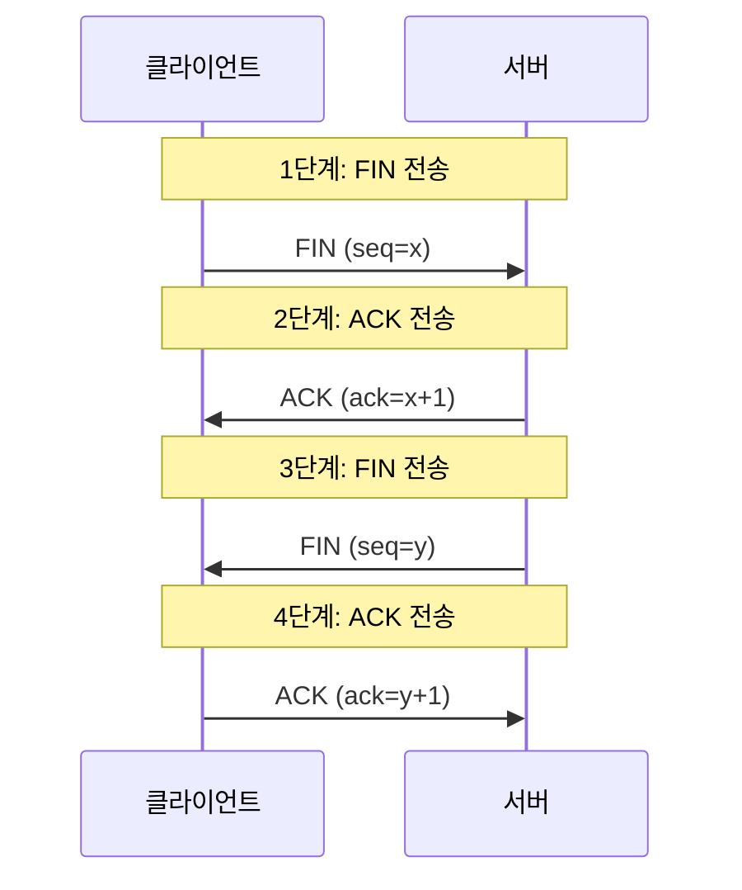

# 3-Way Handshake

## 개요

3-Way Handshake는 TCP(Transmission Control Protocol)에서 클라이언트와 서버 간의 연결을 설정하는 과정입니다. 이 과정을 통해 양쪽 모두 연결 준비가 완료되었음을 확인하고, 신뢰성 있는 통신을 시작할 수 있습니다.

### 주요 목적

1. **연결 설정**: 클라이언트와 서버 간의 TCP 연결을 설정
2. **시퀀스 번호 동기화**: 데이터 전송을 위한 시퀀스 번호를 동기화
3. **신뢰성 보장**: 양쪽 모두 연결 준비가 완료되었음을 확인
4. **보안**: 연결 요청의 유효성을 검증

## 3-Way Handshake 과정



## 상세 과정 설명

### 1단계: SYN (Synchronize) 전송



**클라이언트 동작:**

- 서버에 연결 요청을 보내기 위해 SYN 패킷을 전송
- 시퀀스 번호(seq)를 랜덤하게 생성하여 포함
- 상태를 SYN_SENT로 변경

**패킷 정보:**

```
SYN 플래그: 1
시퀀스 번호: x (랜덤 값)
ACK 번호: 0
```

### 2단계: SYN+ACK 전송



**서버 동작:**

- 클라이언트의 SYN 패킷을 받고 연결 요청을 수락
- 자신의 시퀀스 번호(seq=y)를 생성
- 클라이언트의 시퀀스 번호에 1을 더한 값(ack=x+1)을 ACK 번호로 설정
- SYN과 ACK 플래그를 모두 설정한 패킷을 전송
- 상태를 SYN_RECEIVED로 변경

**패킷 정보:**

```
SYN 플래그: 1
ACK 플래그: 1
시퀀스 번호: y (랜덤 값)
ACK 번호: x+1
```

### 3단계: ACK 전송



**클라이언트 동작:**

- 서버의 SYN+ACK 패킷을 받고 연결 설정을 완료
- 서버의 시퀀스 번호에 1을 더한 값(ack=y+1)을 ACK 번호로 설정
- ACK 패킷을 전송하여 연결 설정 완료를 알림
- 상태를 ESTABLISHED로 변경

**패킷 정보:**

```
SYN 플래그: 0
ACK 플래그: 1
시퀀스 번호: x+1
ACK 번호: y+1
```

## TCP 상태 변화



## 시퀀스 번호의 역할

### 1. 데이터 순서 보장

```
클라이언트 → 서버: seq=1000, 데이터="Hello"
서버 → 클라이언트: ack=1005 (1000+5)
```

### 2. 중복 패킷 감지

- 동일한 시퀀스 번호의 패킷이 다시 오면 중복으로 판단
- 네트워크 지연이나 재전송으로 인한 중복 패킷을 필터링

### 3. 데이터 무결성 검증

- 시퀀스 번호를 통해 데이터 손실을 감지
- 누락된 데이터를 재전송 요청

## 실제 예시

### 웹 브라우저 접속 과정



## 보안 관점에서의 3-Way Handshake

### 1. SYN Flooding 공격

```
공격자 → 서버: SYN (seq=랜덤)
서버 → 공격자: SYN+ACK (seq=y, ack=랜덤+1)
공격자: ACK 응답 없음 (서버 리소스 소모)
```

### 2. 방어 방법

- **SYN Cookie**: 서버가 SYN+ACK에 특별한 값을 포함
- **Connection Limiting**: 동시 연결 수 제한
- **Firewall**: 의심스러운 패킷 필터링

## 4-Way Handshake (연결 종료)



## 주의사항

### 1. 타임아웃

- 각 단계에서 응답이 없으면 타임아웃 발생
- 클라이언트는 SYN 재전송 시도
- 서버는 SYN+ACK 재전송 시도

### 2. 네트워크 지연

- 네트워크 상황에 따라 패킷 전송 지연 가능
- 적절한 타임아웃 설정 필요

### 3. 방화벽 설정

- 일부 방화벽에서 SYN 패킷 차단 가능
- 방화벽 규칙 확인 필요

## 결론

3-Way Handshake는 TCP 연결의 핵심 과정으로, 신뢰성 있는 통신을 위한 필수적인 단계입니다. 이 과정을 통해 클라이언트와 서버는 서로의 존재를 확인하고, 데이터 전송을 위한 준비를 완료합니다. 네트워크 프로그래밍이나 시스템 관리 시 이 과정을 이해하는 것이 중요합니다.
