# TCP vs UDP

## 개요

TCP(Transmission Control Protocol)와 UDP(User Datagram Protocol)는 인터넷에서 데이터를 전송하는 두 가지 주요 전송 계층 프로토콜입니다. 각각의 특성과 사용 사례가 다르며, 애플리케이션의 요구사항에 따라 적절한 프로토콜을 선택해야 합니다.

## 프로토콜 비교

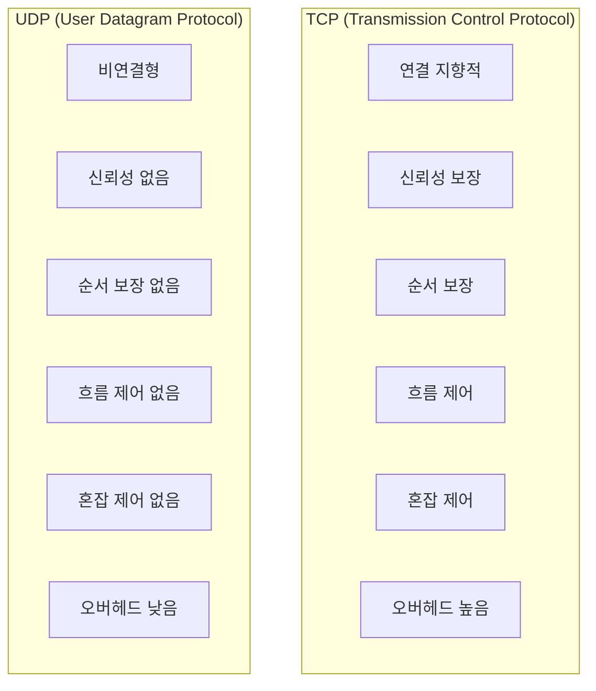

## TCP (Transmission Control Protocol)

### TCP의 특징

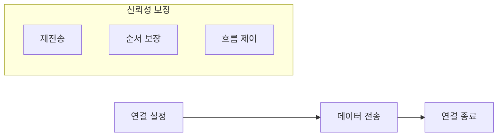

#### 1. 연결 지향적 (Connection-Oriented)

- 통신 전에 연결을 설정 (3-Way Handshake)
- 통신 후 연결을 종료 (4-Way Handshake)
- 양방향 통신 지원

#### 2. 신뢰성 보장

- 데이터 손실 감지 및 재전송
- 체크섬을 통한 데이터 무결성 검증
- ACK(Acknowledgment)를 통한 수신 확인

#### 3. 순서 보장

- 시퀀스 번호를 통한 패킷 순서 관리
- 순서가 바뀐 패킷을 올바른 순서로 재조립

#### 4. 흐름 제어 (Flow Control)

- 수신자의 처리 능력을 고려한 데이터 전송 속도 조절
- 슬라이딩 윈도우 기법 사용

#### 5. 혼잡 제어 (Congestion Control)

- 네트워크 상황에 따른 전송 속도 조절
- 네트워크 혼잡을 방지

### TCP 헤더 구조

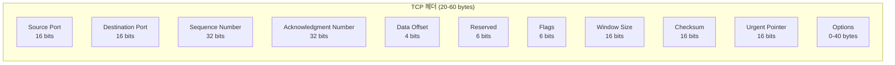

### TCP 상태 머신

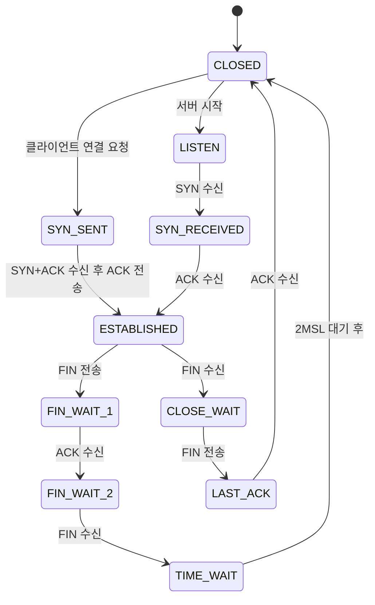

### TCP 사용 사례

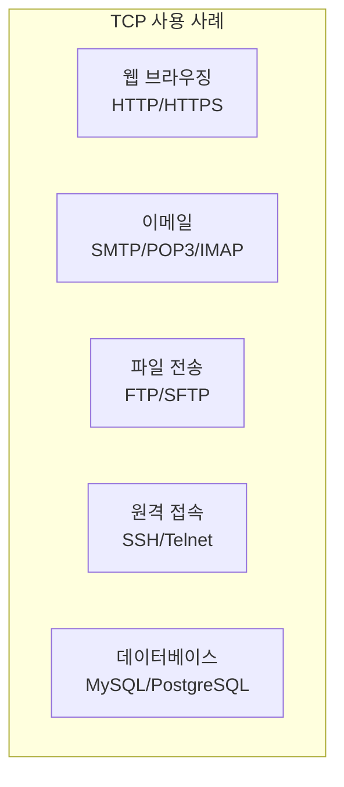

## UDP (User Datagram Protocol)

### UDP의 특징

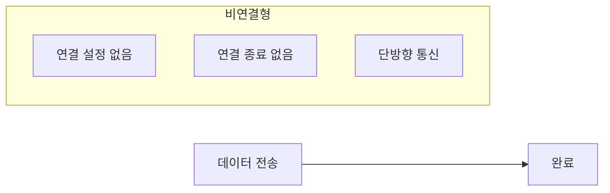

#### 1. 비연결형 (Connectionless)

- 통신 전 연결 설정 과정 없음
- 각 패킷이 독립적으로 전송
- 빠른 전송 속도

#### 2. 신뢰성 없음

- 데이터 손실에 대한 재전송 없음
- 수신 확인(ACK) 없음
- 애플리케이션에서 신뢰성 처리

#### 3. 순서 보장 없음

- 패킷 순서가 바뀔 수 있음
- 애플리케이션에서 순서 처리

#### 4. 흐름 제어 없음

- 수신자 처리 능력 고려하지 않음
- 전송 속도 제한 없음

#### 5. 혼잡 제어 없음

- 네트워크 상황 고려하지 않음
- 네트워크 혼잡 가능성

### UDP 헤더 구조

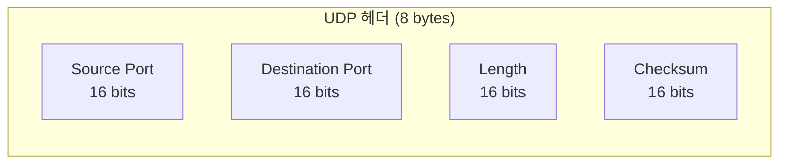

### UDP 사용 사례

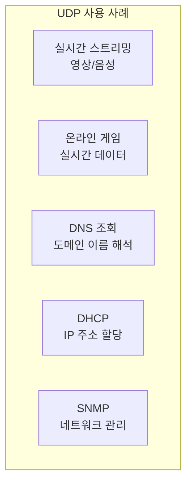

## 상세 비교

### 1. 연결 방식

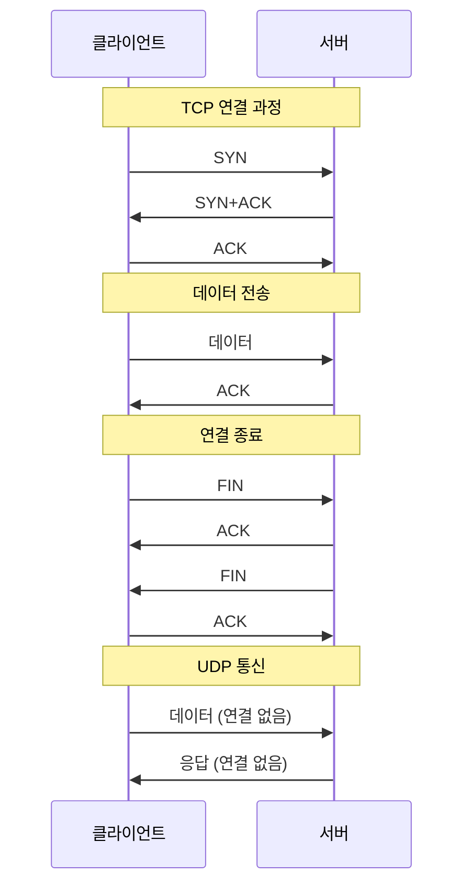

### 2. 데이터 전송 방식

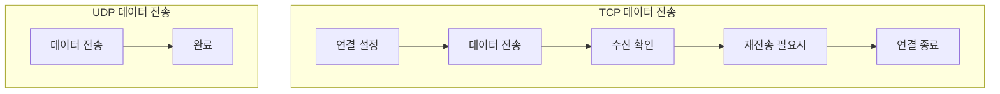

### 3. 오버헤드 비교

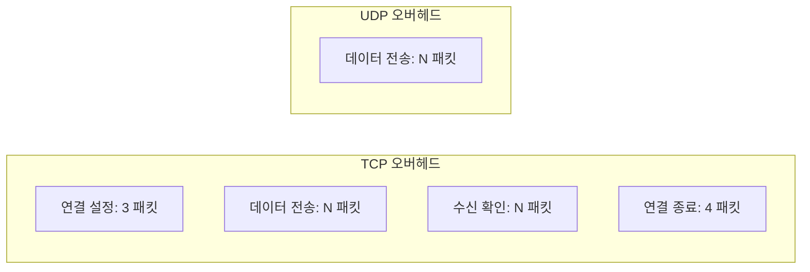

## 실제 사용 예시

### 1. 웹 브라우징 (TCP)

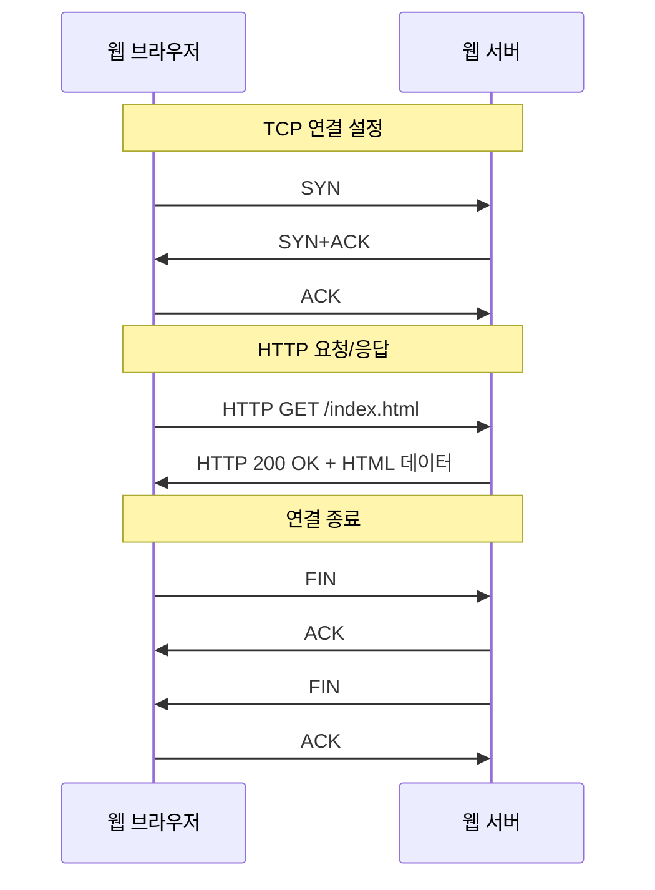

### 2. 실시간 게임 (UDP)

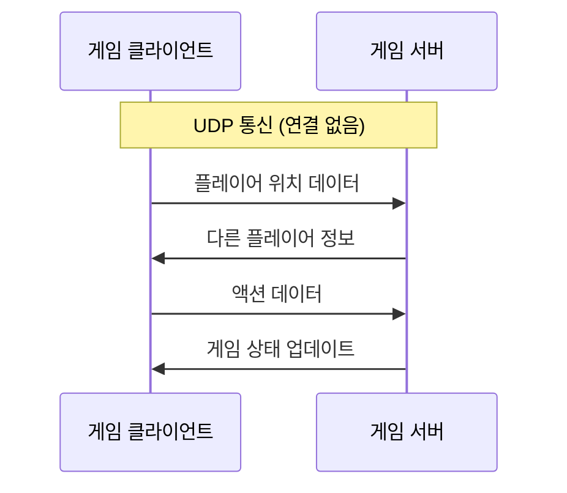

### 3. DNS 조회 (UDP)

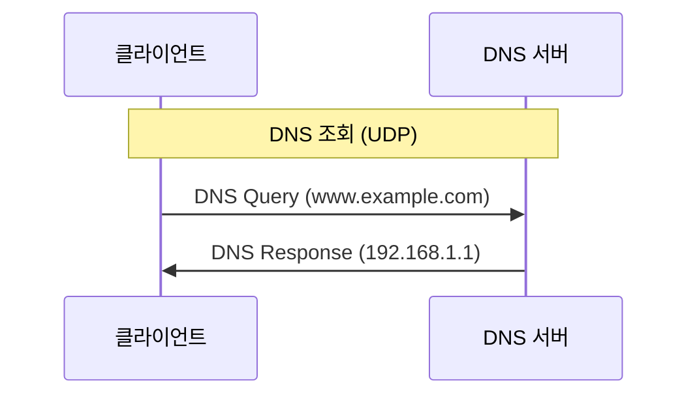

## 성능 비교

### 1. 속도

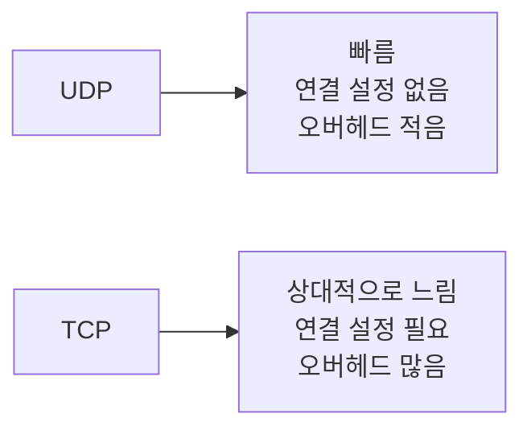

### 2. 신뢰성

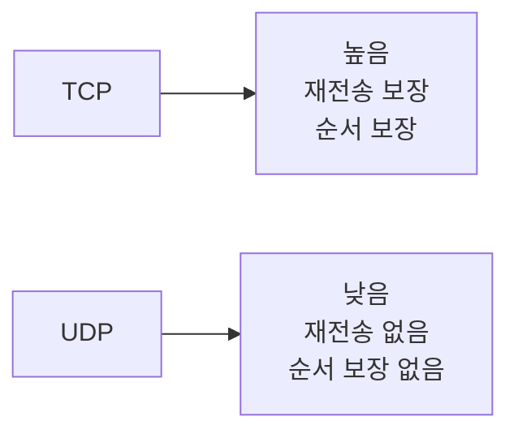

### 3. 리소스 사용량

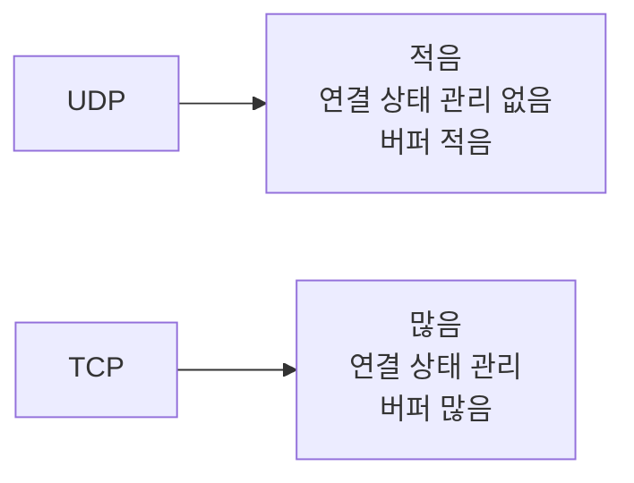

## 프로토콜 선택 가이드

### TCP를 선택해야 하는 경우

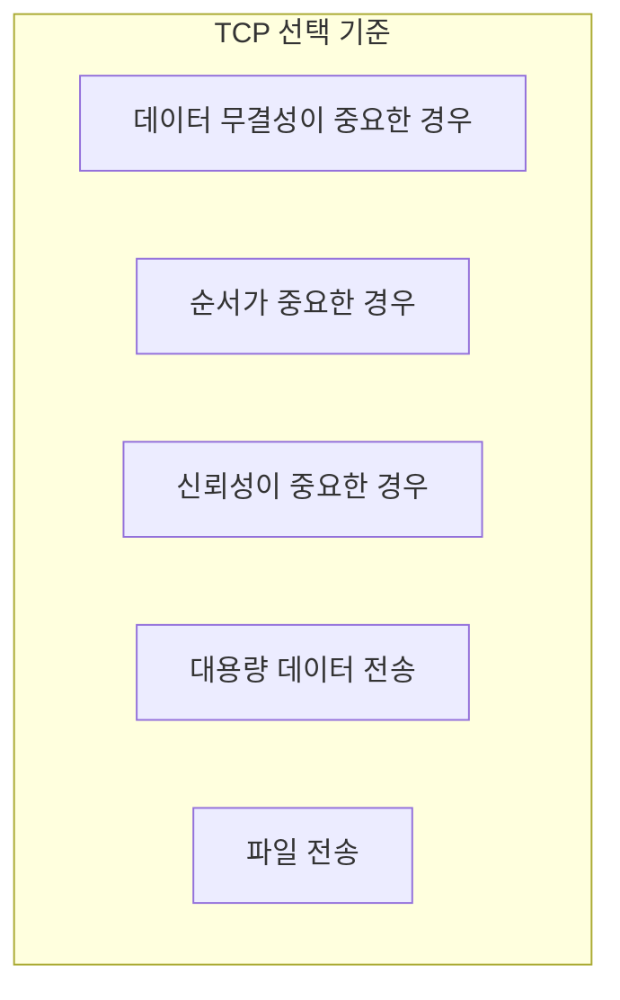

### UDP를 선택해야 하는 경우

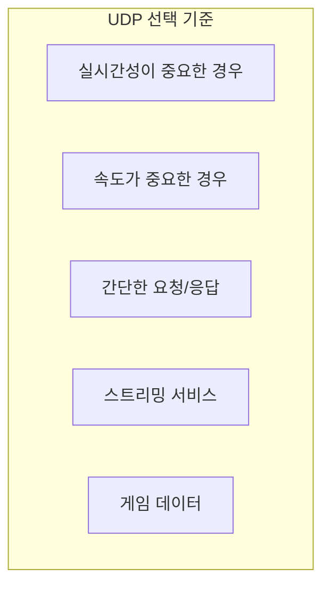

## 결론

TCP와 UDP는 각각의 장단점이 있으며, 애플리케이션의 요구사항에 따라 적절한 프로토콜을 선택해야 합니다. TCP는 신뢰성이 중요한 웹 서비스, 파일 전송 등에 적합하고, UDP는 실시간성이 중요한 스트리밍, 게임 등에 적합합니다. 현대의 네트워크 애플리케이션에서는 두 프로토콜을 상황에 맞게 혼용하여 사용하는 경우가 많습니다.
