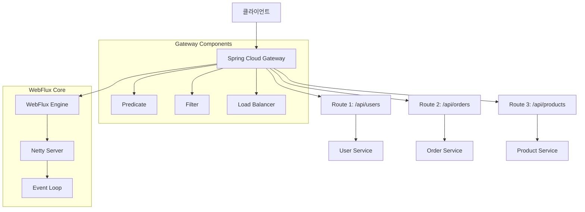
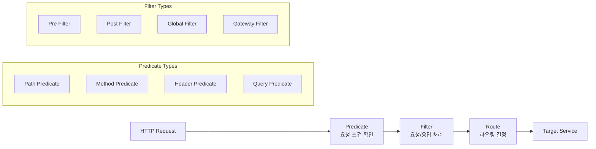
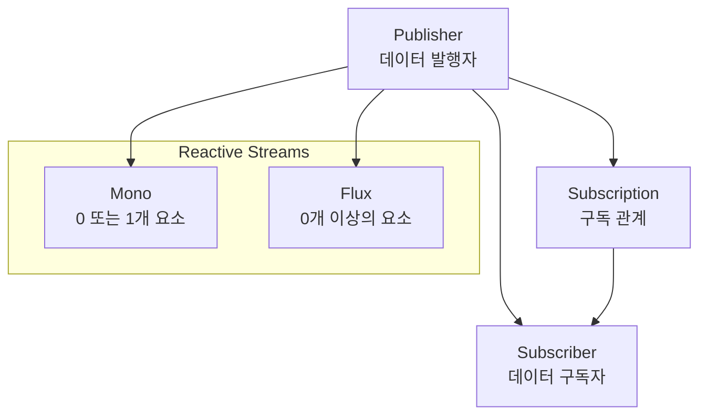
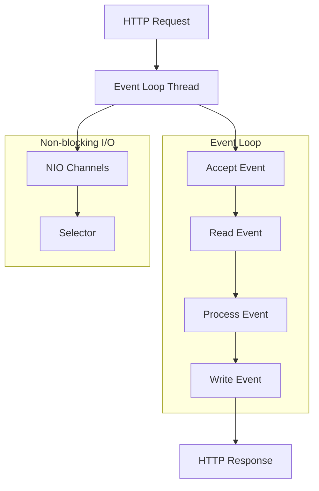
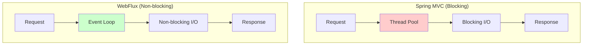
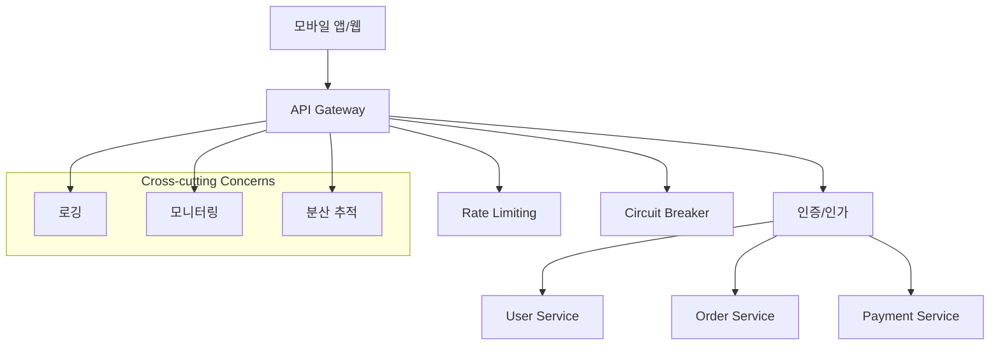
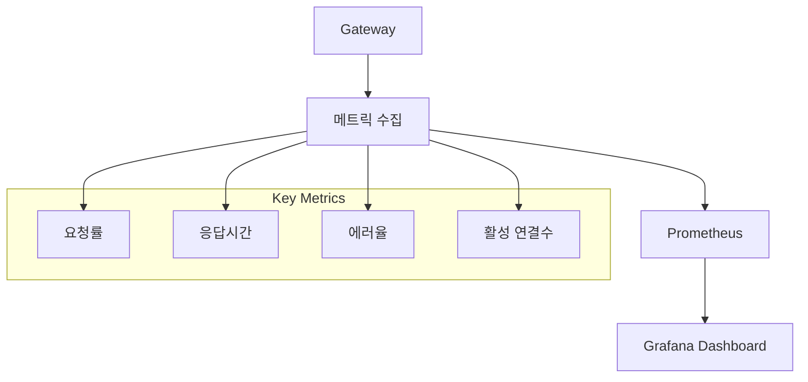

# Spring API Gateway & WebFlux

## 개요

Spring Cloud Gateway는 Spring Cloud 생태계의 API Gateway로, Spring WebFlux를 기반으로 구축되어 비동기 논블로킹 방식으로 동작합니다. 이 문서에서는 Spring API Gateway의 구조와 WebFlux의 핵심 개념을 다이어그램과 함께 상세히 설명합니다.

## Spring Cloud Gateway 아키텍처

### 1. 전체 시스템 구조



### 2. Gateway 핵심 컴포넌트



## WebFlux 핵심 개념

### 1. Reactive Streams 구조



### 2. WebFlux 이벤트 루프 모델



## Spring Cloud Gateway 설정 예제

### 1. 기본 라우팅 설정

```yaml
spring:
  cloud:
    gateway:
      routes:
        - id: user-service
          uri: lb://user-service
          predicates:
            - Path=/api/users/**
          filters:
            - StripPrefix=1
            - AddRequestHeader=X-Response-Time, {response_time}

        - id: order-service
          uri: lb://order-service
          predicates:
            - Path=/api/orders/**
            - Method=GET,POST
          filters:
            - CircuitBreaker=orderCircuitBreaker
            - Retry=3
```

### 2. 커스텀 필터 구현

```java
@Component
public class CustomGlobalFilter implements GlobalFilter, Ordered {

    @Override
    public Mono<Void> filter(ServerWebExchange exchange, GatewayFilterChain chain) {
        ServerHttpRequest request = exchange.getRequest();
        String path = request.getPath().value();

        // 요청 로깅
        log.info("Request: {} {}", request.getMethod(), path);

        return chain.filter(exchange)
            .then(Mono.fromRunnable(() -> {
                ServerHttpResponse response = exchange.getResponse();
                log.info("Response: {} {}", response.getStatusCode(), path);
            }));
    }

    @Override
    public int getOrder() {
        return -1; // 높은 우선순위
    }
}
```

## WebFlux vs Spring MVC 비교

### 1. 스레드 모델 비교



### 2. 성능 특성 비교

| 특성          | Spring MVC          | WebFlux    |
| ------------- | ------------------- | ---------- |
| 스레드 모델   | Thread-per-request  | Event Loop |
| 메모리 사용량 | 높음 (스레드당 1MB) | 낮음       |
| 동시성 처리   | 제한적              | 높음       |
| 학습 곡선     | 낮음                | 높음       |
| 블로킹 작업   | 적합                | 부적합     |

## 실제 사용 사례

### 1. 마이크로서비스 게이트웨이



### 2. 실시간 데이터 스트리밍

```java
@RestController
public class ReactiveController {

    @GetMapping("/events")
    public Flux<Event> getEvents() {
        return Flux.interval(Duration.ofSeconds(1))
            .map(sequence -> new Event("Event-" + sequence, Instant.now()))
            .take(10);
    }

    @PostMapping("/process")
    public Mono<Result> processData(@RequestBody Flux<Data> dataStream) {
        return dataStream
            .filter(data -> data.isValid())
            .map(data -> data.process())
            .collectList()
            .map(results -> new Result(results));
    }
}
```

## 모니터링 및 관찰성

### 1. 메트릭 수집



### 2. 분산 추적

```java
@Component
public class TracingFilter implements GlobalFilter {

    @Override
    public Mono<Void> filter(ServerWebExchange exchange, GatewayFilterChain chain) {
        String traceId = generateTraceId();

        return chain.filter(exchange)
            .doFirst(() -> {
                exchange.getAttributes().put("traceId", traceId);
                log.info("Trace started: {}", traceId);
            })
            .doFinally(signalType -> {
                log.info("Trace completed: {} with signal: {}", traceId, signalType);
            });
    }
}
```

## 성능 최적화 팁

### 1. 메모리 사용량 최적화

- **백프레셔 활용**: `onBackpressureBuffer()`, `onBackpressureDrop()`
- **스트림 변환 최소화**: 불필요한 `map()`, `filter()` 호출 줄이기
- **메모리 풀 사용**: Netty의 메모리 풀 활용

### 2. 네트워크 최적화

- **Connection Pooling**: 적절한 커넥션 풀 크기 설정
- **Timeout 설정**: 적절한 타임아웃 값 설정
- **Load Balancing**: 클라이언트 사이드 로드 밸런싱 활용

## 결론

Spring Cloud Gateway와 WebFlux는 현대적인 마이크로서비스 아키텍처에서 필수적인 기술입니다. 비동기 논블로킹 방식으로 높은 성능과 확장성을 제공하며, 특히 대용량 트래픽을 처리하는 시스템에서 큰 장점을 보입니다.

하지만 WebFlux의 학습 곡선이 높고, 모든 상황에서 적합하지 않을 수 있으므로, 프로젝트의 요구사항을 잘 분석하여 적절한 기술을 선택하는 것이 중요합니다.
