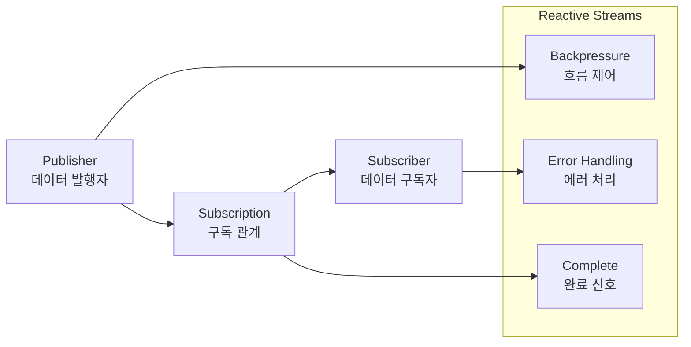
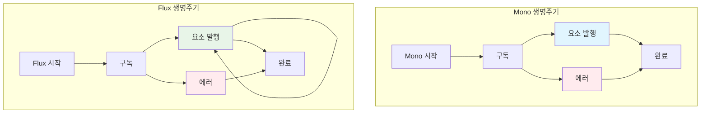
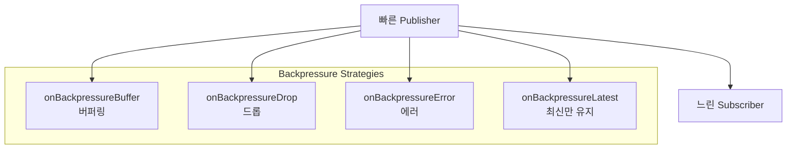

# Flux와 Mono 이해하기

## 개요

Flux와 Mono는 Spring WebFlux의 핵심인 Reactor 라이브러리에서 제공하는 리액티브 스트림 타입입니다. 이들은 Reactive Streams 스펙을 구현하며, 비동기 데이터 스트림을 처리하는 데 사용됩니다.

## Reactive Streams 기반

### 1. Reactive Streams 스펙



- **Publisher**: 데이터를 발행하는 역할
- **Subscriber**: 데이터를 구독하고 처리하는 역할
- **Subscription**: Publisher와 Subscriber 간의 구독 관계
- **Backpressure**: 데이터 흐름 제어 메커니즘

### 2. Java 9에서의 채택

```java
// Java 9의 Reactive Streams 인터페이스
import java.util.concurrent.Flow;

Flow.Publisher<String> publisher = ...;
Flow.Subscriber<String> subscriber = ...;
Flow.Subscription subscription = ...;
```

## Mono<T> - 단일 요소 스트림

### 1. Mono의 개념

Mono는 0개 또는 1개의 요소를 발행하는 리액티브 스트림입니다. 주로 단일 결과를 반환하는 작업에 사용됩니다.

```mermaid
graph TB
    subgraph "Mono<T> - 단일 요소"
        MonoEmpty[Mono.empty()<br/>0개 요소 - 완료]
        MonoJust[Mono.just(item)<br/>1개 요소 - 성공]
        MonoError[Mono.error()<br/>에러 발생]
        MonoDefer[Mono.defer()<br/>지연 실행]
        MonoFromCallable[Mono.fromCallable()<br/>Callable에서 생성]
    end

    subgraph "Mono 생성 패턴"
        MonoCreate[Mono.create()<br/>수동 생성]
        MonoFromSupplier[Mono.fromSupplier()<br/>Supplier에서 생성]
        MonoFromFuture[Mono.fromFuture()<br/>Future에서 생성]
    end

    style MonoJust fill:#e1f5fe
    style MonoError fill:#ffebee
    style MonoDefer fill:#f3e5f5
```

### 2. Mono 생성 방법

#### 기본 생성

```java
// 1. 단일 요소 Mono
Mono<String> mono1 = Mono.just("Hello World");
Mono<Integer> mono2 = Mono.just(42);

// 2. 빈 Mono
Mono<Void> emptyMono = Mono.empty();

// 3. 에러 Mono
Mono<String> errorMono = Mono.error(new RuntimeException("Error occurred"));

// 4. null 값 Mono
Mono<String> nullMono = Mono.justOrEmpty(null); // 빈 Mono 반환
```

#### 지연 실행 Mono

```java
// 1. defer - 구독 시점에 실행
Mono<String> lazyMono = Mono.defer(() -> {
    System.out.println("Executing...");
    return Mono.just("Lazy result");
});

// 2. fromCallable - Callable에서 생성
Mono<String> callableMono = Mono.fromCallable(() -> {
    // 복잡한 계산이나 I/O 작업
    return "Result from callable";
});

// 3. fromSupplier - Supplier에서 생성
Mono<String> supplierMono = Mono.fromSupplier(() -> {
    return "Result from supplier";
});
```

#### 수동 생성

```java
// Mono.create() - 수동으로 Mono 생성
Mono<String> manualMono = Mono.create(sink -> {
    // 비동기 작업 수행
    CompletableFuture.runAsync(() -> {
        try {
            Thread.sleep(1000);
            sink.success("Manual result");
        } catch (InterruptedException e) {
            sink.error(e);
        }
    });
});

// 조건부 Mono 생성
Mono<String> conditionalMono = Mono.create(sink -> {
    if (Math.random() > 0.5) {
        sink.success("Success");
    } else {
        sink.error(new RuntimeException("Random error"));
    }
});
```

### 3. Mono 조작 메서드

#### 변환 (Transform)

```java
// 1. map - 요소 변환
Mono<String> original = Mono.just("Hello");
Mono<String> transformed = original.map(str -> str + " World");
// 결과: "Hello World"

// 2. flatMap - Mono를 다른 Mono로 변환
Mono<User> userMono = Mono.just(new User("john"));
Mono<String> emailMono = userMono.flatMap(user ->
    Mono.just(user.getEmail()));

// 3. switchIfEmpty - 빈 Mono일 때 대체값
Mono<String> fallbackMono = Mono.just("Default");
Mono<String> result = Mono.empty().switchIfEmpty(fallbackMono);
```

#### 필터링 (Filter)

```java
// 1. filter - 조건에 맞는 요소만 통과
Mono<Integer> numberMono = Mono.just(10);
Mono<Integer> filteredMono = numberMono.filter(n -> n > 5);
// 결과: 10

// 2. filterWhen - 비동기 조건으로 필터링
Mono<String> asyncFiltered = Mono.just("test")
    .filterWhen(str -> Mono.just(str.length() > 3));
```

#### 에러 처리 (Error Handling)

```java
// 1. onErrorReturn - 에러 시 기본값 반환
Mono<String> errorHandledMono = Mono.just("test")
    .map(str -> {
        if (str.equals("error")) {
            throw new RuntimeException("Error occurred");
        }
        return str;
    })
    .onErrorReturn("Default value");

// 2. onErrorResume - 에러 시 다른 Mono로 전환
Mono<String> recoveredMono = Mono.just("error")
    .map(str -> {
        if (str.equals("error")) {
            throw new RuntimeException("Error occurred");
        }
        return str;
    })
    .onErrorResume(throwable -> Mono.just("Recovered"));

// 3. onErrorMap - 에러 타입 변환
Mono<String> mappedError = Mono.just("test")
    .map(str -> {
        throw new RuntimeException("Original error");
    })
    .onErrorMap(RuntimeException.class,
        ex -> new CustomException("Mapped error", ex));
```

#### 타임아웃 처리

```java
// 1. timeout - 지정 시간 내 완료되지 않으면 에러
Mono<String> timeoutMono = Mono.just("Slow operation")
    .delayElement(Duration.ofSeconds(5))
    .timeout(Duration.ofSeconds(3))
    .onErrorReturn("Timeout occurred");

// 2. timeout - 다른 Mono로 fallback
Mono<String> timeoutWithFallback = Mono.just("Slow operation")
    .delayElement(Duration.ofSeconds(5))
    .timeout(Duration.ofSeconds(3), Mono.just("Fallback"));
```

### 4. Mono 실제 사용 예제

#### 컨트롤러에서의 Mono 사용

```java
@RestController
@RequestMapping("/api/users")
public class UserController {

    private final UserService userService;

    public UserController(UserService userService) {
        this.userService = userService;
    }

    // 단일 사용자 조회
    @GetMapping("/{id}")
    public Mono<User> getUserById(@PathVariable String id) {
        return userService.findById(id)
            .doOnNext(user -> log.info("Found user: {}", user.getName()))
            .doOnError(error -> log.error("Error finding user: {}", error.getMessage()))
            .switchIfEmpty(Mono.error(new UserNotFoundException(id)));
    }

    // 사용자 생성
    @PostMapping
    public Mono<User> createUser(@RequestBody User user) {
        return Mono.just(user)
            .filter(u -> u.getEmail() != null && !u.getEmail().isEmpty())
            .flatMap(u -> userService.save(u))
            .doOnSuccess(savedUser -> log.info("User created: {}", savedUser.getId()))
            .doOnError(error -> log.error("Error creating user: {}", error.getMessage()));
    }

    // 사용자 업데이트
    @PutMapping("/{id}")
    public Mono<User> updateUser(@PathVariable String id, @RequestBody User user) {
        return userService.findById(id)
            .flatMap(existingUser -> {
                user.setId(id);
                return userService.save(user);
            })
            .switchIfEmpty(Mono.error(new UserNotFoundException(id)));
    }

    // 사용자 삭제
    @DeleteMapping("/{id}")
    public Mono<Void> deleteUser(@PathVariable String id) {
        return userService.findById(id)
            .flatMap(user -> userService.deleteById(id))
            .switchIfEmpty(Mono.error(new UserNotFoundException(id)));
    }
}
```

## Flux<T> - 다중 요소 스트림

### 1. Flux의 개념

Flux는 0개 이상의 요소를 발행하는 리액티브 스트림입니다. 여러 데이터를 순차적으로 처리할 때 사용됩니다.

```mermaid
graph TB
    subgraph "Flux<T> - 다중 요소"
        FluxEmpty[Flux.empty()<br/>0개 요소]
        FluxJust[Flux.just(items)<br/>여러 요소]
        FluxRange[Flux.range(1,10)<br/>범위 생성]
        FluxInterval[Flux.interval()<br/>주기적 생성]
        FluxGenerate[Flux.generate()<br/>상태 기반 생성]
    end

    subgraph "Flux 생성 패턴"
        FluxCreate[Flux.create()<br/>수동 생성]
        FluxFromIterable[Flux.fromIterable()<br/>Iterable에서 생성]
        FluxFromStream[Flux.fromStream()<br/>Stream에서 생성]
    end

    style FluxJust fill:#e8f5e8
    style FluxInterval fill:#fff3e0
    style FluxGenerate fill:#fce4ec
```

### 2. Flux 생성 방법

#### 기본 생성

```java
// 1. 여러 요소 Flux
Flux<String> flux1 = Flux.just("A", "B", "C");
Flux<Integer> flux2 = Flux.just(1, 2, 3, 4, 5);

// 2. 범위 생성
Flux<Integer> rangeFlux = Flux.range(1, 10); // 1부터 10까지

// 3. 주기적 생성
Flux<Long> intervalFlux = Flux.interval(Duration.ofSeconds(1));

// 4. 빈 Flux
Flux<String> emptyFlux = Flux.empty();
```

#### 컬렉션에서 생성

```java
// 1. List에서 Flux 생성
List<String> list = Arrays.asList("Apple", "Banana", "Cherry");
Flux<String> fluxFromList = Flux.fromIterable(list);

// 2. Stream에서 Flux 생성
Flux<Integer> fluxFromStream = Flux.fromStream(
    Stream.of(1, 2, 3, 4, 5)
);

// 3. Array에서 Flux 생성
String[] array = {"A", "B", "C"};
Flux<String> fluxFromArray = Flux.fromArray(array);

// 4. Set에서 Flux 생성
Set<String> set = Set.of("X", "Y", "Z");
Flux<String> fluxFromSet = Flux.fromIterable(set);
```

#### 수동 생성

```java
// 1. Flux.create() - 수동으로 Flux 생성
Flux<String> manualFlux = Flux.create(sink -> {
    sink.next("First");
    sink.next("Second");
    sink.next("Third");
    sink.complete();
});

// 2. Flux.generate() - 상태 기반 생성
Flux<Integer> statefulFlux = Flux.generate(
    () -> 0, // 초기 상태
    (state, sink) -> {
        if (state < 5) {
            sink.next(state);
            return state + 1;
        } else {
            sink.complete();
            return state;
        }
    }
);

// 3. Flux.push() - 단일 스레드에서 생성
Flux<String> pushFlux = Flux.push(sink -> {
    sink.next("Pushed item");
    sink.complete();
});
```

#### 조건부 생성

```java
// 1. 조건에 따른 Flux 생성
Flux<String> conditionalFlux = Flux.defer(() -> {
    if (Math.random() > 0.5) {
        return Flux.just("Success", "Items");
    } else {
        return Flux.empty();
    }
});

// 2. 에러가 있는 Flux
Flux<String> errorFlux = Flux.error(new RuntimeException("Flux error"));
```

### 3. Flux 조작 메서드

#### 변환 (Transform)

```java
// 1. map - 각 요소 변환
Flux<String> original = Flux.just("a", "b", "c");
Flux<String> transformed = original.map(str -> str.toUpperCase());
// 결과: "A", "B", "C"

// 2. flatMap - 각 요소를 Flux로 변환
Flux<String> words = Flux.just("hello", "world");
Flux<Character> characters = words.flatMap(word ->
    Flux.fromArray(word.split(""))
        .map(str -> str.charAt(0)));

// 3. concatMap - 순서 보장하며 flatMap
Flux<String> ordered = words.concatMap(word ->
    Flux.fromArray(word.split(""))
        .map(str -> str.charAt(0))
        .map(ch -> String.valueOf(ch)));

// 4. switchMap - 새로운 요소가 오면 이전 구독 취소
Flux<String> switched = Flux.just("a", "b", "c")
    .switchMap(item -> Flux.interval(Duration.ofMillis(100))
        .map(tick -> item + "-" + tick));
```

#### 필터링 (Filter)

```java
// 1. filter - 조건에 맞는 요소만 통과
Flux<Integer> numbers = Flux.range(1, 10);
Flux<Integer> evenNumbers = numbers.filter(n -> n % 2 == 0);
// 결과: 2, 4, 6, 8, 10

// 2. take - 처음 N개 요소만
Flux<Integer> firstFive = numbers.take(5);
// 결과: 1, 2, 3, 4, 5

// 3. skip - 처음 N개 요소 건너뛰기
Flux<Integer> skipFirstFive = numbers.skip(5);
// 결과: 6, 7, 8, 9, 10

// 4. distinct - 중복 제거
Flux<String> duplicates = Flux.just("a", "b", "a", "c", "b");
Flux<String> distinct = duplicates.distinct();
// 결과: "a", "b", "c"
```

#### 결합 (Combine)

```java
// 1. merge - 여러 Flux를 하나로 합치기
Flux<String> flux1 = Flux.just("A", "B");
Flux<String> flux2 = Flux.just("C", "D");
Flux<String> merged = Flux.merge(flux1, flux2);
// 결과: "A", "B", "C", "D" (순서 보장 안됨)

// 2. concat - 순서 보장하며 합치기
Flux<String> concatenated = Flux.concat(flux1, flux2);
// 결과: "A", "B", "C", "D" (순서 보장)

// 3. zip - 여러 Flux를 짝을 맞춰 결합
Flux<String> names = Flux.just("John", "Jane");
Flux<Integer> ages = Flux.just(25, 30);
Flux<String> zipped = Flux.zip(names, ages)
    .map(tuple -> tuple.getT1() + " is " + tuple.getT2() + " years old");
// 결과: "John is 25 years old", "Jane is 30 years old"
```

#### 수집 (Collect)

```java
// 1. collectList - 모든 요소를 List로 수집
Flux<Integer> numbers = Flux.range(1, 5);
Mono<List<Integer>> listMono = numbers.collectList();
// 결과: Mono<List<Integer>> with [1, 2, 3, 4, 5]

// 2. collectMap - 키-값 쌍으로 수집
Flux<String> items = Flux.just("apple", "banana", "apple");
Mono<Map<String, Long>> countMap = items
    .collectMultimap(item -> item, item -> 1L)
    .map(map -> map.entrySet().stream()
        .collect(Collectors.toMap(
            Map.Entry::getKey,
            entry -> (long) entry.getValue().size()
        )));

// 3. reduce - 모든 요소를 하나로 축소
Mono<Integer> sum = numbers.reduce(0, Integer::sum);
// 결과: Mono<Integer> with 15
```

### 4. Flux 실제 사용 예제

#### 컨트롤러에서의 Flux 사용

```java
@RestController
@RequestMapping("/api/users")
public class UserController {

    private final UserService userService;

    public UserController(UserService userService) {
        this.userService = userService;
    }

    // 모든 사용자 조회
    @GetMapping
    public Flux<User> getAllUsers() {
        return userService.findAll()
            .filter(User::isActive)
            .doOnNext(user -> log.debug("Processing user: {}", user.getName()))
            .doOnComplete(() -> log.info("All users processed"));
    }

    // 사용자 검색
    @GetMapping("/search")
    public Flux<User> searchUsers(@RequestParam String query) {
        return userService.findByEmailContaining(query)
            .take(10) // 최대 10개만 반환
            .doOnNext(user -> log.debug("Found matching user: {}", user.getEmail()));
    }

    // 사용자 스트리밍
    @GetMapping(value = "/stream", produces = MediaType.APPLICATION_NDJSON_VALUE)
    public Flux<User> streamUsers() {
        return userService.findAll()
            .onBackpressureBuffer(100) // 최대 100개 버퍼
            .doOnNext(user -> log.debug("Streaming user: {}", user.getName()))
            .doOnError(error -> log.error("Error in stream: {}", error.getMessage()));
    }

    // Server-Sent Events
    @GetMapping(value = "/events", produces = MediaType.TEXT_EVENT_STREAM_VALUE)
    public Flux<ServerSentEvent<UserEvent>> getUserEvents() {
        return Flux.interval(Duration.ofSeconds(2))
            .flatMap(tick -> userService.findRandomUser())
            .map(user -> ServerSentEvent.<UserEvent>builder()
                .id(String.valueOf(System.currentTimeMillis()))
                .event("user-activity")
                .data(new UserEvent(user.getId(), "User logged in", Instant.now()))
                .build())
            .take(10); // 10개 이벤트만 전송
    }
}
```

## Mono와 Flux의 차이점

### 1. 개념적 차이

| 특성          | Mono<T>        | Flux<T>          |
| ------------- | -------------- | ---------------- |
| **요소 개수** | 0개 또는 1개   | 0개 이상         |
| **사용 사례** | 단일 결과 반환 | 다중 데이터 처리 |
| **완료 신호** | 항상 완료      | 완료 또는 무한   |
| **에러 처리** | 단일 에러      | 스트림 중단      |
| **백프레셔**  | 단순함         | 복잡함           |

### 2. 생명주기 비교



### 3. 변환 메서드

#### Flux에서 Mono로 변환

```java
Flux<String> flux = Flux.just("A", "B", "C");

// 첫 번째 요소만
Mono<String> firstElement = flux.next();

// 모든 요소를 리스트로
Mono<List<String>> allElements = flux.collectList();

// 요소 개수
Mono<Long> count = flux.count();

// 조건에 맞는 첫 번째 요소
Mono<String> firstMatch = flux.filter(s -> s.startsWith("A")).next();

// 모든 요소를 하나로 축소
Mono<String> reduced = flux.reduce("", String::concat);
```

#### Mono에서 Flux로 변환

```java
Mono<String> mono = Mono.just("Hello");

// 단일 요소를 Flux로
Flux<String> fluxFromMono = mono.flux();

// Mono를 Flux로 확장
Mono<List<String>> listMono = Mono.just(Arrays.asList("A", "B", "C"));
Flux<String> expandedFlux = listMono.flatMapMany(Flux::fromIterable);

// Mono를 반복하는 Flux
Flux<String> repeatedFlux = mono.repeat(3); // 3번 반복
```

## 백프레셔 (Backpressure) 처리

### 1. 백프레셔 전략



### 2. 백프레셔 처리 예제

```java
@Service
public class BackpressureService {

    // 버퍼링 전략
    public Flux<String> bufferStrategy() {
        return Flux.interval(Duration.ofMillis(10))
            .map(i -> "Item-" + i)
            .onBackpressureBuffer(1000) // 최대 1000개 버퍼
            .doOnNext(item -> log.debug("Processing: {}", item));
    }

    // 드롭 전략
    public Flux<String> dropStrategy() {
        return Flux.interval(Duration.ofMillis(10))
            .map(i -> "Item-" + i)
            .onBackpressureDrop(item ->
                log.warn("Dropped item: {}", item))
            .doOnNext(item -> log.debug("Processing: {}", item));
    }

    // 에러 전략
    public Flux<String> errorStrategy() {
        return Flux.interval(Duration.ofMillis(10))
            .map(i -> "Item-" + i)
            .onBackpressureError()
            .doOnNext(item -> log.debug("Processing: {}", item))
            .onErrorReturn("Error occurred due to backpressure");
    }

    // 최신만 유지 전략
    public Flux<String> latestStrategy() {
        return Flux.interval(Duration.ofMillis(10))
            .map(i -> "Item-" + i)
            .onBackpressureLatest()
            .doOnNext(item -> log.debug("Processing: {}", item));
    }
}
```

## 실제 사용 사례

### 1. 데이터베이스 조회

```java
@Service
public class ReactiveUserService {

    private final ReactiveUserRepository userRepository;

    public ReactiveUserService(ReactiveUserRepository userRepository) {
        this.userRepository = userRepository;
    }

    // 단일 사용자 조회 (Mono)
    public Mono<User> findById(String id) {
        return userRepository.findById(id)
            .doOnNext(user -> log.debug("Found user: {}", user.getEmail()))
            .doOnError(error -> log.error("Error finding user: {}", error.getMessage()));
    }

    // 모든 사용자 조회 (Flux)
    public Flux<User> findAll() {
        return userRepository.findAll()
            .filter(User::isActive)
            .doOnNext(user -> log.debug("Processing user: {}", user.getName()));
    }

    // 사용자 검색 (Flux)
    public Flux<User> findByEmailContaining(String email) {
        return userRepository.findByEmailContainingIgnoreCase(email)
            .take(10) // 최대 10개만 반환
            .doOnNext(user -> log.debug("Found matching user: {}", user.getEmail()));
    }
}
```

### 2. 외부 API 호출

```java
@Service
public class ExternalApiService {

    private final WebClient webClient;

    public ExternalApiService(WebClient webClient) {
        this.webClient = webClient;
    }

    // 단일 API 호출 (Mono)
    public Mono<User> getUserFromApi(String id) {
        return webClient.get()
            .uri("/users/{id}", id)
            .retrieve()
            .bodyToMono(User.class)
            .timeout(Duration.ofSeconds(5))
            .onErrorReturn(new User(id, "Unknown"));
    }

    // 여러 API 호출 (Flux)
    public Flux<User> getUsersFromApi(List<String> ids) {
        return Flux.fromIterable(ids)
            .flatMap(this::getUserFromApi)
            .doOnNext(user -> log.debug("Retrieved user: {}", user.getName()));
    }

    // 병렬 API 호출
    public Flux<User> getUsersParallel(List<String> ids) {
        return Flux.fromIterable(ids)
            .flatMap(this::getUserFromApi, 5) // 최대 5개 병렬 처리
            .doOnNext(user -> log.debug("Retrieved user: {}", user.getName()));
    }
}
```

### 3. 파일 처리

```java
@Service
public class FileProcessingService {

    // 파일 읽기 (Flux)
    public Flux<String> readFileLines(Path filePath) {
        return Flux.using(
            () -> Files.lines(filePath),
            Flux::fromStream,
            BaseStream::close
        ).doOnNext(line -> log.debug("Processing line: {}", line));
    }

    // 파일 쓰기 (Mono)
    public Mono<Void> writeToFile(Flux<String> lines, Path filePath) {
        return lines
            .map(line -> line + "\n")
            .reduce(new StringBuilder(), StringBuilder::append)
            .flatMap(content -> {
                try {
                    Files.write(filePath, content.toString().getBytes());
                    return Mono.empty();
                } catch (IOException e) {
                    return Mono.error(e);
                }
            });
    }
}
```

## 디버깅과 모니터링

### 1. 로깅

```java
// Mono 로깅
Mono<String> loggedMono = Mono.just("Hello")
    .doOnSubscribe(subscription -> log.info("Mono subscribed"))
    .doOnNext(item -> log.info("Mono emitted: {}", item))
    .doOnSuccess(result -> log.info("Mono completed successfully"))
    .doOnError(error -> log.error("Mono failed: {}", error.getMessage()))
    .doFinally(signalType -> log.info("Mono finally: {}", signalType));

// Flux 로깅
Flux<String> loggedFlux = Flux.just("A", "B", "C")
    .doOnSubscribe(subscription -> log.info("Flux subscribed"))
    .doOnNext(item -> log.info("Flux emitted: {}", item))
    .doOnComplete(() -> log.info("Flux completed"))
    .doOnError(error -> log.error("Flux failed: {}", error.getMessage()))
    .doFinally(signalType -> log.info("Flux finally: {}", signalType));
```

### 2. 메트릭 수집

```java
@Component
public class ReactiveMetrics {

    private final MeterRegistry meterRegistry;

    public ReactiveMetrics(MeterRegistry meterRegistry) {
        this.meterRegistry = meterRegistry;
    }

    // Mono 메트릭
    public <T> Mono<T> withMetrics(Mono<T> mono, String name) {
        Timer.Sample sample = Timer.start(meterRegistry);

        return mono
            .doOnSuccess(result -> {
                sample.stop(Timer.builder("mono.duration")
                    .tag("name", name)
                    .tag("status", "success")
                    .register(meterRegistry));
            })
            .doOnError(error -> {
                sample.stop(Timer.builder("mono.duration")
                    .tag("name", name)
                    .tag("status", "error")
                    .register(meterRegistry));
            });
    }

    // Flux 메트릭
    public <T> Flux<T> withMetrics(Flux<T> flux, String name) {
        Timer.Sample sample = Timer.start(meterRegistry);
        AtomicLong count = new AtomicLong();

        return flux
            .doOnNext(item -> count.incrementAndGet())
            .doOnComplete(() -> {
                sample.stop(Timer.builder("flux.duration")
                    .tag("name", name)
                    .tag("status", "success")
                    .register(meterRegistry));

                meterRegistry.counter("flux.items", "name", name)
                    .increment(count.get());
            })
            .doOnError(error -> {
                sample.stop(Timer.builder("flux.duration")
                    .tag("name", name)
                    .tag("status", "error")
                    .register(meterRegistry));
            });
    }
}
```

## 결론

Mono와 Flux는 Spring WebFlux의 핵심 구성 요소로, 비동기 데이터 스트림을 효율적으로 처리할 수 있게 해줍니다.

### 주요 포인트:

1. **Mono**: 0개 또는 1개의 요소를 처리하는 단일 결과 스트림
2. **Flux**: 0개 이상의 요소를 처리하는 다중 데이터 스트림
3. **백프레셔**: 빠른 생산자와 느린 소비자 간의 흐름 제어
4. **에러 처리**: 다양한 에러 처리 전략 제공
5. **변환과 조합**: 풍부한 연산자를 통한 데이터 처리
6. **모니터링**: 로깅과 메트릭을 통한 관찰성

### 학습 로드맵:

1. **기초**: Mono와 Flux의 기본 생성과 구독
2. **중급**: 변환, 필터링, 결합 연산자 활용
3. **고급**: 백프레셔 처리, 에러 처리, 성능 최적화
4. **실전**: 실제 프로젝트에서의 활용과 모니터링

Mono와 Flux를 마스터하면 Spring WebFlux의 강력한 비동기 프로그래밍 능력을 활용할 수 있으며, 고성능 웹 애플리케이션을 구축할 수 있습니다.
