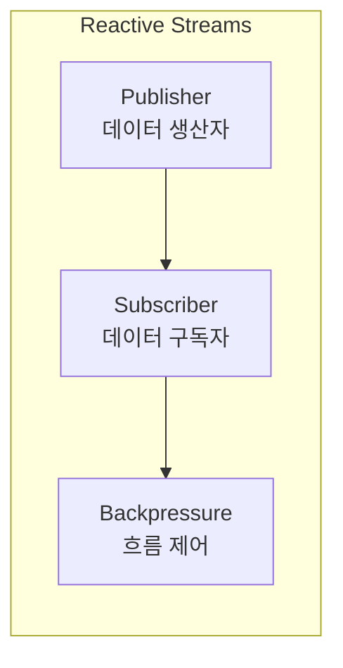
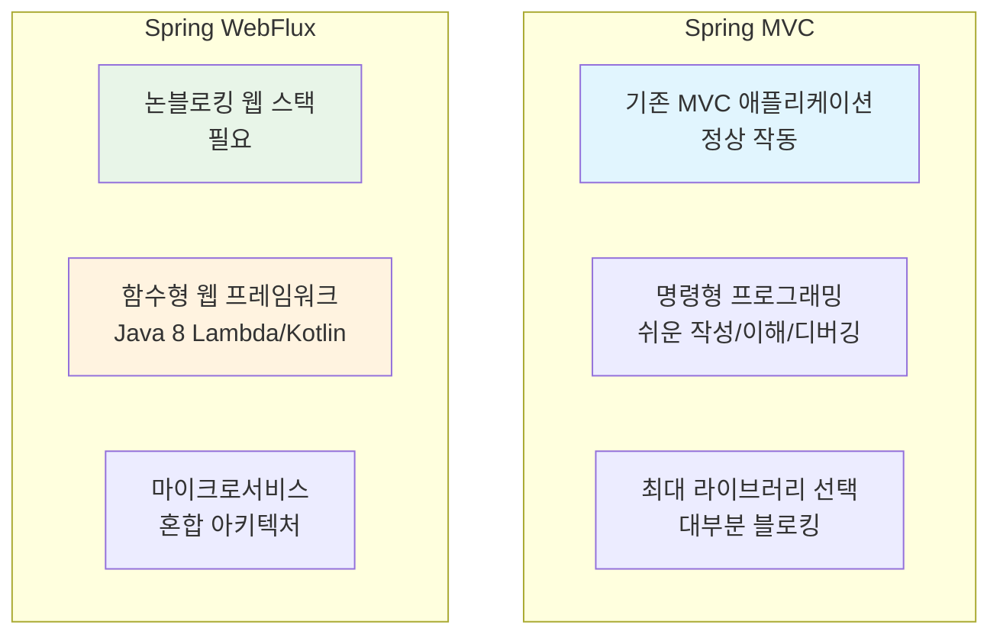
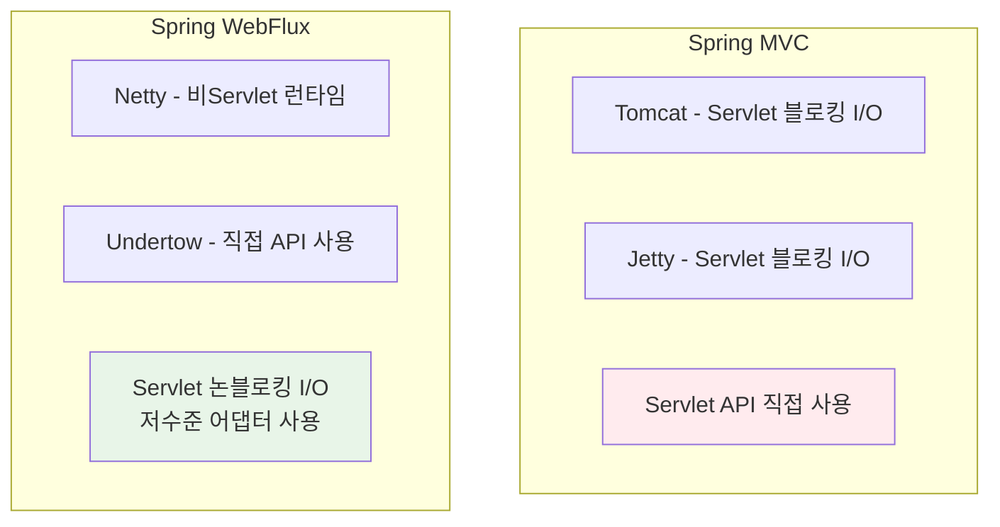
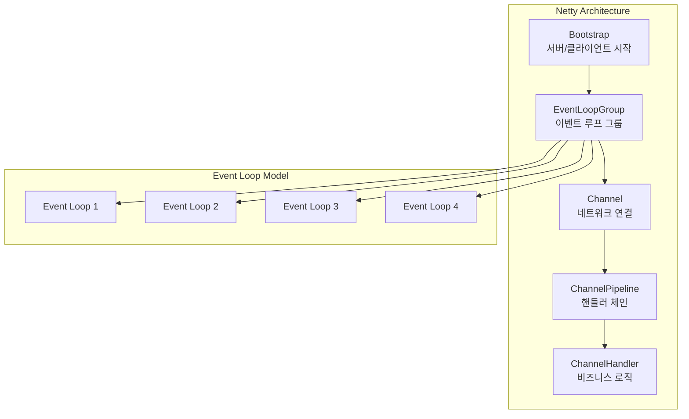
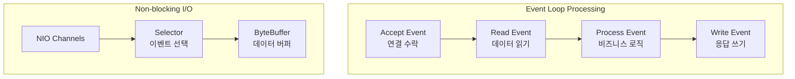
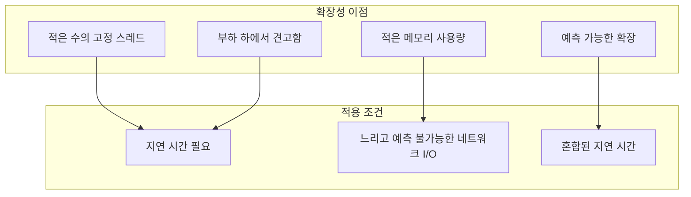
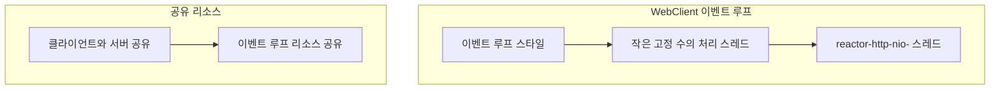
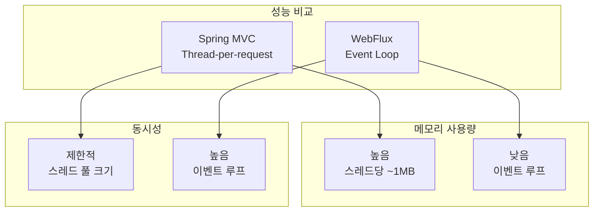

# Spring WebFlux Overview

## 개요

Spring WebFlux는 Spring Framework 5에서 도입된 반응형 웹 프레임워크로, 논블로킹 I/O와 리액티브 스트림을 기반으로 한다. 기존 Spring MVC와 함께 사용하거나 독립적으로 사용할 수 있으며, 고성능, 확장 가능한 웹 애플리케이션을 구축할 수 있습니다.

## WebFlux가 생성된 이유

### 1. 논블로킹 웹 스택의 필요성

- **적은 수의 스레드로 동시성 처리**: 이벤트 루프 모델을 통해 적은 하드웨어 리소스로 확장 가능
- **Servlet API의 한계**: Servlet의 논블로킹 I/O가 기존 동기식 API와 충돌
- **새로운 공통 API 필요**: 다양한 논블로킹 런타임을 지원하는 기반 API 필요
- **Netty 등 비동기 서버 지원**: 이미 확립된 비동기, 논블로킹 서버들과의 호환성

### 2. 함수형 프로그래밍의 도입

- **Java 8 Lambda 표현식**: 함수형 API 구현의 기회 창출
- **선언적 비동기 로직**: CompletableFuture와 ReactiveX 스타일의 연속성 API
- **함수형 웹 엔드포인트**: 어노테이션 기반 컨트롤러와 함께 함수형 엔드포인트 제공

## "Reactive"의 정의

### 1. 반응형 프로그래밍 모델

- **변화에 대한 반응**: 네트워크 컴포넌트가 I/O 이벤트에 반응, UI 컨트롤러가 마우스 이벤트에 반응
- **논블로킹의 반응형 특성**: 블로킹 대신 작업 완료나 데이터 가용성에 대한 알림에 반응

### 2. 논블로킹 백프레셔

- **동기식 코드의 자연스러운 백프레셔**: 블로킹 호출이 호출자를 대기시키는 자연스러운 형태
- **논블로킹 코드의 백프레셔 제어**: 빠른 생산자가 목적지를 압도하지 않도록 이벤트 속도 제어
- **Reactive Streams**: Java 9에서 채택된 작은 스펙으로 비동기 컴포넌트 간 상호작용 정의

### 3. Reactive Streams의 목적



- **구독자가 속도 제어**: 구독자가 생산자의 데이터 생산 속도를 제어
- **상호운용성**: 라이브러리와 인프라 컴포넌트 간의 상호운용성 제공
- **애플리케이션 API**: 높은 수준의 함수형 API 필요

## Reactive API

### 1. Reactor 라이브러리

- **Spring WebFlux의 선택된 리액티브 라이브러리**
- **Mono와 Flux API**: 0..1 (Mono) 및 0..N (Flux) 데이터 시퀀스 처리
- **ReactiveX 연산자**: 풍부한 연산자 세트 제공
- **서버 사이드 Java**: Spring과 긴밀한 협력으로 개발

### 2. 상호운용성

```java
// WebFlux는 일반 Publisher를 입력으로 받아 Reactor 타입으로 내부 변환
// 출력은 Flux 또는 Mono로 반환
Mono<String> result = webFluxApi.accept(publisher);
```

- **Reactive Streams 통한 상호운용**: 다른 리액티브 라이브러리와 호환
- **투명한 적응**: RxJava 등 다른 리액티브 라이브러리와 투명하게 적응
- **Kotlin Coroutines**: Kotlin에서 더 명령형 스타일의 프로그래밍 제공

## 프로그래밍 모델

### 1. 어노테이션 기반 컨트롤러

```java
@RestController
public class UserController {

    @GetMapping("/users/{id}")
    public Mono<User> getUser(@PathVariable String id) {
        return userService.findById(id);
    }

    @GetMapping("/users")
    public Flux<User> getAllUsers() {
        return userService.findAll();
    }
}
```

- **Spring MVC와 일관성**: spring-web 모듈의 동일한 어노테이션 기반
- **리액티브 반환 타입**: Reactor와 RxJava 반환 타입 지원
- **리액티브 @RequestBody**: WebFlux만의 리액티브 요청 본문 인수 지원

### 2. 함수형 엔드포인트

```java
@Configuration
public class RouterConfig {

    @Bean
    public RouterFunction<ServerResponse> userRoutes(UserHandler userHandler) {
        return RouterFunctions
            .route(GET("/users/{id}"), userHandler::getUser)
            .andRoute(GET("/users"), userHandler::getAllUsers);
    }
}
```

- **Lambda 기반**: 경량화된 함수형 프로그래밍 모델
- **애플리케이션 제어**: 어노테이션 선언 대신 애플리케이션이 요청 처리 전체 과정 제어
- **작은 라이브러리**: 라우팅과 요청 처리를 위한 유틸리티 세트

## 적용 가능성: Spring MVC vs WebFlux

### 1. 선택 가이드



### 2. 구체적인 고려사항

#### Spring MVC를 선택해야 하는 경우:

- **기존 Spring MVC 애플리케이션**: 정상 작동하는 경우 변경 불필요
- **명령형 프로그래밍**: 코드 작성, 이해, 디버깅이 가장 쉬운 방법
- **최대 라이브러리 선택**: 역사적으로 대부분이 블로킹 라이브러리
- **블로킹 지속성 API**: JPA, JDBC 등 블로킹 API 사용 시

#### Spring WebFlux를 선택해야 하는 경우:

- **논블로킹 웹 스택 필요**: 다른 논블로킹 스택과 동일한 실행 모델 이점
- **서버 선택**: Netty, Tomcat, Jetty, Undertow, Servlet 컨테이너
- **프로그래밍 모델 선택**: 어노테이션 컨트롤러와 함수형 웹 엔드포인트
- **리액티브 라이브러리 선택**: Reactor, RxJava 또는 기타
- **경량 함수형 웹 프레임워크**: Java 8 Lambda나 Kotlin 사용
- **마이크로서비스 아키텍처**: Spring MVC와 WebFlux 혼합 사용

### 3. 실용적 접근 방법

#### 점진적 도입:

1. **기존 Spring MVC + WebClient**: 원격 서비스 호출에 반응형 WebClient 사용
2. **리액티브 타입 반환**: Spring MVC 컨트롤러에서 직접 리액티브 타입 반환
3. **작은 규모로 시작**: 전체 전환 없이 작은 규모로 시작하고 이점 측정
4. **학습 곡선 고려**: 대규모 팀의 경우 논블로킹, 함수형, 선언적 프로그래밍의 가파른 학습 곡선 고려

## 서버 지원

### 1. 지원 서버

- **Servlet 컨테이너**: Tomcat, Jetty
- **비Servlet 런타임**: Netty, Undertow
- **공통 API**: 모든 서버가 저수준 공통 API로 적응

### 2. 서버별 특성



### 3. 주의사항

- **Servlet 필터 매핑 금지**: WebFlux 애플리케이션에서 Servlet 필터 매핑 금지
- **Servlet API 직접 조작 금지**: 블로킹 I/O와 논블로킹 I/O 혼합 시 런타임 이슈 발생
- **Spring Boot 기본값**: Netty를 기본으로 사용 (비동기, 논블로킹 공간에서 널리 사용)

## Netty vs Tomcat 서버 비교

### 1. 아키텍처 차이점

```mermaid
graph TB
    subgraph "Tomcat (Servlet Container)"
        TomcatRequest[HTTP Request] --> TomcatConnector[Connector]
        TomcatConnector --> TomcatThreadPool[Thread Pool<br/>Request-per-Thread]
        TomcatThreadPool --> TomcatServlet[Servlet Container]
        TomcatServlet --> TomcatApp[Spring MVC Application]
        TomcatApp --> TomcatResponse[HTTP Response]
    end

    subgraph "Netty (Event Loop)"
        NettyRequest[HTTP Request] --> NettyEventLoop[Event Loop]
        NettyEventLoop --> NettyChannel[Channel Pipeline]
        NettyChannel --> NettyHandler[Channel Handler]
        NettyHandler --> NettyApp[Spring WebFlux Application]
        NettyApp --> NettyResponse[HTTP Response]
    end

    style TomcatThreadPool fill:#ffebee
    style NettyEventLoop fill:#e8f5e8
```



### 2. 핵심 차이점

| 특성              | Tomcat                  | Netty            |
| ----------------- | ----------------------- | ---------------- |
| **스레드 모델**   | Thread-per-request      | Event Loop       |
| **동시성 처리**   | 스레드 풀 기반          | 이벤트 루프 기반 |
| **메모리 사용량** | 높음 (스레드당 ~1MB)    | 낮음             |
| **확장성**        | 제한적 (스레드 풀 크기) | 높음             |
| **블로킹 작업**   | 적합                    | 부적합           |
| **학습 곡선**     | 낮음                    | 높음             |
| **Servlet API**   | 직접 사용               | 사용하지 않음    |

### 3. Netty 상세 설명

#### Netty란?

Netty는 비동기 이벤트 기반 네트워크 애플리케이션 프레임워크로, 고성능 서버와 클라이언트를 빠르고 쉽게 개발할 수 있도록 도와주는 Java 라이브러리입니다.

#### Netty의 핵심 구성 요소



#### 1. Bootstrap

```java
// 서버 Bootstrap 예제
ServerBootstrap bootstrap = new ServerBootstrap();
bootstrap.group(bossGroup, workerGroup)
    .channel(NioServerSocketChannel.class)
    .childHandler(new ChannelInitializer<SocketChannel>() {
        @Override
        protected void initChannel(SocketChannel ch) {
            ChannelPipeline pipeline = ch.pipeline();
            pipeline.addLast(new HttpServerCodec());
            pipeline.addLast(new HttpObjectAggregator(65536));
            pipeline.addLast(new CustomHandler());
        }
    });
```

#### 2. EventLoopGroup

```java
// 이벤트 루프 그룹 설정
EventLoopGroup bossGroup = new NioEventLoopGroup(1);    // 연결 수락용
EventLoopGroup workerGroup = new NioEventLoopGroup();   // 요청 처리용

// CPU 코어 수에 따른 최적화
int cores = Runtime.getRuntime().availableProcessors();
EventLoopGroup workerGroup = new NioEventLoopGroup(cores);
```

#### 3. Channel과 ChannelPipeline

```java
// 채널 파이프라인 구성
public class CustomChannelInitializer extends ChannelInitializer<SocketChannel> {
    @Override
    protected void initChannel(SocketChannel ch) {
        ChannelPipeline pipeline = ch.pipeline();

        // HTTP 코덱 추가
        pipeline.addLast("httpCodec", new HttpServerCodec());
        pipeline.addLast("httpAggregator", new HttpObjectAggregator(65536));

        // 커스텀 핸들러 추가
        pipeline.addLast("customHandler", new CustomHttpHandler());

        // 압축 핸들러 추가
        pipeline.addLast("deflater", new HttpContentCompressor());
    }
}
```

#### 4. ChannelHandler

```java
// 커스텀 HTTP 핸들러 예제
public class CustomHttpHandler extends SimpleChannelInboundHandler<FullHttpRequest> {

    @Override
    protected void channelRead0(ChannelHandlerContext ctx, FullHttpRequest request) {
        // HTTP 요청 처리
        FullHttpResponse response = new DefaultFullHttpResponse(
            HttpVersion.HTTP_1_1,
            HttpResponseStatus.OK,
            Unpooled.copiedBuffer("Hello, Netty!", CharsetUtil.UTF_8)
        );

        response.headers().set(HttpHeaderNames.CONTENT_TYPE, "text/plain");
        response.headers().set(HttpHeaderNames.CONTENT_LENGTH, response.content().readableBytes());

        ctx.writeAndFlush(response);
    }

    @Override
    public void exceptionCaught(ChannelHandlerContext ctx, Throwable cause) {
        cause.printStackTrace();
        ctx.close();
    }
}
```

### 4. Netty의 이벤트 루프 모델



#### 이벤트 루프 동작 원리

1. **연결 수락**: 클라이언트 연결을 수락하고 새로운 Channel 생성
2. **이벤트 등록**: Channel을 Selector에 등록하여 관심 이벤트 모니터링
3. **이벤트 처리**: Selector가 준비된 이벤트를 감지하면 해당 Channel의 핸들러 호출
4. **비동기 처리**: 블로킹 없이 이벤트를 순차적으로 처리

### 5. Netty의 장점

#### 1. 높은 성능

```java
// Netty의 비동기 처리 예제
public class AsyncHandler extends SimpleChannelInboundHandler<HttpRequest> {

    @Override
    protected void channelRead0(ChannelHandlerContext ctx, HttpRequest request) {
        // 비동기 데이터베이스 조회
        CompletableFuture.supplyAsync(() -> {
            return databaseService.query(request.getUri());
        }).thenAccept(result -> {
            // 결과를 비동기로 응답
            ctx.writeAndFlush(createResponse(result));
        });
    }
}
```

#### 2. 메모리 효율성

- **적은 스레드**: CPU 코어 수만큼의 이벤트 루프 스레드
- **낮은 메모리 사용량**: 스레드당 메모리 사용량이 적음
- **버퍼 풀링**: ByteBuf 풀링으로 메모리 재사용

#### 3. 확장성

```java
// 수천 개의 동시 연결 처리
ServerBootstrap bootstrap = new ServerBootstrap();
bootstrap.group(bossGroup, workerGroup)
    .channel(NioServerSocketChannel.class)
    .option(ChannelOption.SO_BACKLOG, 10000)  // 백로그 큐 크기
    .childOption(ChannelOption.SO_KEEPALIVE, true)
    .childOption(ChannelOption.TCP_NODELAY, true);
```

### 6. Spring WebFlux에서의 Netty 사용

#### 1. Spring Boot WebFlux 기본 설정

```yaml
# application.yml
spring:
  webflux:
    base-path: /api

# Netty 설정
netty:
  connection-timeout: 30s
  read-timeout: 30s
  write-timeout: 30s
```

#### 2. Netty 커스텀 설정

```java
@Configuration
public class NettyConfig {

    @Bean
    public NettyReactiveWebServerFactory nettyReactiveWebServerFactory() {
        return new NettyReactiveWebServerFactory() {
            @Override
            public WebServer getWebServer(HttpHandler httpHandler) {
                HttpServer httpServer = HttpServer.create()
                    .port(8080)
                    .option(ChannelOption.SO_BACKLOG, 1000)
                    .option(ChannelOption.SO_REUSEADDR, true)
                    .childOption(ChannelOption.SO_KEEPALIVE, true)
                    .childOption(ChannelOption.TCP_NODELAY, true);

                return super.getWebServer(httpHandler);
            }
        };
    }
}
```

#### 3. Netty 이벤트 루프 모니터링

```java
@Component
public class NettyMetrics {

    private final MeterRegistry meterRegistry;

    public NettyMetrics(MeterRegistry meterRegistry) {
        this.meterRegistry = meterRegistry;
    }

    @EventListener
    public void handleNettyEvent(NettyEvent event) {
        // Netty 이벤트 메트릭 수집
        Timer.Sample sample = Timer.start(meterRegistry);

        event.getChannel().closeFuture().addListener(future -> {
            sample.stop(Timer.builder("netty.connection.duration")
                .tag("channel", event.getChannel().id().asLongText())
                .register(meterRegistry));
        });
    }
}
```

### 7. Tomcat vs Netty 성능 비교

```mermaid
graph TB
    subgraph "동시 연결 처리"
        TomcatConnections[Tomcat<br/>제한적 (스레드 풀 크기)]
        NettyConnections[Netty<br/>높음 (이벤트 루프)]
    end

    subgraph "메모리 사용량"
        TomcatMemory[Tomcat<br/>높음 (스레드당 ~1MB)]
        NettyMemory[Netty<br/>낮음 (이벤트 루프)]
    end

    subgraph "응답 시간"
        TomcatLatency[Tomcat<br/>일정함]
        NettyLatency[Netty<br/>빠름 (비동기)]
    end

    subgraph "리소스 효율성"
        TomcatEfficiency[Tomcat<br/>낮음]
        NettyEfficiency[Netty<br/>높음]
    end
```

### 8. 언제 어떤 서버를 선택할까?

#### Netty를 선택해야 하는 경우:

- **고성능 요구**: 대용량 트래픽 처리 필요
- **실시간 애플리케이션**: WebSocket, Server-Sent Events 사용
- **마이크로서비스**: Spring Cloud Gateway와 함께 사용
- **IoT 애플리케이션**: 많은 동시 연결 처리
- **리소스 제약**: 제한된 메모리와 CPU 환경

#### Tomcat을 선택해야 하는 경우:

- **기존 Spring MVC**: 이미 Servlet 기반 애플리케이션
- **블로킹 작업**: 많은 블로킹 I/O 작업
- **팀 역량**: Netty 학습 곡선이 높음
- **안정성**: 검증된 Servlet 컨테이너
- **서드파티 라이브러리**: 블로킹 라이브러리 의존성

### 9. 마이그레이션 전략

#### Tomcat에서 Netty로 전환:

1. **점진적 전환**: 새로운 기능은 WebFlux + Netty로 구현
2. **하이브리드 접근**: 기존 MVC는 Tomcat, 새로운 API는 Netty
3. **성능 테스트**: 각 단계에서 성능 측정
4. **팀 교육**: Netty와 리액티브 프로그래밍 학습

```java
// 하이브리드 설정 예제
@Configuration
public class HybridConfig {

    @Bean
    @ConditionalOnProperty(name = "server.type", havingValue = "tomcat")
    public TomcatServletWebServerFactory tomcatFactory() {
        return new TomcatServletWebServerFactory();
    }

    @Bean
    @ConditionalOnProperty(name = "server.type", havingValue = "netty")
    public NettyReactiveWebServerFactory nettyFactory() {
        return new NettyReactiveWebServerFactory();
    }
}
```

### 10. 결론

Netty는 현대적인 고성능 웹 애플리케이션에 최적화된 서버로, 이벤트 루프 모델을 통해 높은 동시성과 낮은 메모리 사용량을 제공합니다. Spring WebFlux와 함께 사용할 때 특히 강력한 조합을 만들어내며, 대용량 트래픽 처리와 실시간 애플리케이션에 이상적입니다.

하지만 모든 상황에서 Netty가 최선의 선택은 아니므로, 프로젝트의 요구사항, 팀의 기술 역량, 그리고 기존 인프라를 고려하여 신중하게 선택해야 합니다.

## 성능 특성

### 1. 성능의 의미

- **실행 속도**: 반응형과 논블로킹이 항상 애플리케이션을 더 빠르게 만들지는 않음
- **병렬 처리**: WebClient로 원격 호출을 병렬로 실행하는 경우 등 일부 경우에만 속도 향상
- **처리 시간**: 논블로킹 방식은 더 많은 작업이 필요하여 처리 시간이 약간 증가할 수 있음

### 2. 주요 이점



### 3. 동시성 모델

#### Spring MVC (Servlet 애플리케이션):

- **블로킹 가정**: 애플리케이션이 현재 스레드를 블로킹할 수 있다고 가정
- **대용량 스레드 풀**: 요청 처리 중 잠재적 블로킹을 흡수하기 위해 대용량 스레드 풀 사용

#### Spring WebFlux (논블로킹 서버):

- **논블로킹 가정**: 애플리케이션이 블로킹하지 않는다고 가정
- **작은 고정 크기 스레드 풀**: 이벤트 루프 워커를 사용하여 요청 처리
- **콜백 의존**: 현재 스레드를 절대 블로킹하지 않고 콜백에 의존

### 4. 블로킹 API 호출

```java
// Reactor와 RxJava의 publishOn 연산자 사용
Flux<String> result = blockingApiCall()
    .publishOn(Schedulers.elastic()) // 다른 스레드에서 처리
    .map(data -> processData(data));
```

- **publishOn 연산자**: 다른 스레드에서 처리 계속
- **쉬운 탈출구**: 블로킹 라이브러리 사용 시 쉬운 해결책 제공
- **적합하지 않음**: 블로킹 API는 이 동시성 모델에 적합하지 않음

## 스레딩 모델

### 1. 예상되는 스레드

#### "바닐라" Spring WebFlux 서버:

- **서버 스레드**: 1개
- **요청 처리 스레드**: CPU 코어 수만큼 (일반적으로)

#### Servlet 컨테이너:

- **더 많은 스레드**: Tomcat의 경우 10개 등
- **Servlet 블로킹 I/O**: 지원
- **Servlet 3.1 논블로킹 I/O**: 지원

### 2. WebClient 스레딩



### 3. 스케줄러

- **parallel**: CPU 바운드 작업용 제한된 스레드 수
- **elastic**: I/O 바운드 작업용 대용량 스레드 수
- **특정 스레드 풀 전략**: 스케줄러 이름으로 특정 동시성 전략 제안

### 4. 가변 상태

```java
// Reactor와 RxJava에서 연산자를 통해 로직 선언
// 런타임에 리액티브 파이프라인 형성
// 애플리케이션 코드는 동시에 호출되지 않음
Flux<String> pipeline = source
    .map(data -> process(data))
    .filter(data -> validate(data))
    .doOnNext(data -> log(data));
```

- **순차적 처리**: 데이터가 순차적으로, 구별된 단계에서 처리
- **가변 상태 보호 불필요**: 파이프라인 내 애플리케이션 코드는 동시에 호출되지 않음

## 설정

### 1. 서버 설정

- **Spring Framework**: 서버 시작/중지 지원 없음
- **서버별 설정 API**: 서버별 설정 API 사용 필요
- **Spring Boot**: 각 서버의 Spring Boot 설정 옵션 확인

### 2. WebClient 설정

```java
@Configuration
public class WebClientConfig {

    @Bean
    public WebClient webClient() {
        return WebClient.builder()
            .baseUrl("https://api.example.com")
            .defaultHeader(HttpHeaders.CONTENT_TYPE, MediaType.APPLICATION_JSON_VALUE)
            .build();
    }
}
```

### 3. 기타 라이브러리

- **데이터 액세스 라이브러리**: 자체 스레드 생성 및 사용
- **서드파티 의존성**: 각각의 문서 참조

## 결론

Spring WebFlux는 현대적인 웹 애플리케이션에서 높은 성능과 확장성을 요구하는 시스템에 적합한 프레임워크입니다. 특히 다음과 같은 상황에서 큰 장점을 보입니다:

### 적합한 사용 사례:

- **대용량 트래픽 처리**: 이벤트 루프 모델로 높은 동시성 지원
- **실시간 데이터 스트리밍**: Server-Sent Events, WebSocket 지원
- **마이크로서비스 게이트웨이**: Spring Cloud Gateway의 기반
- **IoT 데이터 처리**: 센서 데이터의 실시간 처리
- **실시간 채팅 시스템**: WebSocket을 통한 양방향 통신
- **고성능 API 서버**: 대용량 트래픽을 처리하는 REST API

### 기술 선택 가이드:

#### WebFlux를 선택해야 하는 경우:

- **높은 동시성 요구**: 초당 수만 개의 요청을 처리해야 하는 경우
- **실시간 데이터 처리**: 실시간 스트리밍이나 이벤트 기반 아키텍처
- **마이크로서비스 환경**: Spring Cloud Gateway와 함께 사용
- **메모리 효율성**: 제한된 리소스 환경에서 최대 성능 필요

#### Spring MVC를 선택해야 하는 경우:

- **기존 코드베이스**: 이미 동기식 코드로 구성된 프로젝트
- **간단한 CRUD 애플리케이션**: 복잡한 비동기 처리가 필요 없는 경우
- **팀 역량**: 리액티브 프로그래밍 경험이 부족한 팀
- **서드파티 라이브러리 의존성**: 블로킹 라이브러리를 많이 사용하는 경우

### 성능 고려사항:



### 학습 로드맵:

1. **기초 단계**: Reactive Streams 스펙 이해, Mono와 Flux 개념 학습
2. **중급 단계**: WebFlux 컨트롤러 구현, WebClient 사용법, 백프레셔 처리
3. **고급 단계**: 복잡한 리액티브 스트림 조합, 성능 최적화 및 모니터링

### 마이그레이션 전략:

기존 Spring MVC 애플리케이션을 WebFlux로 마이그레이션할 때는 점진적 접근이 권장됩니다:

1. **하이브리드 접근**: MVC와 WebFlux를 함께 사용
2. **새로운 기능**: 새로운 기능은 WebFlux로 구현
3. **점진적 전환**: 기존 코드를 단계적으로 리팩토링
4. **성능 테스트**: 각 단계에서 성능 측정 및 검증

WebFlux의 학습 곡선이 높고, 모든 상황에서 적합하지 않을 수 있으므로, 프로젝트의 요구사항을 잘 분석하여 적절한 기술을 선택하는 것이 중요합니다. 특히 팀의 기술 역량과 프로젝트의 복잡성을 고려한 신중한 결정이 필요합니다.
