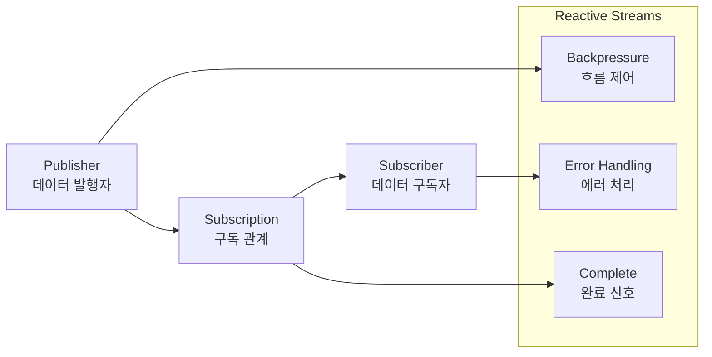
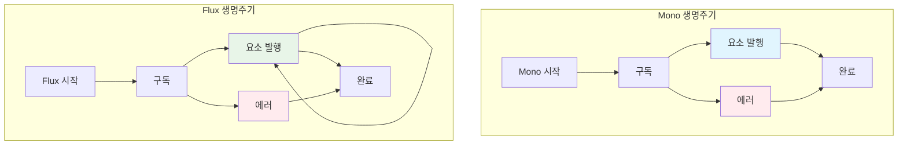
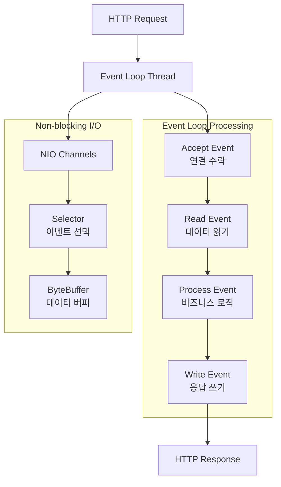
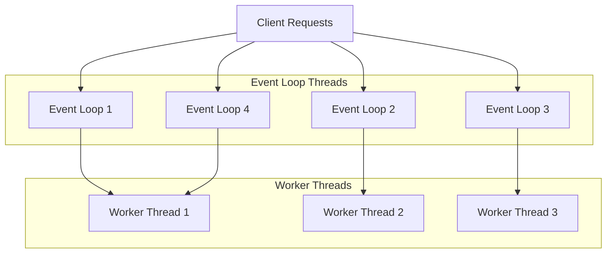
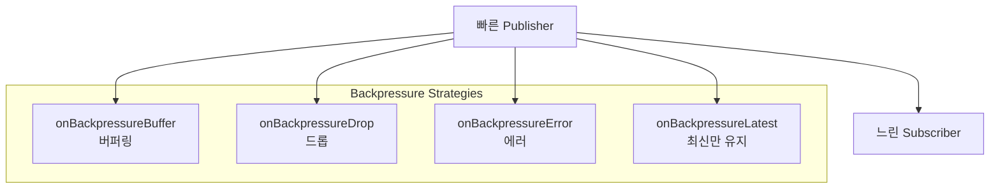
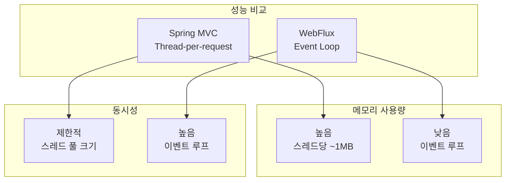

# Spring WebFlux

## 개요

Spring WebFlux는 Spring Framework 5에서 도입된 반응형 웹 프레임워크로, 논블로킹 I/O와 리액티브 스트림을 기반으로 합니다. 이를 통해 고성능, 확장 가능한 웹 애플리케이션을 구축할 수 있으며, 특히 마이크로서비스 아키텍처에 적합합니다. WebFlux는 기존 Spring MVC와 함께 사용하거나 독립적으로 사용할 수 있습니다.

### 주요 특징

#### 1. 반응형 프로그래밍

- 리액티브 스트림을 기반으로 하며, 비동기 및 논블로킹 방식으로 데이터를 처리합니다.
- `Mono<T>`와 `Flux<T>`를 통해 0개 또는 1개, 그리고 0개 이상의 요소를 처리합니다.

#### 2. 논블로킹 I/O

- 쓰레드 풀을 효율적으로 사용하여 적은 수의 쓰레드로도 많은 요청을 처리할 수 있습니다.
- 이벤트 루프 모델을 통해 높은 동시성을 달성합니다.

#### 3. 서버 지원

- Netty, Undertow, Servlet 컨테이너 등 다양한 서버를 지원합니다.
- 각 서버의 특성에 맞는 최적화된 설정이 가능합니다.

#### 4. WebClient

- 비동기 HTTP 요청을 위한 클라이언트 라이브러리를 제공합니다.
- 리액티브 스트림 기반의 HTTP 클라이언트입니다.

#### 5. Reactor

- 리액티브 프로그래밍을 위한 핵심 라이브러리인 Reactor를 사용합니다.
- Project Reactor는 Reactive Streams 스펙의 구현체입니다.

### 장점

#### 1. 높은 성능과 확장성

- 많은 동시 요청을 처리할 수 있어 높은 트래픽 환경에 적합합니다.
- 이벤트 루프 모델로 인해 스레드당 메모리 사용량이 적습니다.

#### 2. 자원 효율성

- 적은 수의 쓰레드로도 효율적인 처리가 가능하여 자원 사용을 최적화합니다.
- 메모리 사용량이 낮아 대용량 트래픽 처리에 유리합니다.

#### 3. 실시간 데이터 처리

- 반응형 스트림을 통해 실시간 데이터를 효율적으로 처리할 수 있습니다.
- Server-Sent Events, WebSocket 등을 통한 실시간 통신을 지원합니다.

### 단점

#### 1. 복잡성

- 기존의 동기 방식보다 학습 곡선이 높고, 디버깅이 어려울 수 있습니다.
- 리액티브 프로그래밍 패러다임에 대한 이해가 필요합니다.

#### 2. 호환성

- 모든 서드파티 라이브러리와 호환되지 않을 수 있습니다.
- 블로킹 작업이 포함된 기존 코드와의 통합이 복잡할 수 있습니다.

### 사용 예시

- **실시간 데이터 스트리밍 서비스**: 센서 데이터, 주식 시세 등 실시간 정보 전송
- **고성능 API 서버**: 대용량 트래픽을 처리하는 REST API
- **마이크로서비스 아키텍처**: Spring Cloud Gateway의 기반 기술
- **IoT 데이터 처리**: 센서 데이터의 실시간 수집 및 처리
- **실시간 채팅 시스템**: WebSocket을 통한 양방향 통신

## WebFlux vs Spring MVC

### 1. 아키텍처 비교

```mermaid
graph TB
    subgraph "Spring MVC (Synchronous)"
        MVCClient[Client] --> MVCServer[Tomcat/Jetty]
        MVCServer --> MVCThread[Thread Pool]
        MVCThread --> MVCController[Controller]
        MVCController --> MVCService[Service]
        MVCService --> MVCDB[Database]
    end

    subgraph "Spring WebFlux (Asynchronous)"
        FluxClient[Client] --> FluxServer[Netty]
        FluxServer --> FluxEventLoop[Event Loop]
        FluxEventLoop --> FluxController[Controller]
        FluxController --> FluxService[Service]
        FluxService --> FluxDB[Database]
    end

    style MVCThread fill:#ffcccc
    style FluxEventLoop fill:#ccffcc
```



### 2. 성능 특성 비교

| 특성                 | Spring MVC                     | Spring WebFlux     |
| -------------------- | ------------------------------ | ------------------ |
| **스레드 모델**      | Thread-per-request             | Event Loop         |
| **동시성**           | 제한적 (스레드 풀 크기에 의존) | 높음 (이벤트 루프) |
| **메모리 사용량**    | 높음 (스레드당 ~1MB)           | 낮음               |
| **블로킹 작업**      | 적합                           | 부적합             |
| **학습 곡선**        | 낮음                           | 높음               |
| **기존 코드 호환성** | 높음                           | 제한적             |

## Reactive Streams 핵심 개념

### 1. Publisher, Subscriber, Subscription



### 2. Mono와 Flux

#### Mono<T> - 단일 요소 스트림

Mono는 0개 또는 1개의 요소를 발행하는 리액티브 스트림입니다. 주로 단일 결과를 반환하는 작업에 사용됩니다.

```mermaid
graph TB
    subgraph "Mono<T> - 단일 요소"
        MonoEmpty[Mono.empty()<br/>0개 요소 - 완료]
        MonoJust[Mono.just(item)<br/>1개 요소 - 성공]
        MonoError[Mono.error()<br/>에러 발생]
        MonoDefer[Mono.defer()<br/>지연 실행]
        MonoFromCallable[Mono.fromCallable()<br/>Callable에서 생성]
    end

    subgraph "Mono 생성 패턴"
        MonoCreate[Mono.create()<br/>수동 생성]
        MonoFromSupplier[Mono.fromSupplier()<br/>Supplier에서 생성]
        MonoFromFuture[Mono.fromFuture()<br/>Future에서 생성]
    end

    style MonoJust fill:#e1f5fe
    style MonoError fill:#ffebee
    style MonoDefer fill:#f3e5f5
```

#### Mono 사용 예제

```java
// 1. 기본 Mono 생성
Mono<String> mono1 = Mono.just("Hello World");
Mono<String> mono2 = Mono.empty();
Mono<String> mono3 = Mono.error(new RuntimeException("Error"));

// 2. 지연 실행 Mono
Mono<String> lazyMono = Mono.defer(() -> {
    System.out.println("Executing...");
    return Mono.just("Lazy result");
});

// 3. Callable에서 Mono 생성
Mono<String> callableMono = Mono.fromCallable(() -> {
    // 복잡한 계산이나 I/O 작업
    return "Result from callable";
});

// 4. Supplier에서 Mono 생성
Mono<String> supplierMono = Mono.fromSupplier(() -> {
    return "Result from supplier";
});

// 5. 수동으로 Mono 생성
Mono<String> manualMono = Mono.create(sink -> {
    // 비동기 작업 수행
    CompletableFuture.runAsync(() -> {
        try {
            Thread.sleep(1000);
            sink.success("Manual result");
        } catch (InterruptedException e) {
            sink.error(e);
        }
    });
});
```

#### Mono 조작 메서드

```java
// 1. 변환 (map)
Mono<String> original = Mono.just("Hello");
Mono<String> transformed = original.map(str -> str + " World");

// 2. 평면화 (flatMap)
Mono<User> userMono = Mono.just(new User("john"));
Mono<String> emailMono = userMono.flatMap(user ->
    Mono.just(user.getEmail()));

// 3. 필터링 (filter)
Mono<Integer> numberMono = Mono.just(10);
Mono<Integer> filteredMono = numberMono.filter(n -> n > 5);

// 4. 에러 처리
Mono<String> errorHandledMono = Mono.just("test")
    .map(str -> {
        if (str.equals("error")) {
            throw new RuntimeException("Error occurred");
        }
        return str;
    })
    .onErrorReturn("Default value")
    .onErrorResume(throwable -> Mono.just("Recovered"));

// 5. 타임아웃 처리
Mono<String> timeoutMono = Mono.just("Slow operation")
    .delayElement(Duration.ofSeconds(5))
    .timeout(Duration.ofSeconds(3))
    .onErrorReturn("Timeout occurred");
```

#### Flux<T> - 다중 요소 스트림

Flux는 0개 이상의 요소를 발행하는 리액티브 스트림입니다. 여러 데이터를 순차적으로 처리할 때 사용됩니다.

```mermaid
graph TB
    subgraph "Flux<T> - 다중 요소"
        FluxEmpty[Flux.empty()<br/>0개 요소]
        FluxJust[Flux.just(items)<br/>여러 요소]
        FluxRange[Flux.range(1,10)<br/>범위 생성]
        FluxInterval[Flux.interval()<br/>주기적 생성]
        FluxGenerate[Flux.generate()<br/>상태 기반 생성]
    end

    subgraph "Flux 생성 패턴"
        FluxCreate[Flux.create()<br/>수동 생성]
        FluxFromIterable[Flux.fromIterable()<br/>Iterable에서 생성]
        FluxFromStream[Flux.fromStream()<br/>Stream에서 생성]
    end

    style FluxJust fill:#e8f5e8
    style FluxInterval fill:#fff3e0
    style FluxGenerate fill:#fce4ec
```

#### Flux 사용 예제

```java
// 1. 기본 Flux 생성
Flux<String> flux1 = Flux.just("A", "B", "C");
Flux<Integer> flux2 = Flux.range(1, 10);
Flux<Long> flux3 = Flux.interval(Duration.ofSeconds(1));

// 2. Iterable에서 Flux 생성
List<String> list = Arrays.asList("Apple", "Banana", "Cherry");
Flux<String> fluxFromList = Flux.fromIterable(list);

// 3. Stream에서 Flux 생성
Flux<Integer> fluxFromStream = Flux.fromStream(
    Stream.of(1, 2, 3, 4, 5)
);

// 4. 수동으로 Flux 생성
Flux<String> manualFlux = Flux.create(sink -> {
    sink.next("First");
    sink.next("Second");
    sink.next("Third");
    sink.complete();
});

// 5. 상태 기반 Flux 생성
Flux<Integer> statefulFlux = Flux.generate(
    () -> 0, // 초기 상태
    (state, sink) -> {
        if (state < 5) {
            sink.next(state);
            return state + 1;
        } else {
            sink.complete();
            return state;
        }
    }
);
```

#### Mono와 Flux의 차이점

| 특성          | Mono<T>        | Flux<T>          |
| ------------- | -------------- | ---------------- |
| **요소 개수** | 0개 또는 1개   | 0개 이상         |
| **사용 사례** | 단일 결과 반환 | 다중 데이터 처리 |
| **완료 신호** | 항상 완료      | 완료 또는 무한   |
| **에러 처리** | 단일 에러      | 스트림 중단      |
| **백프레셔**  | 단순함         | 복잡함           |

#### Mono와 Flux 변환

```java
// Flux에서 Mono로 변환
Flux<String> flux = Flux.just("A", "B", "C");
Mono<String> firstElement = flux.next(); // 첫 번째 요소만
Mono<List<String>> allElements = flux.collectList(); // 모든 요소를 리스트로

// Mono에서 Flux로 변환
Mono<String> mono = Mono.just("Hello");
Flux<String> fluxFromMono = mono.flux(); // 단일 요소를 Flux로

// Mono를 Flux로 확장
Mono<List<String>> listMono = Mono.just(Arrays.asList("A", "B", "C"));
Flux<String> expandedFlux = listMono.flatMapMany(Flux::fromIterable);
```

#### 실제 사용 사례 - Mono와 Flux 컨트롤러

```java
@RestController
@RequestMapping("/api/reactive")
public class ReactiveExamplesController {

    private final UserService userService;

    public ReactiveExamplesController(UserService userService) {
        this.userService = userService;
    }

    // Mono 사용 예제 - 단일 사용자 조회
    @GetMapping("/users/{id}")
    public Mono<User> getUserById(@PathVariable String id) {
        return userService.findById(id)
            .doOnNext(user -> log.info("Found user: {}", user.getName()))
            .doOnError(error -> log.error("Error finding user: {}", error.getMessage()))
            .switchIfEmpty(Mono.error(new UserNotFoundException(id)));
    }

    // Mono 사용 예제 - 사용자 생성
    @PostMapping("/users")
    public Mono<User> createUser(@RequestBody User user) {
        return Mono.just(user)
            .filter(u -> u.getEmail() != null && !u.getEmail().isEmpty())
            .flatMap(u -> userService.save(u))
            .doOnSuccess(savedUser -> log.info("User created: {}", savedUser.getId()))
            .doOnError(error -> log.error("Error creating user: {}", error.getMessage()));
    }

    // Flux 사용 예제 - 모든 사용자 조회
    @GetMapping("/users")
    public Flux<User> getAllUsers() {
        return userService.findAll()
            .filter(User::isActive)
            .doOnNext(user -> log.debug("Processing user: {}", user.getName()))
            .doOnComplete(() -> log.info("All users processed"));
    }

    // Flux 사용 예제 - 사용자 검색
    @GetMapping("/users/search")
    public Flux<User> searchUsers(@RequestParam String query) {
        return userService.findByEmailContaining(query)
            .take(10) // 최대 10개만 반환
            .doOnNext(user -> log.debug("Found matching user: {}", user.getEmail()));
    }

    // Mono와 Flux 조합 예제 - 사용자 통계
    @GetMapping("/users/stats")
    public Mono<UserStats> getUserStats() {
        return userService.findAll()
            .collectList()
            .map(users -> {
                long activeCount = users.stream().filter(User::isActive).count();
                long inactiveCount = users.size() - activeCount;
                return new UserStats(users.size(), activeCount, inactiveCount);
            });
    }

    // Flux 스트리밍 예제 - 실시간 사용자 이벤트
    @GetMapping(value = "/users/events", produces = MediaType.TEXT_EVENT_STREAM_VALUE)
    public Flux<ServerSentEvent<UserEvent>> getUserEvents() {
        return Flux.interval(Duration.ofSeconds(2))
            .flatMap(tick -> userService.findRandomUser())
            .map(user -> ServerSentEvent.<UserEvent>builder()
                .id(String.valueOf(System.currentTimeMillis()))
                .event("user-activity")
                .data(new UserEvent(user.getId(), "User logged in", Instant.now()))
                .build())
            .take(10); // 10개 이벤트만 전송
    }

    // Mono 에러 처리 예제
    @GetMapping("/users/{id}/profile")
    public Mono<UserProfile> getUserProfile(@PathVariable String id) {
        return userService.findById(id)
            .flatMap(user -> userService.getUserProfile(user.getId()))
            .onErrorReturn(new UserProfile(id, "Default Profile"))
            .onErrorResume(UserNotFoundException.class,
                error -> Mono.just(new UserProfile(id, "Profile not found")));
    }

    // Flux 백프레셔 처리 예제
    @GetMapping("/users/stream")
    public Flux<User> streamUsers() {
        return userService.findAll()
            .onBackpressureBuffer(100) // 최대 100개 버퍼
            .doOnNext(user -> log.debug("Streaming user: {}", user.getName()))
            .doOnError(error -> log.error("Error in stream: {}", error.getMessage()));
    }
}
```

#### Mono와 Flux의 생명주기



## WebFlux 이벤트 루프 모델

### 1. 이벤트 루프 동작 원리



### 2. 스레드 모델



## WebFlux 컨트롤러 구현

### 1. 기본 컨트롤러 예제

```java
@RestController
@RequestMapping("/api")
public class ReactiveController {

    private final UserService userService;

    public ReactiveController(UserService userService) {
        this.userService = userService;
    }

    // 단일 사용자 조회
    @GetMapping("/users/{id}")
    public Mono<User> getUser(@PathVariable String id) {
        return userService.findById(id)
            .switchIfEmpty(Mono.error(new UserNotFoundException(id)));
    }

    // 모든 사용자 조회
    @GetMapping("/users")
    public Flux<User> getAllUsers() {
        return userService.findAll()
            .filter(user -> user.isActive());
    }

    // 사용자 생성
    @PostMapping("/users")
    public Mono<User> createUser(@RequestBody User user) {
        return userService.save(user)
            .doOnSuccess(savedUser ->
                log.info("User created: {}", savedUser.getId()));
    }

    // 사용자 업데이트
    @PutMapping("/users/{id}")
    public Mono<User> updateUser(@PathVariable String id,
                                @RequestBody User user) {
        return userService.findById(id)
            .flatMap(existingUser -> {
                user.setId(id);
                return userService.save(user);
            })
            .switchIfEmpty(Mono.error(new UserNotFoundException(id)));
    }

    // 사용자 삭제
    @DeleteMapping("/users/{id}")
    public Mono<Void> deleteUser(@PathVariable String id) {
        return userService.findById(id)
            .flatMap(user -> userService.deleteById(id))
            .switchIfEmpty(Mono.error(new UserNotFoundException(id)));
    }
}
```

### 2. 스트리밍 응답 예제

```java
@RestController
@RequestMapping("/api/stream")
public class StreamingController {

    // Server-Sent Events (SSE)
    @GetMapping(value = "/events", produces = MediaType.TEXT_EVENT_STREAM_VALUE)
    public Flux<ServerSentEvent<String>> streamEvents() {
        return Flux.interval(Duration.ofSeconds(1))
            .map(sequence -> ServerSentEvent.<String>builder()
                .id(String.valueOf(sequence))
                .event("periodic-event")
                .data("SSE - " + LocalTime.now().toString())
                .build());
    }

    // 실시간 데이터 스트리밍
    @GetMapping(value = "/data", produces = MediaType.APPLICATION_NDJSON_VALUE)
    public Flux<DataPoint> streamData() {
        return Flux.interval(Duration.ofMillis(100))
            .map(tick -> new DataPoint(
                tick,
                Math.random() * 100,
                Instant.now()
            ))
            .take(100); // 100개 데이터 포인트만 전송
    }

    // 파일 업로드 처리
    @PostMapping("/upload")
    public Mono<String> uploadFile(@RequestPart("file") Flux<DataBuffer> file) {
        return file
            .map(dataBuffer -> {
                // 파일 데이터 처리
                byte[] bytes = new byte[dataBuffer.readableByteCount()];
                dataBuffer.read(bytes);
                DataBufferUtils.release(dataBuffer);
                return bytes;
            })
            .collectList()
            .map(bytesList -> {
                // 전체 파일 데이터 조합
                byte[] allBytes = bytesList.stream()
                    .flatMapToInt(bytes -> IntStream.range(0, bytes.length)
                        .map(i -> bytes[i]))
                    .collect(ByteArrayOutputStream::new,
                           (baos, b) -> baos.write(b),
                           (baos1, baos2) -> baos1.write(baos2.toByteArray(), 0, baos2.size()))
                    .toByteArray();
                return "File uploaded: " + allBytes.length + " bytes";
            });
    }
}
```

## Reactive Service Layer

### 1. 서비스 구현 예제

```java
@Service
public class ReactiveUserService {

    private final ReactiveUserRepository userRepository;
    private final ReactiveMongoTemplate mongoTemplate;

    public ReactiveUserService(ReactiveUserRepository userRepository,
                             ReactiveMongoTemplate mongoTemplate) {
        this.userRepository = userRepository;
        this.mongoTemplate = mongoTemplate;
    }

    // 사용자 조회
    public Mono<User> findById(String id) {
        return userRepository.findById(id)
            .doOnNext(user -> log.debug("Found user: {}", user.getEmail()))
            .doOnError(error -> log.error("Error finding user: {}", error.getMessage()));
    }

    // 사용자 검색
    public Flux<User> findByEmailContaining(String email) {
        return userRepository.findByEmailContainingIgnoreCase(email)
            .filter(User::isActive)
            .take(10); // 최대 10개만 반환
    }

    // 사용자 저장
    public Mono<User> save(User user) {
        return Mono.just(user)
            .filter(u -> u.getEmail() != null && !u.getEmail().isEmpty())
            .flatMap(u -> {
                if (u.getId() == null) {
                    u.setCreatedAt(Instant.now());
                }
                u.setUpdatedAt(Instant.now());
                return userRepository.save(u);
            })
            .doOnSuccess(savedUser ->
                log.info("User saved: {}", savedUser.getEmail()))
            .doOnError(error ->
                log.error("Error saving user: {}", error.getMessage()));
    }

    // 사용자 삭제
    public Mono<Void> deleteById(String id) {
        return userRepository.findById(id)
            .flatMap(user -> userRepository.deleteById(id))
            .doOnSuccess(v -> log.info("User deleted: {}", id))
            .doOnError(error -> log.error("Error deleting user: {}", error.getMessage()));
    }

    // 복잡한 쿼리 예제
    public Flux<User> findActiveUsersByAgeRange(int minAge, int maxAge) {
        Criteria criteria = Criteria.where("age").gte(minAge).lte(maxAge)
            .and("active").is(true);

        Query query = Query.query(criteria);
        query.with(Sort.by(Sort.Direction.DESC, "createdAt"));

        return mongoTemplate.find(query, User.class)
            .onBackpressureBuffer(100) // 백프레셔 처리
            .doOnNext(user -> log.debug("Found user in age range: {}", user.getEmail()));
    }
}
```

### 2. 에러 처리

```java
@Component
public class ReactiveErrorHandler {

    @ExceptionHandler(UserNotFoundException.class)
    public Mono<ResponseEntity<ErrorResponse>> handleUserNotFound(
            UserNotFoundException ex, ServerWebExchange exchange) {

        ErrorResponse error = new ErrorResponse(
            "USER_NOT_FOUND",
            ex.getMessage(),
            exchange.getRequest().getPath().value()
        );

        return Mono.just(ResponseEntity.status(HttpStatus.NOT_FOUND)
            .body(error));
    }

    @ExceptionHandler(ValidationException.class)
    public Mono<ResponseEntity<ErrorResponse>> handleValidation(
            ValidationException ex, ServerWebExchange exchange) {

        ErrorResponse error = new ErrorResponse(
            "VALIDATION_ERROR",
            ex.getMessage(),
            exchange.getRequest().getPath().value()
        );

        return Mono.just(ResponseEntity.status(HttpStatus.BAD_REQUEST)
            .body(error));
    }

    @ExceptionHandler(Exception.class)
    public Mono<ResponseEntity<ErrorResponse>> handleGeneric(
            Exception ex, ServerWebExchange exchange) {

        ErrorResponse error = new ErrorResponse(
            "INTERNAL_ERROR",
            "An unexpected error occurred",
            exchange.getRequest().getPath().value()
        );

        return Mono.just(ResponseEntity.status(HttpStatus.INTERNAL_SERVER_ERROR)
            .body(error));
    }
}
```

## 백프레셔 (Backpressure) 처리

### 1. 백프레셔 전략



### 2. 백프레셔 처리 예제

```java
@Service
public class BackpressureService {

    // 버퍼링 전략
    public Flux<String> bufferStrategy() {
        return Flux.interval(Duration.ofMillis(10))
            .map(i -> "Item-" + i)
            .onBackpressureBuffer(1000) // 최대 1000개 버퍼
            .doOnNext(item -> log.debug("Processing: {}", item));
    }

    // 드롭 전략
    public Flux<String> dropStrategy() {
        return Flux.interval(Duration.ofMillis(10))
            .map(i -> "Item-" + i)
            .onBackpressureDrop(item ->
                log.warn("Dropped item: {}", item))
            .doOnNext(item -> log.debug("Processing: {}", item));
    }

    // 에러 전략
    public Flux<String> errorStrategy() {
        return Flux.interval(Duration.ofMillis(10))
            .map(i -> "Item-" + i)
            .onBackpressureError()
            .doOnNext(item -> log.debug("Processing: {}", item))
            .onErrorReturn("Error occurred due to backpressure");
    }

    // 최신만 유지 전략
    public Flux<String> latestStrategy() {
        return Flux.interval(Duration.ofMillis(10))
            .map(i -> "Item-" + i)
            .onBackpressureLatest()
            .doOnNext(item -> log.debug("Processing: {}", item));
    }
}
```

## WebFlux 설정 및 최적화

### 1. application.yml 설정

```yaml
spring:
  webflux:
    base-path: /api
    static-path-pattern: /static/**

  # Netty 설정
  netty:
    connection-timeout: 30s
    read-timeout: 30s
    write-timeout: 30s

  # 로깅 설정
logging:
  level:
    org.springframework.web.reactive: DEBUG
    reactor.netty: DEBUG
    io.netty: DEBUG

# 메트릭 설정
management:
  endpoints:
    web:
      exposure:
        include: health,info,metrics,prometheus
  metrics:
    export:
      prometheus:
        enabled: true
```

### 2. 성능 최적화 설정

```java
@Configuration
public class WebFluxConfig {

    @Bean
    public NettyReactiveWebServerFactory nettyReactiveWebServerFactory() {
        return new NettyReactiveWebServerFactory() {
            @Override
            public WebServer getWebServer(HttpHandler httpHandler) {
                HttpServer httpServer = HttpServer.create()
                    .port(8080)
                    .option(ChannelOption.SO_BACKLOG, 1000)
                    .option(ChannelOption.SO_REUSEADDR, true)
                    .childOption(ChannelOption.SO_KEEPALIVE, true)
                    .childOption(ChannelOption.TCP_NODELAY, true);

                return super.getWebServer(httpHandler);
            }
        };
    }

    @Bean
    public WebFilter corsFilter() {
        return (exchange, chain) -> {
            ServerHttpResponse response = exchange.getResponse();
            response.getHeaders().add("Access-Control-Allow-Origin", "*");
            response.getHeaders().add("Access-Control-Allow-Methods", "GET,POST,PUT,DELETE,OPTIONS");
            response.getHeaders().add("Access-Control-Allow-Headers", "Content-Type,Authorization");

            return chain.filter(exchange);
        };
    }
}
```

## 모니터링 및 관찰성

### 1. 메트릭 수집

```java
@Component
public class WebFluxMetrics {

    private final MeterRegistry meterRegistry;

    public WebFluxMetrics(MeterRegistry meterRegistry) {
        this.meterRegistry = meterRegistry;
    }

    @EventListener
    public void handleHttpRequest(HttpRequestEvent event) {
        Timer.Sample sample = Timer.start(meterRegistry);

        event.getExchange().getResponse()
            .beforeCommit(() -> {
                sample.stop(Timer.builder("http.server.requests")
                    .tag("method", event.getMethod())
                    .tag("uri", event.getUri())
                    .tag("status", event.getStatus().toString())
                    .register(meterRegistry));
                return Mono.empty();
            });
    }
}
```

### 2. 분산 추적

```java
@Component
public class TracingFilter implements WebFilter {

    @Override
    public Mono<Void> filter(ServerWebExchange exchange, WebFilterChain chain) {
        String traceId = generateTraceId();
        String spanId = generateSpanId();

        return chain.filter(exchange)
            .doFirst(() -> {
                exchange.getAttributes().put("traceId", traceId);
                exchange.getAttributes().put("spanId", spanId);

                log.info("Request started - TraceId: {}, SpanId: {}, Path: {}",
                    traceId, spanId, exchange.getRequest().getPath());
            })
            .doFinally(signalType -> {
                log.info("Request completed - TraceId: {}, SpanId: {}, Signal: {}",
                    traceId, spanId, signalType);
            });
    }

    private String generateTraceId() {
        return UUID.randomUUID().toString();
    }

    private String generateSpanId() {
        return UUID.randomUUID().toString().substring(0, 8);
    }
}
```

## WebClient 사용법

### 1. WebClient 기본 사용법

```java
@RestController
@RequestMapping("/api/client")
public class WebClientController {

    private final WebClient webClient;

    public WebClientController() {
        this.webClient = WebClient.builder()
            .baseUrl("https://api.example.com")
            .defaultHeader(HttpHeaders.CONTENT_TYPE, MediaType.APPLICATION_JSON_VALUE)
            .defaultHeader(HttpHeaders.USER_AGENT, "WebFlux-Client")
            .build();
    }

    // GET 요청 예제
    @GetMapping("/users/{id}")
    public Mono<User> getUser(@PathVariable String id) {
        return webClient.get()
            .uri("/users/{id}", id)
            .retrieve()
            .bodyToMono(User.class)
            .doOnSuccess(user -> log.info("User retrieved: {}", user.getName()))
            .doOnError(error -> log.error("Error retrieving user: {}", error.getMessage()));
    }

    // POST 요청 예제
    @PostMapping("/users")
    public Mono<User> createUser(@RequestBody User user) {
        return webClient.post()
            .uri("/users")
            .bodyValue(user)
            .retrieve()
            .bodyToMono(User.class)
            .doOnSuccess(savedUser -> log.info("User created: {}", savedUser.getId()));
    }

    // PUT 요청 예제
    @PutMapping("/users/{id}")
    public Mono<User> updateUser(@PathVariable String id, @RequestBody User user) {
        return webClient.put()
            .uri("/users/{id}", id)
            .bodyValue(user)
            .retrieve()
            .bodyToMono(User.class);
    }

    // DELETE 요청 예제
    @DeleteMapping("/users/{id}")
    public Mono<Void> deleteUser(@PathVariable String id) {
        return webClient.delete()
            .uri("/users/{id}", id)
            .retrieve()
            .bodyToMono(Void.class);
    }
}
```

### 2. WebClient 고급 기능

```java
@Component
public class AdvancedWebClient {

    private final WebClient webClient;

    public AdvancedWebClient() {
        this.webClient = WebClient.builder()
            .baseUrl("https://api.example.com")
            .defaultHeader(HttpHeaders.CONTENT_TYPE, MediaType.APPLICATION_JSON_VALUE)
            .filter((request, next) -> {
                // 요청 로깅
                log.info("Request: {} {}", request.method(), request.url());
                return next.exchange(request)
                    .doOnNext(response ->
                        log.info("Response: {} {}", response.statusCode(), request.url()));
            })
            .filter(ExchangeFilterFunction.ofRequestProcessor(clientRequest -> {
                // 인증 토큰 추가
                return Mono.just(ClientRequest.from(clientRequest)
                    .header("Authorization", "Bearer " + getAuthToken())
                    .build());
            }))
            .build();
    }

    // 타임아웃 설정
    public Mono<User> getUserWithTimeout(String id) {
        return webClient.get()
            .uri("/users/{id}", id)
            .retrieve()
            .bodyToMono(User.class)
            .timeout(Duration.ofSeconds(5))
            .onErrorMap(TimeoutException.class,
                ex -> new RuntimeException("Request timeout"));
    }

    // 재시도 로직
    public Mono<User> getUserWithRetry(String id) {
        return webClient.get()
            .uri("/users/{id}", id)
            .retrieve()
            .bodyToMono(User.class)
            .retryWhen(Retry.backoff(3, Duration.ofSeconds(1))
                .filter(throwable -> throwable instanceof WebClientResponseException)
                .onRetryExhaustedThrow((retryBackoffSpec, retrySignal) ->
                    new RuntimeException("Max retries exceeded")));
    }

    // 스트리밍 응답 처리
    public Flux<User> streamUsers() {
        return webClient.get()
            .uri("/users/stream")
            .retrieve()
            .bodyToFlux(User.class)
            .doOnNext(user -> log.debug("Received user: {}", user.getName()));
    }

    // 파일 업로드
    public Mono<String> uploadFile(Flux<DataBuffer> fileData, String filename) {
        return webClient.post()
            .uri("/upload")
            .contentType(MediaType.MULTIPART_FORM_DATA)
            .body(BodyInserters.fromMultipartData("file",
                new HttpHeaders(), fileData))
            .retrieve()
            .bodyToMono(String.class);
    }

    private String getAuthToken() {
        // 실제 구현에서는 토큰 관리 로직
        return "your-auth-token";
    }
}
```

### 3. WebClient 설정

```java
@Configuration
public class WebClientConfig {

    @Bean
    public WebClient webClient() {
        return WebClient.builder()
            .baseUrl("https://api.example.com")
            .defaultHeader(HttpHeaders.CONTENT_TYPE, MediaType.APPLICATION_JSON_VALUE)
            .codecs(configurer -> configurer
                .defaultCodecs()
                .maxInMemorySize(2 * 1024 * 1024)) // 2MB
            .filter(ExchangeFilterFunction.ofRequestProcessor(clientRequest -> {
                // 요청 전처리
                return Mono.just(clientRequest);
            }))
            .filter(ExchangeFilterFunction.ofResponseProcessor(clientResponse -> {
                // 응답 후처리
                return Mono.just(clientResponse);
            }))
            .build();
    }

    @Bean
    public HttpClient httpClient() {
        return HttpClient.create()
            .option(ChannelOption.CONNECT_TIMEOUT_MILLIS, 5000)
            .responseTimeout(Duration.ofSeconds(10))
            .doOnConnected(conn ->
                conn.addHandlerLast(new ReadTimeoutHandler(10))
                    .addHandlerLast(new WriteTimeoutHandler(10)));
    }
}
```

## 실제 사용 사례

### 1. 실시간 채팅 시스템

```java
@RestController
@RequestMapping("/chat")
public class ChatController {

    private final FluxSink<ChatMessage> messageSink;
    private final Flux<ChatMessage> messageFlux;

    public ChatController() {
        Flux<ChatMessage> flux = Flux.create(sink -> {
            this.messageSink = sink;
        });
        this.messageFlux = flux.publish().autoConnect();
    }

    @PostMapping("/send")
    public Mono<Void> sendMessage(@RequestBody ChatMessage message) {
        return Mono.fromRunnable(() -> {
            message.setTimestamp(Instant.now());
            messageSink.next(message);
        });
    }

    @GetMapping(value = "/messages", produces = MediaType.TEXT_EVENT_STREAM_VALUE)
    public Flux<ServerSentEvent<ChatMessage>> getMessages() {
        return messageFlux
            .map(message -> ServerSentEvent.<ChatMessage>builder()
                .data(message)
                .build());
    }
}
```

### 2. 데이터 스트리밍 API

```java
@RestController
@RequestMapping("/stream")
public class DataStreamController {

    @GetMapping(value = "/sensor-data", produces = MediaType.APPLICATION_NDJSON_VALUE)
    public Flux<SensorData> streamSensorData() {
        return Flux.interval(Duration.ofMillis(100))
            .map(tick -> new SensorData(
                "sensor-" + (tick % 5),
                Math.random() * 100,
                Math.random() * 50,
                Instant.now()
            ))
            .onBackpressureBuffer(1000)
            .doOnNext(data -> log.debug("Streaming sensor data: {}", data));
    }

    @PostMapping("/process-batch")
    public Mono<ProcessingResult> processBatch(@RequestBody Flux<DataItem> items) {
        return items
            .buffer(100) // 100개씩 배치 처리
            .flatMap(batch -> processBatch(batch))
            .collectList()
            .map(results -> new ProcessingResult(results));
    }
}
```

## 결론

Spring WebFlux는 현대적인 웹 애플리케이션에서 높은 성능과 확장성을 요구하는 시스템에 적합한 프레임워크입니다. 특히 다음과 같은 상황에서 큰 장점을 보입니다:

### 적합한 사용 사례

- **대용량 트래픽 처리**: 이벤트 루프 모델로 높은 동시성 지원
- **실시간 데이터 스트리밍**: Server-Sent Events, WebSocket 지원
- **마이크로서비스 게이트웨이**: Spring Cloud Gateway의 기반
- **IoT 데이터 처리**: 센서 데이터의 실시간 처리
- **실시간 채팅 시스템**: WebSocket을 통한 양방향 통신
- **고성능 API 서버**: 대용량 트래픽을 처리하는 REST API

### 기술 선택 가이드

#### WebFlux를 선택해야 하는 경우:

- **높은 동시성 요구**: 초당 수만 개의 요청을 처리해야 하는 경우
- **실시간 데이터 처리**: 실시간 스트리밍이나 이벤트 기반 아키텍처
- **마이크로서비스 환경**: Spring Cloud Gateway와 함께 사용
- **메모리 효율성**: 제한된 리소스 환경에서 최대 성능 필요

#### Spring MVC를 선택해야 하는 경우:

- **기존 코드베이스**: 이미 동기식 코드로 구성된 프로젝트
- **간단한 CRUD 애플리케이션**: 복잡한 비동기 처리가 필요 없는 경우
- **팀 역량**: 리액티브 프로그래밍 경험이 부족한 팀
- **서드파티 라이브러리 의존성**: 블로킹 라이브러리를 많이 사용하는 경우

### 성능 고려사항



### 학습 로드맵

1. **기초 단계**

   - Reactive Streams 스펙 이해
   - Mono와 Flux 개념 학습
   - 기본적인 리액티브 프로그래밍 패턴

2. **중급 단계**

   - WebFlux 컨트롤러 구현
   - WebClient 사용법
   - 백프레셔 처리 방법

3. **고급 단계**
   - 복잡한 리액티브 스트림 조합
   - 성능 최적화 및 모니터링
   - 마이크로서비스 아키텍처 적용

### 마이그레이션 전략

기존 Spring MVC 애플리케이션을 WebFlux로 마이그레이션할 때는 점진적 접근이 권장됩니다:

1. **하이브리드 접근**: MVC와 WebFlux를 함께 사용
2. **새로운 기능**: 새로운 기능은 WebFlux로 구현
3. **점진적 전환**: 기존 코드를 단계적으로 리팩토링
4. **성능 테스트**: 각 단계에서 성능 측정 및 검증

WebFlux의 학습 곡선이 높고, 모든 상황에서 적합하지 않을 수 있으므로, 프로젝트의 요구사항을 잘 분석하여 적절한 기술을 선택하는 것이 중요합니다. 특히 팀의 기술 역량과 프로젝트의 복잡성을 고려한 신중한 결정이 필요합니다.
